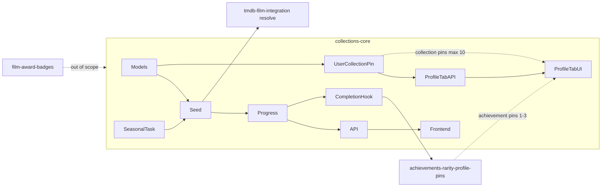

# Plan: collections-core

Step-by-step implementation. No code until phases are approved; UI copy marked **TBD** where product text is unset.

---

## Phase 0 — Artifacts & domain design

1. Confirm this `plan.md` + `feature.md` (done at kickoff).
2. Add enum/constants module: `backend/src/services/collections/constants.py`
   - `CollectionKind`: `evergreen`, `seasonal`
   - Known slugs: `letterboxd-top-500`, `oscars-{year}` pattern
3. Document achievement hook contract in code comment / ADR snippet in `result.md` at closeout:
   - Input: `user_id`, `collection_slug`, `completed_at`
   - Downstream owner: **`achievements-rarity-profile-pins`**
   - v1 stub: `GrantCollectionAchievementService` no-op or minimal `user_collection_completion` row

---

## Phase 1 — Models & migrations

**Files:**

| Path | Purpose |
|------|---------|
| `backend/src/models/collection.py` | `Collection`, `CollectionKind` enum |
| `backend/src/models/collection_film.py` | M2M membership + `sort_order` |
| `backend/src/models/user_collection_progress.py` | Per-user progress + `completed_at` |
| `backend/src/models/user_collection_pin.py` | Per-user collection pin + `sort_order` |
| `backend/src/migrations/versions/<rev>_collections_core.py` | Alembic upgrade |

**Schema sketch:**

- `collections`: `id`, `slug` (unique), `kind`, `title`, `description`, `season_year` (nullable int), `is_active`, `film_count` (denormalized), `created_at`, **`content_updated_at`** (timestamptz, NOT NULL; set on catalog/content changes — see FR-10)
- `collection_films`: `collection_id`, `film_id`, `sort_order`, `seed_imdb_id` (nullable, audit), unique `(collection_id, film_id)`
- `user_collection_progress`: `user_id`, `collection_id`, `rated_count`, `total_count`, `completed_at`, unique `(user_id, collection_id)`
- **`user_collection_pins`:** `user_id`, `collection_id`, `sort_order` (int, default 0), `pinned_at` (timestamptz), unique `(user_id, collection_id)`; index on `(user_id, sort_order)` for profile tab ordering

**`content_updated_at` rules (enforce in services, not DB triggers only):**

- Set/bump on: seed import, `CollectionFilm` membership changes, collection metadata writes, seasonal ensure/sync.
- Never bump on: `RefreshUserCollectionProgressService`, pin/unpin DAO ops.
- Evergreen: initial seed sets timestamp; unchanged until `--force` re-import or manual edit.

**Invariants:**

- `Film` FK via `film_id` → `films.id`; catalog identity remains `Film.kinopoisk_id`
- No link to TMDB collection / `franchise_key`

**Verify:** migration applies in Docker (`make start` + alembic upgrade).

---

## Phase 2 — Seed data & import scripts

**Seed assets** (git-tracked manifests):

- `backend/src/data/collections/letterboxd-top-500.json` — array of `{ "imdb_id": "tt…", "sort_order": N }` (source: Letterboxd Top 500 static export; **never auto-refreshed**)
- `backend/src/data/collections/oscars-2026.json` — Oscar year catalog seed (nominees/winners list as IMDB ids)

**Script:**

- `backend/src/manage_seed_collection.py`
  - Args: `--slug`, `--manifest`, `--dry-run`, `--force` (evergreen re-import only with `--force`)
  - For each entry: `normalize_imdb_id` → resolve film:
    - Prefer existing `Film` by `imdb_id`
    - Else Kinopoisk resolve path (reuse patterns from catalog resolve / `SyncFilmFromTmdbService`)
  - Upsert `Collection` + `CollectionFilm` rows
  - **Set `content_updated_at`** to import timestamp (or `now()` on membership/metadata change)
- Makefile target: `make seed-collection SLUG=letterboxd-top-500` (optional convenience)

**Initial seed run (manual, one-shot for evergreen):**

1. `letterboxd-top-500` — import once; document in `result.md`
2. `oscars-2026` — import for v1 launch

**Verify:** integration test with mocked resolve; spot-check `film_count` ≈ 500 / oscars list size.

---

## Phase 3 — Progress services

**Shared query helper** (reuse taste-quiz rule):

- `backend/src/services/collections/meaningful_rated_film_ids.py`
  - SQL: user’s `UserCard` where `is_planned=false`, `rating >= 1.0`, `film_id IS NOT NULL`
  - Mirror `meaningful_rated_cards_stmt` from `backend/src/services/taste_quiz/card_pool.py`

**Services** (`@dataclass`, `build()`, `execute()`):

| Service | File | Responsibility |
|---------|------|----------------|
| `ComputeCollectionProgressService` | `compute_collection_progress.py` | rated ∩ collection films → counts + percent |
| `ListUserCollectionsProgressService` | `list_user_collections_progress.py` | all active collections + progress for user |
| `GetCollectionDetailService` | `get_collection_detail.py` | metadata + viewer progress (header-only) |
| `ListCollectionFilmsService` | `list_collection_films.py` | paginated films + per-film `viewer_has_rated` |
| `RefreshUserCollectionProgressService` | `refresh_user_collection_progress.py` | upsert `user_collection_progress`; detect 0→100% transition |
| `CompleteCollectionService` | `complete_collection.py` | idempotent completion + achievement hook |
| `PinCollectionService` | `pin_collection.py` | pin active collection; enforce max **10**; assign `sort_order` |
| `UnpinCollectionService` | `unpin_collection.py` | remove pin (idempotent) |
| `ListProfilePinnedCollectionsService` | `list_profile_pinned_collections.py` | profile owner's ordered pins + owner progress |

**DAO (optional thin layer):**

- `backend/src/daos/collection_dao.py` — fetch by slug, list films paginated, upsert progress, **touch `content_updated_at`**, pin CRUD

**Hook on card rating changes:**

- Call site in existing card create/update service(s), e.g. `backend/src/services/cards/create_user_card.py` / update rating path — invoke `RefreshUserCollectionProgressService` for affected `film_id` (async-safe, best-effort).

**Verify:** unit tests for progress math (rated vs planned vs unrated); integration test for completion idempotency; unit test that progress refresh **does not** mutate `content_updated_at`.

---

## Phase 3b — Collection pins & profile tab API

**Services:** `PinCollectionService`, `UnpinCollectionService`, `ListProfilePinnedCollectionsService` (see Phase 3 table).

**Files:**

- `backend/src/api/collections/pin_routes.py` (or extend `routes.py`) — pin/unpin
- Extend profile routes or `backend/src/api/profile/collections_routes.py` — public pinned list

**Endpoints (add to Phase 5 table):**

| Method | Path | Auth | Notes |
|--------|------|------|-------|
| POST | `/api/me/collection-pins/{slug}` | required | Pin; 409/422 if ≥10 pins or collection inactive |
| DELETE | `/api/me/collection-pins/{slug}` | required | Unpin; idempotent |
| GET | `/api/profiles/{userId}/collections` | optional | Owner's pinned collections + **owner's** progress; `[]` if none |

**List/detail schema additions:** `content_updated_at`, `is_pinned` (auth on global list/detail).

**Verify:** integration tests — pin limit, idempotent unpin, profile endpoint returns owner progress not viewer's, empty pins array.

---

## Phase 4 — Achievement completion stub (dependency)

**Owner of full achievement UX:** `achievements-rarity-profile-pins` (sibling, not implemented here).

**v1 in this feature:**

- `backend/src/services/collections/grant_collection_achievement.py`
  - `GrantCollectionAchievementService.execute(user_id, collection_slug, completed_at)`
  - v1: insert into `user_collection_completion` **or** call placeholder `UserAchievement` stub if table exists
  - Document `# DEPENDS ON: achievements-rarity-profile-pins` in class docstring
- Achievement slug convention: `collection-complete:{slug}` (TBD with sibling feature)

**Verify:** test that second 100% refresh does not double-grant.

---

## Phase 5 — HTTP API

**Files:**

- `backend/src/api/collections/schemas.py` — Pydantic: `CollectionSummary`, `CollectionDetail`, `CollectionFilmItem`, `UserCollectionProgress`, `PaginatedCollectionFilms`
- `backend/src/api/collections/routes.py` — thin routes
- Register router in `backend/src/api/router.py` (or existing API mount)

**Endpoints:**

| Method | Path | Auth | Notes |
|--------|------|------|-------|
| GET | `/api/collections` | optional | Active global collections; `?kind=evergreen\|seasonal`; include `viewer_progress`, **`content_updated_at`**, **`is_pinned`** when authenticated |
| GET | `/api/collections/{slug}` | optional | Header metadata only + **`content_updated_at`** + `viewer_progress` + **`is_pinned`** if auth — **no films** |
| GET | `/api/collections/{slug}/films` | optional | Paginated flat film list; `limit` (default 25) + `cursor` or `offset`; each item includes film summary + `viewer_has_rated: bool` when auth |
| GET | `/api/me/collections` | required | Optional convenience alias: all active collections + progress summary |
| POST | `/api/me/collection-pins/{slug}` | required | Pin collection (max 10) |
| DELETE | `/api/me/collection-pins/{slug}` | required | Unpin collection |
| GET | `/api/profiles/{userId}/collections` | optional | Profile «Коллекции» tab payload: pinned set + owner progress |

**Pagination contract (films sub-resource):**

- Response: `{ items: CollectionFilmItem[], next_cursor: string | null, total_count: int }` (or offset-based `{ items, offset, has_more, total_count }` — pick one, document in schemas).
- `CollectionFilmItem`: `film_id`, `title`, `year`, `poster_url`, `viewer_has_rated` (auth).
- Sort: `CollectionFilm.sort_order` ascending (stable for Top 500).
- Service: extend `GetCollectionDetailService` or add `ListCollectionFilmsService` in `backend/src/services/collections/list_collection_films.py`.

**Verify:** `backend/src/tests/integration/api/test_collections_routes.py` — list with progress, header-only detail, films pagination, `viewer_has_rated` true/false, empty page edge cases.

---

## Phase 6 — Celery seasonal ensure task

**File:** `backend/src/tasks/ensure_seasonal_collections.py`

```python
"""Celery tasks: ensure seasonal Oscar year collections exist and are active.

Beat schedule (document only — configure externally):
    ensure_seasonal_collections: e.g. 1 Jan 06:00 UTC (crontab minute=0 hour=6 day_of_month=1 month_of_year=1)
    — or host-specific schedule before Oscar season; no Celery Beat in repo.
"""
```

**Service:** `backend/src/services/collections/ensure_seasonal_collection.py`

- Read target year from kwargs or `datetime.now(UTC).year`
- If `oscars-{year}` missing: create `Collection` + seed from manifest if present
- Set `is_active=true`; bump **`content_updated_at`** when membership/metadata changes
- Optionally deactivate prior year (product TBD)

**Registration:** add to `backend/src/celery_app.py` `_register_all_tasks` (see `docs/features/celery-redis-workers.md`).

**Verify:** unit test for ensure logic; manual `send_task` in dev optional.

---

## Phase 7 — Frontend

**API client:**

- `frontend/src/api/collectionsApi.ts` — `listCollections`, `getCollectionBySlug`, `listCollectionFilms` (cursor/offset params)
- `frontend/src/api/collectionTypes.ts` — `CollectionSummary`, `CollectionDetail`, `CollectionFilmItem`, `ViewerProgress`, **`ProfilePinnedCollection`**
- `frontend/src/api/collectionPinsApi.ts` — `pinCollection`, `unpinCollection`, `getProfilePinnedCollections`

**Hooks:**

- `frontend/src/hooks/useCollectionsQuery.ts` — list collections for index page
- `frontend/src/hooks/useCollectionDetailQuery.ts` — header + progress by slug
- `frontend/src/hooks/useCollectionFilmsInfiniteQuery.ts` — `useInfiniteQuery` wrapper for paginated films (pattern: `frontend/src/hooks/useUserCardsInfiniteQuery.ts`)
- `frontend/src/hooks/useCollectionPinMutation.ts` — pin/unpin with cache invalidation (detail, list, profile tab)
- `frontend/src/hooks/useProfilePinnedCollectionsQuery.ts` — profile tab data by `userId`

**Pages & components:**

| Path | Purpose |
|------|---------|
| `frontend/src/pages/CollectionsIndexPage.tsx` | List active global collections: title, description snippet, progress % + rated/total |
| `frontend/src/pages/CollectionDetailPage.tsx` | Header (title, description, progress), infinite flat film list |
| `frontend/src/components/collections/CollectionListItem.tsx` | Tappable row/card for index → `/collections/:slug` |
| `frontend/src/components/collections/CollectionDetailHeader.tsx` | Title, description, `CollectionProgressBar`, **`PinCollectionButton`** («Закрепить»/«Открепить») |
| `frontend/src/components/collections/PinCollectionButton.tsx` | Toggles pin; disabled at max 10 with hint |
| `frontend/src/components/collections/CollectionProgressBar.tsx` | % bar + `rated_count / total_count` |
| `frontend/src/components/collections/CollectionFilmRow.tsx` | Film row: poster/title/year; rated vs unrated visual; `Link` to `/films/:filmId` |
| `frontend/src/components/collections/CollectionFilmsList.tsx` | Flat `<ul>` of rows + IntersectionObserver sentinel for load-more |

**Navigation & routing** (`frontend/src/routes.tsx`, `frontend/src/components/navigation/BottomNav.tsx`):

1. Add 4th `NavLink` in `BottomNav`: label **«Коллекции»**, `to="/collections"`, icon `Layers` from `lucide-react`.
2. Register under `AppShell` in `routes.tsx`:
   - `path="collections"` → lazy `CollectionsIndexPage`
   - `path="collections/:slug"` → lazy `CollectionDetailPage`
3. Collections tab is **separate** from Search browse (genres/directors remain on `/search` and `/genres` routes).
4. **Naming clarity:** Bottom nav «Коллекции» = **global discovery** (`/collections`); profile tab «Коллекции» = **user's pinned showcase** only.

**Profile «Коллекции» tab** (extend existing profile page tab strip):

| Path | Purpose |
|------|---------|
| `frontend/src/components/profile/ProfileCollectionsTab.tsx` | Tab panel: empty state or pinned list |
| `frontend/src/components/profile/ProfilePinnedCollectionRow.tsx` | Title, description snippet, owner progress % |

- Tab **always visible** on profile (own + public); register in profile tab config alongside existing tabs.
- **Empty state:** copy TBD + optional link to `/collections` discovery.
- **Populated:** fetch `GET /api/profiles/{userId}/collections`; tap row → `/collections/:slug`.
- Viewing **other user:** show **their** pins + **their** progress (API returns owner progress).

**CollectionFilmRow visual spec** (align with TGUI + `CatalogRatedFilmRow`):

- Base layout: reuse dimensions/spacing from `frontend/src/components/catalog/CatalogRatedFilmRow.tsx` (poster 4.5rem×3rem, title, year).
- **Rated (`viewer_has_rated`):** full opacity; mint `CircleCheck` (lucide, 16px) badge on poster top-right; hint «Оценён».
- **Unrated:** poster `opacity-60`; hint «Не оценён» in `--tgui--hint_color`.
- Row wraps in `Link to={/films/${film.film_id}}` — **no** new film detail route.

**Infinite scroll** (`CollectionDetailPage` + `CollectionFilmsList`):

- Initial fetch via `useCollectionFilmsInfiniteQuery`; page size 25.
- Sentinel `div` + `IntersectionObserver` (same pattern as `ProfileWatchlistPanel` load-more ref).
- Loading skeleton / spinner at list footer while fetching next page.
- On mount return from `/films/:filmId`: invalidate `useCollectionDetailQuery` + films infinite query so progress / rated flags refresh (eventual consistency ok).

**Index page UX:**

- `Section` / `Cell` or list pattern consistent with other index pages (e.g. `GenresIndexPage`).
- Each item shows title, 1–2 line description clamp, progress bar or % + counts for auth user.
- Tap → `navigate(/collections/${slug})`.

**Empty/error/loading:** per frontend standards; guest users see collections without personal progress on index/detail header.

**Out of scope note:** Oscar cup badges on film rows — `film-award-badges`; optional future enhancement on rows or film page only.

**Verify:** `cd frontend && npm run lint && npm run build`; manual check Top 500 scroll loads >1 page; rated/unrated states; nav tab highlights on `/collections*`; pin/unpin toggles; profile tab empty vs populated; profile tab on other user's profile shows their pins.

---

## Phase 7b — Profile tab & pin UX (checklist)

1. Profile tab strip includes **«Коллекции»** from day one (no feature flag on tab visibility).
2. Empty tab until first pin — no fallback fake data.
3. Pin button on collection detail only for auth user (guest hidden/disabled).
4. Invalidate profile pinned query after pin/unpin.
5. Document in `result.md`: distinction vs **`achievements-rarity-profile-pins`** achievement pins.

---

## Phase 8 — Tests & closeout

**Backend tests (Docker):**

| Path | Scope |
|------|-------|
| `backend/src/tests/unit/services/collections/test_compute_collection_progress.py` | Progress math, watchlist exclusion |
| `backend/src/tests/unit/services/collections/test_complete_collection.py` | Idempotent completion + hook |
| `backend/src/tests/unit/services/collections/test_content_updated_at.py` | Bumps on seed/sync; no bump on progress/pin |
| `backend/src/tests/unit/services/collections/test_collection_pins.py` | Pin limit 10, idempotent unpin |
| `backend/src/tests/integration/api/test_collections_routes.py` | API contracts incl. `content_updated_at`, `is_pinned` |
| `backend/src/tests/integration/api/test_collection_pins_routes.py` | Pin/unpin + profile pinned list endpoint |
| `backend/src/tests/integration/services/collections/test_seed_collection.py` | Seed with mocked resolve; `content_updated_at` on import |

Run: `make backend-test` or scoped `make backend-test-one target=…`

**Docs closeout:**

- `.cursor/active/collections-core/result.md`
- `docs/features/collections-core.md`
- Action-log fragment + HOT update

---

## Open questions / TBD

| Item | Notes |
|------|-------|
| UI copy (RU) | Titles, empty states, completion toast |
| Nav entry point | **Resolved:** dedicated BottomNav tab «Коллекции» → `/collections` |
| Deactivate old Oscar collection | When `oscars-2027` goes live, keep 2026 active? Default: both active |
| «My film of the year» | Explicit v2 follow-up after 100% |
| Oscar badges | **`film-award-badges`** only |
| Collection pin limit | **Resolved:** max **10** per user v1 |
| Profile tab vs nav tab | **Resolved:** profile «Коллекции» = pins; bottom nav «Коллекции» = global catalog |
| Achievement vs collection pins | **Cross-ref `achievements-rarity-profile-pins`** — achievements 1–3 slots; collections max 10 |

---

## Dependency graph


