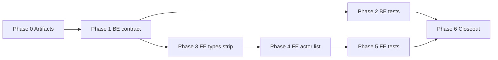

# Plan: profile-actors-top20

Step-by-step FE + BE implementation. No code until phases are approved.

---

## Phase 0 — Artifacts

1. Confirm `feature.md`, `plan.md`, `progress.md` (kickoff).
2. Inventory current contract: `get_user_card_stats.py`, profile stats API schema, `profileTypes.ts`, `ProfileStatsPanel.tsx`.

---

## Phase 1 — Backend: cap distribution, drop unique count

**Files (expected):**

| Path | Change |
|------|--------|
| `backend/src/services/profile/get_user_card_stats.py` | Slice `actor_distribution` to top 20 by count; remove `unique_actors_count` from insights dataclass / return payload |
| `backend/src/api/profile/schemas.py` (or equivalent) | Drop `unique_actors_count` from response model if exposed explicitly |
| OpenAPI / serializer mirrors | Keep `top_actor_*` fields |

**Rules:**

- Sort by `count` desc, then stable tie-break (e.g. name or kinopoisk_id) — document choice in service.
- `top_actor_*` derived from #1 row of full sorted list **before** slice (or from same query — must match previous behavior for leader).
- Do not change director/franchise/genre distributions in this feature.

**Verify:** `make backend-test-one target=src/tests/...` for profile stats tests.

---

## Phase 2 — Backend: tests

**Files (expected):**

| Path | Change |
|------|--------|
| `backend/src/tests/unit/services/profile/test_get_user_card_stats.py` (or integration under `tests/integration/`) | Assert max 20 actors, ordering, absence of `unique_actors_count`, preserved `top_actor_*` |

**Cases:**

- User with >20 distinct actors → response length 20, highest counts first.
- User with ≤10 actors → list length matches distinct count.
- Empty cast → empty distribution, null/zero top actor fields.
- Regression: `unique_actors_count` not in serialized JSON.

**Verify:** `make backend-test` (Docker).

---

## Phase 3 — Frontend: types & metrics strip

**Files (expected):**

| Path | Change |
|------|--------|
| `frontend/src/api/profileTypes.ts` | Remove `unique_actors_count` from insights type |
| `frontend/src/components/profile/ProfileStatsPanel.tsx` | Remove «Актёров» from `metricStripItems`; keep «Любимый актёр» insight block |

**Verify:** TypeScript compile; no references to removed field.

---

## Phase 4 — Frontend: Taste actor list (replace donut)

**Files (expected):**

| Path | Change |
|------|--------|
| `frontend/src/components/profile/ProfileStatsPanel.tsx` | Remove `actorDonutSegments` + actor `StatsDonutChart`; add collapsible ranked list UI |
| Optional extract | `ActorDistributionList.tsx` if panel grows — only if needed for clarity |

**UX spec:**

- Section title consistent with existing Taste blocks (e.g. «Актёры»).
- Default visible rows: **10**; «Показать ещё» (or chevron) expands to **20** max.
- Each row: actor name (link to `/actors/:kinopoisk_id` when id present), film count — reuse director/franchise list patterns if they exist.
- Collapsed state resets on navigation away optional (match similar expanders in panel).

**Verify:** `cd frontend && npm run lint && npm run build`.

---

## Phase 5 — Frontend tests (if present)

- Update any component tests or snapshots referencing actor donut or `unique_actors_count`.
- Add test for collapse/expand behavior if project has `ProfileStatsPanel` coverage.

---

## Phase 6 — Closeout

1. `result.md` — changed files, verification commands, limitations.
2. `docs/features/profile-actors-top20.md`.
3. Action-log fragment + HOT `recent_completed` on merge-ready closeout.

---

## Dependency graph

