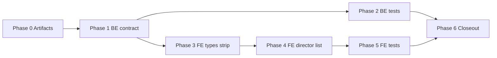

# Plan: profile-directors-top20

Step-by-step FE + BE implementation. No code until phases are approved.

---

## Phase 0 — Artifacts

1. Confirm `feature.md`, `plan.md`, `progress.md` (kickoff).
2. Inventory current contract: `get_user_card_stats.py`, profile stats API schema, `profileTypes.ts`, `ProfileStatsPanel.tsx`.
3. Review `profile-actors-top20` closeout for reusable patterns (`ActorDistributionList`, SQL `LIMIT`, metrics strip changes).

---

## Phase 1 — Backend: cap distribution, drop unique count

**Files (expected):**

| Path | Change |
|------|--------|
| `backend/src/services/profile/get_user_card_stats.py` | Slice `director_distribution` to top 20 by count; remove `unique_directors_count` from insights dataclass / return payload |
| `backend/src/api/profile/schemas.py` (or equivalent) | Drop `unique_directors_count` from response model if exposed explicitly |
| OpenAPI / serializer mirrors | Keep `top_director_*` fields |

**Rules:**

- Sort by `count` desc, then stable tie-break (e.g. name or kinopoisk_id) — document choice in service; mirror actor cap logic.
- `top_director_*` derived from #1 row of full sorted list **before** slice (or from same query — must match previous behavior for leader).
- Do not change actor/franchise/genre distributions in this feature.

**Verify:** `make backend-test-one target=src/tests/...` for profile stats tests.

---

## Phase 2 — Backend: tests

**Files (expected):**

| Path | Change |
|------|--------|
| `backend/src/tests/unit/services/profile/test_get_user_card_stats.py` (or integration under `tests/integration/`) | Assert max 20 directors, ordering, absence of `unique_directors_count`, preserved `top_director_*` |

**Cases:**

- User with >20 distinct directors → response length 20, highest counts first.
- User with ≤10 directors → list length matches distinct count.
- Empty director data → empty distribution, null/zero top director fields.
- Regression: `unique_directors_count` not in serialized JSON.

**Verify:** `make backend-test` (Docker).

---

## Phase 3 — Frontend: types & metrics strip

**Files (expected):**

| Path | Change |
|------|--------|
| `frontend/src/api/profileTypes.ts` | Remove `unique_directors_count` from insights type |
| `frontend/src/components/profile/ProfileStatsPanel.tsx` | Remove «Режиссёров» from `metricStripItems`; keep «Любимый режиссёр» insight block |
| `frontend/src/components/profile/ProfileStatsPanel.tsx` | Link «Любимый актёр» / «Любимый режиссёр» insight values when `top_actor_kinopoisk_id` / `top_director_kinopoisk_id` present |

**Verify:** TypeScript compile; no references to removed field.

---

## Phase 4 — Frontend: Taste director list (replace donut)

**Files (expected):**

| Path | Change |
|------|--------|
| `frontend/src/components/profile/ProfileStatsPanel.tsx` | Remove `directorDonutSegments` + director `StatsDonutChart`; add collapsible ranked list UI |
| Optional extract | `DirectorDistributionList.tsx` if panel grows — mirror `ActorDistributionList` |

**UX spec:**

- Section title consistent with existing Taste blocks (e.g. «По режиссёрам»).
- Default visible rows: **10**; «Показать ещё» (or chevron) expands to **20** max.
- Each row: director name (link to `/directors/:kinopoisk_id` when id present), film count — reuse actor list patterns.
- Optional footer link «Страница топ-режиссёра →» when `top_director_kinopoisk_id` present (mirror actor section).
- Collapsed state resets on navigation away optional (match similar expanders in panel).

**Verify:** `cd frontend && npm run lint && npm run build`.

---

## Phase 5 — Frontend tests (if present)

- Update any component tests or snapshots referencing director donut or `unique_directors_count`.
- Add test for collapse/expand behavior if project has `ProfileStatsPanel` coverage.
- Assert insight links render when kinopoisk ids present.

---

## Phase 6 — Closeout

1. `result.md` — changed files, verification commands, limitations.
2. `docs/features/profile-directors-top20.md`.
3. Action-log fragment + HOT `recent_completed` on merge-ready closeout.

---

## Dependency graph

