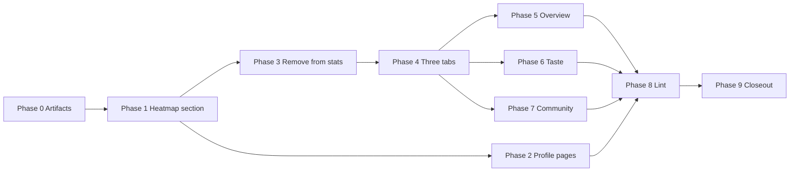

# Plan: profile-heatmap-stats-regroup

Step-by-step frontend implementation. No backend changes. No code until phases are approved.

---

## Phase 0 — Artifacts

1. Confirm `feature.md`, `plan.md`, `progress.md` (kickoff).
2. Inventory current `ProfileStatsPanel.tsx` sub-tab union (`overview` | `taste` | `social` | `rankings` | `rewards`), block placement per tab, and heatmap wiring (`activityShelfId`, `handleActivityDaySelect`, `useUserMovieCardStatsQuery`).
3. Inventory profile page chrome order in `ProfilePage.tsx` and `PublicProfilePage.tsx` (header → bio → pins → `ProfileMainTabs`).

---

## Phase 1 — Extract profile heatmap section

**Files:**

| Path | Change |
|------|--------|
| `frontend/src/components/profile/ProfileActivityHeatmapSection.tsx` | **New.** Self-contained section: loads stats via `useUserMovieCardStatsQuery(userId, activityCategoryId)`, shelves via `publicProfileCardCategoriesQueryKey` + `getUserPublicCardCategories`, owns `activityShelfId` state (reset on `userId` change via `queueMicrotask`), renders `ProfileActivityHeatmap`. Props: `userId`, `cardsQuery`, `onCardsQueryChange`, `onDrillToRatedCards`. `onDaySelect` → `{ completedOn, categoryId: shelfId, sort: 'recent' }` + `onDrillToRatedCards`. Loading/error: compact inline hint or skeleton — do not block entire profile page. |
| `frontend/src/components/profile/ProfileActivityHeatmap.tsx` | No logic change expected; optional: accept `className` or drop `ProfileStatsSectionCard` wrapper if section provides chrome (keep card title **«Активность просмотров»** visible on profile). |

**Props contract (`ProfileActivityHeatmapSection`):**

```ts
type ProfileActivityHeatmapSectionProps = {
  userId: string
  cardsQuery: RatedCardsListQuery
  onCardsQueryChange: (next: RatedCardsListQuery) => void
  onDrillToRatedCards: () => void
  className?: string
}
```

**Verify:** TypeScript compile; heatmap renders with shelf filter and day cells independently of stats tab.

---

## Phase 2 — Mount heatmap on profile pages

**Files:**

| Path | Change |
|------|--------|
| `frontend/src/pages/ProfilePage.tsx` | Import `ProfileActivityHeatmapSection`. Insert after bio / recap banner block and **before** `<ProfileMainTabs …>`. Wire `ratedQuery`, `setRatedQuery`, existing `drillToRatedCards`. Pass `userId={profile.id}`. |
| `frontend/src/pages/PublicProfilePage.tsx` | Same placement: after `PublicProfilePinnedAchievements` / bio, before `<ProfileMainTabs …>`. Wire `ratedQuery`, `setRatedQuery`, `drillToRatedCards`. Pass `userId={profile.id}`. |

**Placement rule:** profile chrome only — never inside `ProfileStatsTab` / lazy `ProfileStatsPanel`.

**Verify:** Manual — own + public profile show heatmap above main tabs; stats tab no longer required to see heatmap (after Phase 3).

---

## Phase 3 — Remove heatmap from stats panel

**Files:**

| Path | Change |
|------|--------|
| `frontend/src/components/profile/ProfileStatsPanel.tsx` | Remove `ProfileActivityHeatmap` import and JSX from `overview` sub-tab. Remove `activityShelfId` / `activityCategoryId` state and `useEffect` reset if only used by heatmap. Keep `useUserMovieCardStatsQuery` for stats blocks (shelf-filtered stats may still use `cardsQuery.categoryId` or drop activity shelf coupling — heatmap section owns activity shelf filter). Remove `handleActivityDaySelect`. |

**Verify:** Stats **Обзор** opens without heatmap; profile-level heatmap still works.

---

## Phase 4 — Collapse sub-tabs to three

**Files:**

| Path | Change |
|------|--------|
| `frontend/src/components/profile/ProfileStatsPanel.tsx` | Change `StatsSubTab` to `'overview' | 'taste' | 'community'` only. Replace `BASE_STATS_SUB_TABS` with exactly `{ overview: 'Обзор', taste: 'Вкус', community: 'Сообщество' }`. Remove dynamic `rewards` tab push. Remove `rankings` tab render branch. Migrate any `useState` default / persisted sub-tab: map old `'social'` → `'community'`, `'rankings'` → `'overview'`, `'rewards'` → `'community'`. Update taste-quiz `useEffect` guard: `statsSubTab !== 'community'` (was `social`). |

**Verify:** Sub-tab bar shows exactly three labels; no **Рейтинги** / **Награды** / **Социальность**.

---

## Phase 5 — Regroup **Обзор** content

**Files:**

| Path | Change |
|------|--------|
| `frontend/src/components/profile/ProfileStatsPanel.tsx` | In `overview` branch, keep: metric strip, insights, rating contrast, polarity. **Move from former `rankings` tab:** `StatsRatedCardRows` blocks **«Топ по оценке»** and **«Самые низкие оценки»** (preserve `rankingsQuery` / `needsFilteredRankings` / skeleton / error handling). Do **not** move popular tag chips here (they go to **Вкус**). |

**Verify:** Overview shows six block groups; drill from top/worst rows still works via `onDrillToRatedCards`.

---

## Phase 6 — Regroup **Вкус** content

**Files:**

| Path | Change |
|------|--------|
| `frontend/src/components/profile/ProfileStatsPanel.tsx` | Keep rating-scale donut first. **Combined «Теги»:** wrap `TagBubbleChart` + popular tag chips (moved from old `rankings` tab) in one `ProfileStatsSectionCard` titled **«Теги»** (subsection headings optional: bubble vs chips). **Combined «Как смотрю»:** wrap company + mood donuts in one `ProfileStatsSectionCard` titled **«Как смотрю»** (keep interactive drill on segments). Below: shelves, genres, `PeopleDistributionSection`, franchises, decades — order unchanged from current taste tab. |

**Verify:** All taste distribution blocks still render; tag chip toggle still updates `cardsQuery.tags` and drills.

---

## Phase 7 — Regroup **Сообщество** content

**Files:**

| Path | Change |
|------|--------|
| `frontend/src/components/profile/ProfileStatsPanel.tsx` | Rename tab label to **Сообщество**. Keep: taste-quiz teaser, mutual subscriptions, `SocialTastePeers`. **Move from old `rewards` tab:** `ProfilePassportPanel` (when `showPassportCollection`), `AchievementsPanel` (when `showAchievements`) — section headers **«Коллекция»** / **«Достижения»** or existing panel titles. Preserve `onMarathonDrill`, `showTasteQuizTeaser` as `isOwnProfile` proxy for passport. |

**Verify:** Own profile shows quiz + passport + achievements in **Сообщество**; public profile shows mutual + peers (+ passport when applicable); no empty **Награды** tab.

---

## Phase 8 — Tests and lint

**Files:**

| Path | Change |
|------|--------|
| `frontend/src/components/profile/ProfileStatsPanel.test.ts` | Extend only if new pure helpers extracted; otherwise no change required. |
| `frontend/src/components/profile/ProfileActivityHeatmapSection.test.tsx` | **Optional.** Unit test shelf-id → `activityCategoryId` mapping or day-select payload if logic extracted. |

**Verify:**

```bash
cd frontend && npm run lint && npm run build
```

Manual smoke: heatmap day drill; each stats sub-tab scroll-through on own + public profile.

---

## Phase 9 — Closeout

1. `.cursor/active/profile-heatmap-stats-regroup/result.md` — changed files, verification, known limitations.
2. `docs/features/profile-heatmap-stats-regroup.md` — user-facing summary of new layout.
3. Action-log fragment + HOT update on merge-ready closeout.

---

## File checklist (DoD)

| Path | Role |
|------|------|
| `frontend/src/components/profile/ProfileActivityHeatmapSection.tsx` | New profile-chrome heatmap host |
| `frontend/src/pages/ProfilePage.tsx` | Mount section before main tabs |
| `frontend/src/pages/PublicProfilePage.tsx` | Mount section before main tabs |
| `frontend/src/components/profile/ProfileStatsPanel.tsx` | Three-tab regroup, block moves, heatmap removal |
| `docs/features/profile-heatmap-stats-regroup.md` | Published feature doc (closeout) |

---

## Dependency graph


