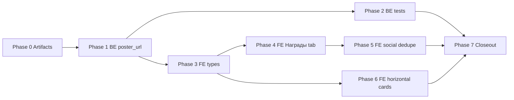

# Plan: profile-stats-people-restructure

Step-by-step FE + BE implementation. No code until phases are approved.

---

## Phase 0 — Artifacts

1. Confirm `feature.md`, `plan.md`, `progress.md` (kickoff).
2. Inventory: `ProfileStatsPanel.tsx` sub-tab builder, taste vs social sections, `DirectorDistributionList` / `ActorDistributionList`.
3. Inventory backend: `DirectorDistributionItem`, director aggregation loop in `get_user_card_stats.py`, `DirectorDistributionItemResponse` in schemas.

---

## Phase 1 — Backend: director `poster_url`

**Files (expected):**

| Path | Change |
|------|--------|
| `backend/src/services/profile/get_user_card_stats.py` | Extend `DirectorDistributionItem` with `poster_url`; track per-director poster while iterating rated cards (from `Film.primary_director_poster_url`); prefer non-null poster when multiple films share a director |
| `backend/src/api/profile/schemas.py` | Add `poster_url` to director distribution response item |
| `backend/src/api/profile/schemas.py` (mapper) | Map `poster_url` in `director_distribution` serialization |

**Rules:**

- Mirror actor distribution pattern: `poster_url: str | None`.
- When several films contribute to the same director, keep first non-null `primary_director_poster_url` encountered (or prefer film with highest rating — document in service comment).
- Do not change actor aggregation or cap-at-20 behavior.

**Verify:** `make backend-test-one target=src/tests/integration/api/test_profile_routes.py` (scoped cases).

---

## Phase 2 — Backend: tests

**Files (expected):**

| Path | Change |
|------|--------|
| `backend/src/tests/integration/api/test_profile_routes.py` | Assert `director_distribution[].poster_url` when films have `primary_director_poster_url`; assert `null` when absent |

**Cases:**

- Rated films with director poster → distribution entry includes URL.
- Rated films without director poster → `poster_url` is `null`, other fields unchanged.
- Regression: ordering, cap at 20, `top_director_*` insights unchanged.

**Verify:** `make backend-test` (Docker).

---

## Phase 3 — Frontend: types

**Files (expected):**

| Path | Change |
|------|--------|
| `frontend/src/api/profileTypes.ts` | Add `poster_url?: string | null` to `DirectorDistributionItem` (align with actors) |

**Verify:** TypeScript compile; no unsafe casts.

---

## Phase 4 — Frontend: sub-tab «Награды»

**Files (expected):**

| Path | Change |
|------|--------|
| `frontend/src/components/profile/ProfileStatsPanel.tsx` | Adjust `StatsSubTab` union and `statsSubTabs` builder: when `showAchievements`, replace `collection` + `achievements` with single `rewards` tab labeled **«Награды»** |
| `frontend/src/components/profile/ProfileStatsPanel.tsx` | Render `ProfilePassportPanel` + `AchievementsPanel` under `statsSubTab === 'rewards'` with section headers |

**UX spec:**

- **Награды** order: passport/collection first (when `showPassportCollection`), achievements below (when `showAchievements`).
- Preserve `onMarathonDrill`, `isOwnProfile` props from current collection/achievements tabs.
- Deep links / default sub-tab: if user had `collection` or `achievements` in local state, map to `rewards` (optional migration in `useState` initializer).

**Verify:** manual check own profile vs public profile tab sets.

---

## Phase 5 — Frontend: dedupe Social vs Taste

**Files (expected):**

| Path | Change |
|------|--------|
| `frontend/src/components/profile/ProfileStatsPanel.tsx` | Remove `watchSummaryRows` / `moodSummaryRows` blocks from **Социальность** tab |
| `frontend/src/components/profile/ProfileStatsPanel.tsx` | Keep company/mood donuts on **Вкус** tab unchanged |

**Verify:** Social tab shows only social-only sections; Taste donuts still filter cards.

---

## Phase 6 — Frontend: horizontal people cards

**Files (expected):**

| Path | Change |
|------|--------|
| `frontend/src/components/profile/ProfileStatsPanel.tsx` | Replace `DirectorDistributionList` / `ActorDistributionList` vertical lists with horizontal scroll rows |
| Optional extract | `PersonDistributionCarousel.tsx` shared component for director + actor cards |

**UX spec:**

- Horizontal `overflow-x-auto` row with `snap` or gap between portrait cards (~72–88px photo, name truncate, count badge).
- Card tap → `/directors/:id` or `/actors/:id` with `userId` query when viewing another profile.
- Director: `Avatar` / image from `poster_url`, fallback initials.
- Actor: existing `poster_url` behavior.
- Optional «Показать все» only if list exceeds viewport — prefer full horizontal scroll over collapse for ≤20 items.
- Keep footer links «Страница топ-режиссёра/актёра →» when insights present.

**Verify:** `cd frontend && npm run lint && npm run build`.

---

## Phase 7 — Closeout

1. `result.md` — changed files, verification commands, limitations.
2. `docs/features/profile-stats-people-restructure.md`.
3. Action-log fragment + HOT `recent_completed` on merge-ready closeout.

---

## Dependency graph

