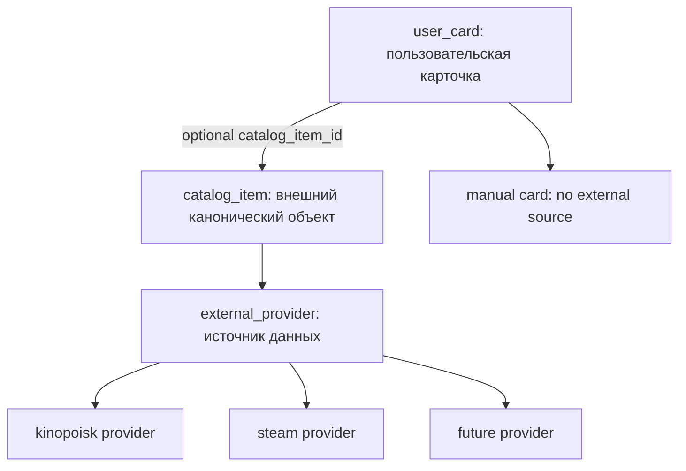

# Universal User Cards

## Цель

Сделать приложение независимым от Кинопоиска и бизнес-центрации на фильмах. Основной объект домена должен быть универсальной пользовательской карточкой чего угодно: фильма, игры, книги, дерева, места, события или полностью ручной записи.

Главный инвариант: все существующие пользовательские карточки из `movie_card` должны сохраниться без пересоздания, с теми же `id`, владельцами, текстами, реакциями, постами, статистикой и связями. В проде уже больше 1000 карточек, поэтому миграция должна быть conservative-first и проверяемой тестами.

## Новая Доменная Модель



- `user_card` — главная сущность приложения. Это то, что создал пользователь. Бывшая `movie_card`, но с нейтральным названием и универсальной семантикой.
- `catalog_item` — опциональная каноническая ссылка на внешний объект. Не является пользовательской карточкой.
- `external_provider` или enum/provider registry — источник внешних данных: `kinopoisk`, позже `steam`, `goodreads`, любой другой.
- Provider adapters/resolvers — слой интеграций, который знает, как искать и нормализовать данные конкретного сервиса.

## Ключевое Решение

Не делать `catalog_item` основной моделью карточки. Это сломает смысл пользовательских карточек: у разных пользователей могут быть разные карточки на один и тот же внешний объект, а часть карточек вообще не должна иметь внешнего объекта.

Правильное направление миграции:

```text
movie_card -> user_card
film -> catalog_item(provider='kinopoisk')
kinopoisk-specific logic -> provider adapter/resolver
```

`catalog_item` нужен для дедупликации внешних объектов, community views, поиска по источникам и подтягивания метаданных. Но пользовательский контент, id карточки, владелец, видимость, посты и реакции должны оставаться на стороне `user_card`.

## Backend Scope

### 1. Database Migration

Затронутые области:

- `backend/src/.../models/movie_card.py`
- `backend/src/.../models/film.py`
- Alembic migrations
- модели feed/reactions, где сейчас используется `MOVIE_CARD`

План миграции:

- Переименовать таблицу `movie_card` в `user_card` или ввести `user_card` с переносом primary key без изменения `id`.
- Добавить универсальные поля отображения на `user_card`: `title`, `cover_url`, `summary`, возможно `source_url` и typed metadata для пользовательского слоя.
- Добавить nullable `catalog_item_id` на `user_card`.
- Создать `catalog_item` из существующих `film` записей с `provider='kinopoisk'` и `external_id` из текущего кинопоискового идентификатора.
- Связать существующие `user_card.catalog_item_id` с созданными `catalog_item`.
- Сохранить совместимость старых связей на переходный период: `film_id` может остаться deprecated alias/legacy column до завершения миграции API и фронта.
- Заменить уникальность `user_id + film_id` на partial unique `user_id + catalog_item_id WHERE catalog_item_id IS NOT NULL`.
- Разрешить много ручных карточек с `catalog_item_id IS NULL`.

Обязательные проверки миграции:

- количество строк до/после совпадает;
- набор `id` карточек до/после совпадает;
- все старые карточки имеют заполненный `catalog_item_id`;
- реакции, feed posts, комментарии, mentions и статистика продолжают ссылаться на те же карточки;
- нет пересоздания карточек с новыми id.

### 2. Domain Services

Затронутые области:

- `backend/src/.../services/create_movie_card.py`
- `backend/src/.../services/update_movie_card.py`
- `backend/src/.../services/get_movie_card_details.py`
- `backend/src/.../services/list_movie_card_feed.py`
- `backend/src/.../services/list_user_movie_cards.py`
- `backend/src/.../services/list_film_community_cards.py`
- `backend/src/.../services/search_catalog_films.py`

Направление:

- Переименовать сервисы в card-first нейтральные названия: `CreateUserCardService`, `UpdateUserCardService`, `GetUserCardDetailsService`, `ListUserCardFeedService`.
- Убрать из бизнес-логики предположение, что карточка всегда фильм.
- Вынести Кинопоиск в provider-specific слой: `KinopoiskCatalogProvider`, `ResolveCatalogItemService`, `SearchCatalogItemsService`.
- Создание карточки должно поддерживать три сценария:
  - ручная карточка без внешнего источника;
  - карточка по существующему `catalog_item_id`;
  - карточка через resolver URL/search, который создает или находит `catalog_item`.
- Community-cards должны работать по `catalog_item_id`, а не по `film_id`.

### 3. API Compatibility

Затронутые области:

- `backend/src/.../api/cards/schemas.py`
- `backend/src/.../api/cards/routes.py`
- `backend/src/.../api/films/routes.py`
- новый или обновленный `backend/src/.../api/catalog/routes.py`

Подход:

- Ввести новые endpoints/DTO вокруг `cards` и `catalog`, не завязанные на фильмы.
- Сохранить старые `film_*`, `film_id`, `/api/films/*` как compatibility layer на переходный период.
- В новых ответах использовать структуру:
  - `card`: пользовательские поля;
  - `catalog`: nullable внешний объект;
  - `provider`: источник, если есть;
  - deprecated `film_*` только для старого фронта.
- Новый `/api/catalog/resolve` или аналог должен принимать URL/search query и возвращать нормализованный draft: provider, external id, title, cover, summary.

### 4. Frontend Scope

Затронутые области:

- `frontend/src/api/profileTypes.ts`
- `frontend/src/api/cardApi.ts`
- `frontend/src/api/profileApi.ts`
- `frontend/src/api/feedInFeedTypes.ts`
- `frontend/src/pages/CreateCardPage*`
- `frontend/src/pages/EditMovieCardPage*`
- `frontend/src/pages/MovieCardDetailPage*`
- `frontend/src/components/FeedCard*`
- `frontend/src/components/FeedPostCard*`

Направление:

- Переименовать frontend domain types из movie/film-centered в user-card/card-centered.
- UI создания карточки должен позволять ручное создание без Кинопоиска.
- Внешний источник должен быть optional enhancement: вставил ссылку, resolver нашел данные, пользователь подтвердил или отредактировал.
- Детали карточки и feed должны отображать `user_card` first, а `catalog_item` использовать только для badge/source/external link.
- Кнопки внешних сервисов должны строиться по `provider`, а не по жесткому Kinopoisk URL.

## Phased Delivery

### Phase 1: Schema Foundation

- Добавить `catalog_item` и provider model/enum.
- Подготовить `user_card` как новое имя для `movie_card` с сохранением id.
- Сделать backfill из `film` в `catalog_item`.
- Связать старые карточки с `catalog_item`.
- Добавить миграционные тесты-инварианты.

### Phase 2: Backend Read Compatibility

- Перевести read DTO на `user_card + catalog_item`.
- Сохранить deprecated `film_*` поля в ответах.
- Перевести details/feed/profile/community reads без смены пользовательского поведения.

### Phase 3: Backend Write Path

- Реализовать создание ручной карточки.
- Реализовать создание по `catalog_item_id`.
- Реализовать provider resolver для Kinopoisk как первого адаптера.
- Обновить uniqueness и conflict handling.

### Phase 4: Frontend Migration

- Обновить типы и API-клиент.
- Переделать создание/редактирование карточек под card-first модель.
- Обновить detail/feed/profile UI.
- Оставить compatibility с deprecated backend-полями только где нужно для плавного перехода.

### Phase 5: Cleanup

- Убрать прямую бизнес-зависимость от `film_id` в карточках.
- Убрать или изолировать старые `/api/films/*` endpoints.
- Переименовать оставшиеся movie/film-specific symbols, если они больше не отражают домен.
- Документировать новую архитектуру в `docs/features/abstract-user-cards.md`.

## Testing And Verification

Backend tests должны запускаться внутри Docker по правилам проекта.

Покрыть:

- миграцию: count/id preservation, связи, уникальность;
- создание ручной карточки без `catalog_item`;
- создание карточки по `catalog_item_id`;
- конфликт при повторной карточке одного пользователя на тот же `catalog_item`;
- несколько ручных карточек одного пользователя без catalog link;
- read DTO с deprecated `film_*` и новыми `catalog`/`card` полями;
- community-cards по `catalog_item_id`;
- feed/details/profile после миграции;
- Kinopoisk resolver как первый provider adapter.

Frontend verification:

- `cd frontend && npm run lint && npm run build`;
- ручное создание карточки;
- создание через внешний источник;
- просмотр старой мигрированной карточки;
- лента и профиль не теряют старые карточки.

## Non Goals For First Delivery

- Не добавлять все возможные провайдеры сразу.
- Не делать `catalog_item` пользовательской карточкой.
- Не удалять мгновенно все legacy `film`/`movie` названия, если это увеличивает риск миграции.
- Не менять id существующих карточек.
- Не переписывать вотчлист, если он пока остается отдельным film-centered модулем.

## Acceptance Criteria

- Все существующие карточки доступны после миграции с теми же `id`.
- Приложение умеет создавать карточку без Кинопоиска и без любого внешнего источника.
- Приложение умеет создавать карточку, связанную с внешним `catalog_item`.
- Кинопоиск работает как один provider, а не как основа доменной модели.
- Новые provider-ы можно добавлять через adapter/resolver без добавления колонок вроде `steam_id`, `book_id`, `tree_id` в `user_card`.
- Старый API/frontend не ломается на переходном этапе за счет deprecated compatibility fields.
- Есть Docker-backed backend tests на миграцию и ключевые API сценарии.
- Есть финальная документация фичи и progress/result артефакты по workflow проекта.
