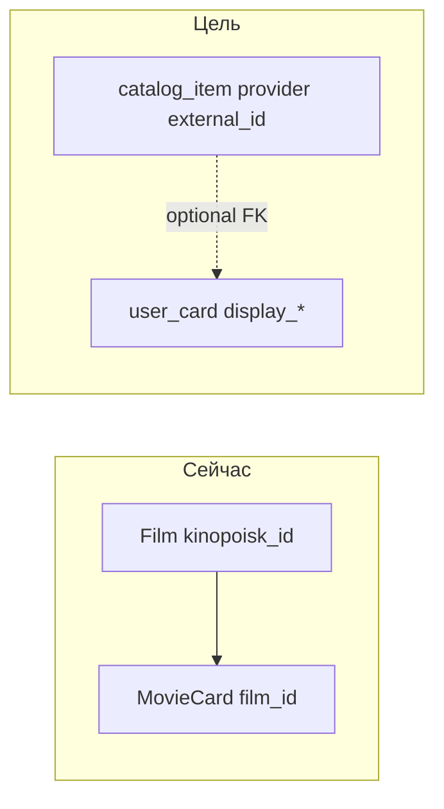

# План: универсальная карточка + канон по внешнему источнику

## Сопоставление с текущим кодом

Сейчас домен зафиксирован так:

- **[`backend/src/models/film.py`](backend/src/models/film.py)** — каталог только Кинопоиска: `kinopoisk_id` unique, метаданные для UI.
- **[`backend/src/models/movie_card.py`](backend/src/models/movie_card.py)** — карточка пользователя **всегда** с `film_id` FK на `film.id`, уникальность **`uq_movie_card_user_film`** `(user_id, film_id)`.
- **Создание:** [`CreateMovieCardService`](backend/src/services/cards/create_movie_card.py) проверяет соответствие `film_id` и `kinopoisk_id` строке `Film`, затем создаёт `MovieCard`; при конфликте уникальности — `MovieCardAlreadyExistsError`.
- **Резолв ссылки КП:** [`ResolveKinopoiskFilmService`](backend/src/services/kinopoisk/resolve_kinopoisk_film.py) + [`POST /api/films/resolve`](backend/src/api/films/routes.py).
- **«Другие оценки того же тайтла»:** [`GET /api/films/{film_id}/community-cards`](backend/src/api/films/routes.py) + [`ListFilmCommunityCardsService`](backend/src/services/films/list_film_community_cards.py) — ключ агрегации = **`film_id`**.
- **Лента и детали:** большой конвейер в [`list_movie_card_feed.py`](backend/src/services/cards/list_movie_card_feed.py), маппинг в [`api/cards/schemas.py`](backend/src/api/cards/schemas.py) (`MovieCardFeedItemResponse`, `CardDetailResponse` с полями `film_*`).
- **Посты ленты:** [`FeedPost.referenced_movie_card_id`](backend/src/models/feed_post.py) — FK на `movie_card.id` (id карточек сохраняем).
- **Реакции:** [`ReactionTargetKind.MOVIE_CARD`](backend/src/models/reaction_target_kind.py) + `UserReaction.target_id` = int; менять строку `target_kind` необязательно в первой волне (можно оставить значение `'movie_card'` как legacy-имя цели «карточка»).
- **Инлайн-упоминания карточек в тексте:** токены `c{id}` в [`inline_movie_card_ref_tokens.py`](backend/src/services/cards/inline_movie_card_ref_tokens.py), сниппеты с `film_title` / `film_year`.
- **Поиск каталога:** [`SearchCatalogResponse`](backend/src/api/search/schemas.py) / [`SearchCatalogFilmsService`](backend/src/services/search/search_catalog_films.py) — только фильмы + `my_card_id` через [`GetMyMovieCardIdForFilmService`](backend/src/services/cards/get_my_movie_card_id_for_film.py).
- **Фронт:** единый тип [`MovieCard` / `FeedMovieCard`](frontend/src/api/profileTypes.ts) с обязательными `film_id`, `film_kinopoisk_id`, `film_*`; создание — [`CreateMovieCardPayload`](frontend/src/api/cardApi.ts) + `resolveFilmByKinopoiskUrl`; страницы [`CreateCardPage`](frontend/src/pages/CreateCardPage.tsx), [`MovieCardDetailPage`](frontend/src/pages/MovieCardDetailPage.tsx), лента [`FeedCard`](frontend/src/components/feed/FeedCard.tsx) / [`FeedPostCard`](frontend/src/components/feed/FeedPostCard.tsx).

Цель миграции: **разделить «что показываем» (пользовательские/денормализованные поля карточки) и «к чему привязаны другие люди» (канон по provider + external_id)**. Кинопоиск — первый провайдер; книги/еда — `catalog_item_id` NULL, только пользовательский контент.

---

## Архитектурные варианты (выбор)

| Вариант | Суть | Плюсы | Минусы |
|--------|------|--------|--------|
| **A (рекомендуемый)** | Новая таблица `catalog_item` (provider, external_id, snapshot полей); `movie_card.catalog_item_id` nullable; постепенно `film_id` nullable / удалён из write-path | Чистая модель под Steam/IGDB; ручные карточки без строки в каталоге | Больше миграции и join-ов на переходном этапе |
| **B** | Расширить `Film` в «универсальный каталог» (тип + nullable kinopoisk_id) | Меньше таблиц | Таблица `film` семантически ложна для игр/книг; усложнение индексов и API |
| **C** | Только колонки на `movie_card`, без глобального канона | Быстро для MVP ручных карточек | Нет связи «один KP id — много пользователей» без дублирования данных |

**Рекомендация:** вариант **A**: `catalog_item` как единственный канон для внешних объектов; существующие `Film` мигрировать в `catalog_item` с `provider=kinopoisk_film` и сохранением **того же числового id**, что у `film.id` (одноразовый data-migration `INSERT INTO catalog_item SELECT id, ... FROM film`), затем `movie_card.catalog_item_id = film_id` для всех строк и постепенный отказ от чтения через `Film` в пользу snapshot на `catalog_item` или join на один источник.

---

## Целевая схема данных (детали)

1. **`catalog_item`**
   - `id` int PK (заполнить из `film.id` при миграции КП-строк).
   - `provider` str/enum: минимум `kinopoisk_film`.
   - `external_id` str (нормализованный id КП как строка для единообразия со Steam).
   - Поля снимка: `title`, `year`, `cover_url`, `genres` JSON, `short_description`, `long_description` (имена подогнать под уже существующие в `Film`).
   - `UNIQUE(provider, external_id)`.
   - Индексы под поиск (перенос логики из поиска по `Film`).

2. **`movie_card` (переименование таблицы опционально позже)**
   - `catalog_item_id` int NULL FK → `catalog_item.id` (для старых карточек NOT NULL после бэкфилла).
   - Пользовательский слой отображения: `display_title`, `display_cover_url`, `display_summary` (и при необходимости `display_subtitle` / `display_body`) — бэкфилл из `Film` для существующих карточек.
   - **`film_id`:** переходный период держать синхронно с `catalog_item_id` при `provider=kinopoisk_film` ИЛИ сделать nullable и заполнять только для обратной совместимости старых join-ов; конечная цель — один FK `catalog_item_id`.
   - Уникальность: **частичный unique** `(user_id, catalog_item_id) WHERE catalog_item_id IS NOT NULL` вместо `uq_movie_card_user_film`.
   - Для `catalog_item_id IS NULL` — без уникального ограничения (много ручных карточек).

3. **`Film`**
   - После стабилизации: либо view на `catalog_item WHERE provider=kinopoisk_film`, либо удаление и полная замена сервисами на `catalog_item` (отдельная фаза, чтобы не сломать вотчлист сразу).

4. **`UserWatchlistFilm`**
   - Остаётся на `film_id` в первой волне ([`backend/src/models/user_watchlist_film.py`](backend/src/models/user_watchlist_film.py)); в плане явно **не обобщать** вотчлист, пока не согласован отдельный продукт.

---

## API: эволюция контрактов

- **Обратная совместимость ответов:** в `CardDetailResponse` / `MovieCardFeedItemResponse` ([`api/cards/schemas.py`](backend/src/api/cards/schemas.py)) сохранить поля `film_*` и `film_id` как **deprecated alias** из `display_*` / `catalog_item` для 1–2 релизов; новые поля: `card_display`, `catalog` (`provider`, `external_id`, `catalog_item_id`).
- **Создание карточки:** расширить `CardCreateRequest`: режим A — только ручные поля + опционально `resolve_url`; режим B — `catalog_item_id` + оценка/теги (как сейчас); убрать обязательность пары `film_id`+`kinopoisk_id` для ручных карточек.
- **Новый endpoint** (или расширение): `POST /api/catalog/resolve` (или `/api/cards/resolve-link`) — URL → провайдер + черновик полей; внутри реестр резолверов: сначала только КП (обёртка над текущим [`parse_kinopoisk_film_id`](backend/src/services/kinopoisk/parse_url.py) + клиент).
- **Фильмы:** [`/api/films/*`](backend/src/api/films/routes.py) оставить как thin-wrapper над `catalog_item` с `provider=kinopoisk_film` или пометить deprecated в пользу `/api/catalog/items/{id}` — решение зафиксировать в фазе 2, чтобы не ломать [`cardApi.ts`](frontend/src/api/cardApi.ts) сразу.

---

## Сервисный слой (файлы с наибольшим объёмом правок)

- Создание/обновление: [`create_movie_card.py`](backend/src/services/cards/create_movie_card.py), [`update_movie_card.py`](backend/src/services/cards/update_movie_card.py).
- Детали и лента: [`get_movie_card_details.py`](backend/src/services/cards/get_movie_card_details.py), [`list_movie_card_feed.py`](backend/src/services/cards/list_movie_card_feed.py) (файл ~1000+ строк — планировать вынос сборки DTO в маленькие хелперы при правках, без массового рефакторинга «ради красоты»).
- Профиль и экспорт: [`list_user_movie_cards.py`](backend/src/services/profile/list_user_movie_cards.py), [`export_my_movie_cards_csv_telegram.py`](backend/src/services/profile/export_my_movie_cards_csv_telegram.py), [`get_user_movie_card_stats.py`](backend/src/services/profile/get_user_movie_card_stats.py).
- Community: [`list_film_community_cards.py`](backend/src/services/films/list_film_community_cards.py) → обобщить на `catalog_item_id` (роут может стать `/api/catalog/items/{id}/community-cards` с редиректом со старого `film_id` при равенстве id).
- Поиск: [`search_catalog_films.py`](backend/src/services/search/search_catalog_films.py), [`get_my_movie_card_id_for_film.py`](backend/src/services/cards/get_my_movie_card_id_for_film.py) → «моя карточка по catalog_item».
- Telegram: все `notify_*movie_card*` в [`backend/src/services/telegram/`](backend/src/services/telegram/) — проверить тексты и deep link; без смены id карточек ссылки живы.
- Celery: [`telegram_engagement.py`](backend/src/tasks/telegram_engagement.py), bump глобальной ленты ([`global_feed_head_broker`](backend/src/services/feed/global_feed_head_broker.py)) — регрессионные тесты.

---

## Фронтенд

- Типы: разделить «карточка в ленте» от кино-легенды — расширить [`profileTypes.ts`](frontend/src/api/profileTypes.ts) (поля `catalog`, `display`), сохранить совместимость при парсинге.
- API-слой: [`cardApi.ts`](frontend/src/api/cardApi.ts), [`profileApi.ts`](frontend/src/api/profileApi.ts), [`feedInFeedTypes.ts`](frontend/src/api/feedInFeedTypes.ts), нормализация в [`cardApi` `normalizeFeedPageItem`](frontend/src/api/cardApi.ts).
- UI: [`CreateCardPage`](frontend/src/pages/CreateCardPage.tsx), [`EditMovieCardPage`](frontend/src/pages/EditMovieCardPage.tsx), [`MovieCardDetailPage`](frontend/src/pages/MovieCardDetailPage.tsx) (кнопка КП только при `provider=kinopoisk_film`), [`FeedCard`](frontend/src/components/feed/FeedCard.tsx), [`FeedPostCard`](frontend/src/components/feed/FeedPostCard.tsx), профильные гриды.
- Инлайн-токены: при необходимости подпись сниппета брать из `display_title`, а не только из `film_title` ([`inline_movie_card_ref_tokens.py`](backend/src/services/cards/inline_movie_card_ref_tokens.py) + фронт, если дублирует логику).

---

## Тестирование (обязательные зоны)

Расширить/добавить pytest (в Docker по [`Makefile`](Makefile)):

- [`backend/src/tests/api/test_cards_routes.py`](backend/src/tests/api/test_cards_routes.py) — создание ручной карточки, создание по URL, конфликт уникальности на один `catalog_item`, PATCH полей display.
- [`backend/src/tests/api/test_film_community_routes.py`](backend/src/tests/api/test_film_community_routes.py) / новый тест для catalog community.
- Лента: существующие тесты feed + снимок DTO с новыми полями.
- Реакции: [`test_reactions_routes.py`](backend/src/tests/api/test_reactions_routes.py) — без смены `target_kind` должны проходить как есть.
- Поиск: [`test_search_routes.py`](backend/src/tests/api/test_search_routes.py) — `my_card_id` для привязанных карточек.
- Миграция: отдельный тест на инварианты после бэкфилла (кол-во строк, `catalog_item_id` NOT NULL для старых карточек, уникальность).

---

## Фазы внедрения

1. **Схема + миграция Alembic:** `catalog_item` + новые колонки `movie_card` + бэкфилл + partial unique + отключение старого unique после проверки.
2. **Read-path:** сервисы отдают старые `film_*` из новых полей / join `catalog_item`; интеграционные тесты зелёные без смены клиента.
3. **Write-path:** новые сценарии создания; обновление `display_*`; резолв URL.
4. **Фронт:** формы и типы; feature-flag по желанию.
5. **Чистка:** удалить дублирующую зависимость от `Film` в карточках; опционально переименование API/таблицы; обновить документацию фичи по правилам репозитория ([`.cursor/rules/feature-delivery-workflow.mdc`](.cursor/rules/feature-delivery-workflow.mdc)).

---

## Документация по процессу (после утверждения плана)

- По прикреплённому **brainstorming**: после вашего «ок» на этот план — зафиксировать согласованный дизайн в `docs/superpowers/specs/2026-05-11-abstract-user-cards-design.md` (или в `.cursor/features/...` + `docs/features/...` по вашему основному workflow) и только затем вызывать детальный implementation plan (writing-plans), если нужен отдельный чеклист по PR.

---

## Риски и явные неохваты первой волны

- Лицензии и квоты новых провайдеров (Steam и т.д.) — только после появления второго резолвера.
- Переименование `movie_card` в БД и `ReactionTargetKind` — отложено, чтобы не трогать все реакции в одном PR.
- Вотчлист и CSV-экспорт могут оставаться «кино-центричными» до отдельной фичи.
