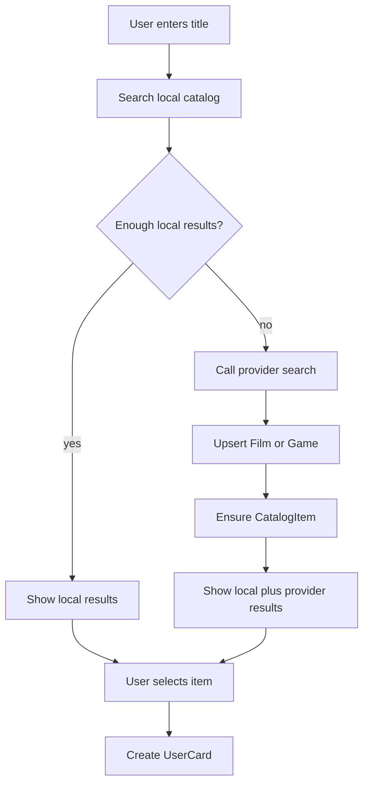

# Local-First Catalog Search

## Product Direction

Переходим от `вставь ссылку` к `найди в каталоге`. Ссылка на Кинопоиск может остаться дополнительным shortcut, но основной сценарий для фильмов и игр должен быть одинаковым: поиск по названию, выбор результата, сохранение карточки.

Главное правило: сначала ищем в нашем локальном каталоге. Только если локально недостаточно результатов или каталог устарел, идём во внешний API. Всё, что пришло из провайдера и было показано/выбрано, сохраняем локально.



## Data Model

### CatalogItem

Update [backend/src/models/catalog_item.py](backend/src/models/catalog_item.py):

- Extend `CatalogProvider` with `rawg`.
- Keep `no_provider` for manual cards only; do not use it for `CatalogItem` rows.
- Add nullable `game_id` FK, mirroring existing `film_id`.
- Keep unique `(provider, external_id)`.

Conceptually:

```text
catalog_item
- provider: kinopoisk | rawg
- external_id: string
- film_id: nullable
- game_id: nullable
```

For now, enforce “exactly one of film_id/game_id for provider-backed catalog items” in services. A DB check can come later if migrations stay simple.

### Game Table

Add `Game` model, likely [backend/src/models/game.py](backend/src/models/game.py), backed by a new `game` table.

Store both normalized fields and RAWG snapshots:

- Identity: `rawg_id` unique, `slug`, `name`, `name_original`.
- Display/search: `released`, `tba`, `background_image`, `background_image_additional`, `description`, `website`.
- Ratings/counts: `rating`, `rating_top`, `ratings_count`, `metacritic`, `playtime`, `added`, `suggestions_count`, etc.
- Nested data as JSONB: `platforms_json`, `metacritic_platforms_json`, `esrb_rating_json`, `ratings_json`, `added_by_status_json`, `reactions_json`, `alternative_names_json`.
- Raw fidelity: `raw_search_snapshot`, `raw_detail_snapshot`.
- Sync audit: `list_synced_at`, `detail_fetched_at`, `updated_at_rawg`.

This gives us rich local search/display now and preserves provider-specific detail for future UI without schema churn.

## Backend Services

### Provider Contract

Introduce a normalized provider-facing DTO, for example:

```text
CatalogSearchHitDTO
- provider
- external_id
- kind: film | game
- title
- subtitle
- year_or_released
- cover_url
- summary
- catalog_item_id
- local_subject_id
- source: local | provider
```

### Local-First Search

Add services under [backend/src/services/catalog](backend/src/services/catalog):

- `SearchCatalogService`: dispatches by provider and query.
- `SearchLocalFilmsService`: DB-only film search.
- `SearchLocalGamesService`: DB-only game search.
- `SearchKinopoiskFilmsService`: local first, then Kinopoisk search fallback.
- `SearchRawgGamesService`: local first, then RAWG fallback.
- `UpsertRawgGameService`: persists RAWG list/detail DTOs without clearing detail-only fields on list-only updates.
- `EnsureCatalogItemService`: idempotently creates/returns `CatalogItem` for `(provider, external_id)`.

RAWG provider code already exists in [backend/src/providers/rawg/rawg_provider_transport.py](backend/src/providers/rawg/rawg_provider_transport.py): use `search_games` for list and `get_game` for detail.

Kinopoisk needs a new search method in [backend/src/providers/kinopoisk/kinopoisk_provider_transport.py](backend/src/providers/kinopoisk/kinopoisk_provider_transport.py):

- Preferred search endpoint from swagger: `GET /api/v2.1/films/search-by-keyword?keyword=...`.
- Detail remains `GET /api/v2.2/films/{id}`.

## API

Add a search endpoint in [backend/src/api/catalog/routes.py](backend/src/api/catalog/routes.py):

```http
GET /api/catalog/search?provider=kinopoisk&q=matrix&page=1
GET /api/catalog/search?provider=rawg&q=witcher&page=1
```

Response:

```json
{
  "items": [
    {
      "provider": "rawg",
      "external_id": "3328",
      "catalog_item_id": 123,
      "kind": "game",
      "title": "The Witcher 3: Wild Hunt",
      "subtitle": "2015 · RPG",
      "cover_url": "...",
      "source": "provider"
    }
  ],
  "has_more": true
}
```

Keep existing resolve endpoint temporarily for compatibility, but new UI should use search-first.

## API Economy

To avoid burning limits:

- Frontend: no request before 2-3 chars.
- Frontend: debounce 400-500 ms.
- Backend: normalize query and cache provider search results by `(provider, q, page, filters)` for 5-15 minutes.
- Backend: detail fetch only when user selects a result, or only for top result if explicitly needed.
- Kinopoisk search must be separately throttled to <= 5 req/s because search endpoints have lower limits.
- RAWG list results should be stored as list snapshots; detail snapshot fetched lazily on selection.
- Local catalog results should be returned immediately; remote fallback can enrich/merge.

## Frontend Flow

Update [frontend/src/pages/CreateCardPage.tsx](frontend/src/pages/CreateCardPage.tsx):

1. Step 1: `Что добавляем?`
   - `Фильм или сериал`
   - `Игра`
   - `Без каталога`

2. Step 2: `Найти в каталоге`
   - For films: search Kinopoisk.
   - For games: search RAWG.
   - Result rows show poster, title, year/release/platforms, provider badge.
   - Empty state: `Ничего не нашли` + `Создать вручную`.

3. Step 3: `Проверьте карточку`
   - Show provider metadata as read-only.
   - User confirms the selected object.

4. Step 4: `Ваши данные`
   - Rating, shelf/category, user tags, note, optional share.

Manual flow remains always available:

```text
provider = no_provider
external_id = null
category = selected shelf
```

## Tests

Backend tests:

- Local film search returns existing `Film` without provider call.
- RAWG search falls back to provider when local games are missing.
- RAWG results create/update `game` and `catalog_item` rows.
- Search deduplicates local + provider rows by `(provider, external_id)`.
- Selecting a RAWG result can create a user card through `catalog_item_id`.
- Kinopoisk search uses local-first behavior and persists provider hits.

Frontend verification:

- `cd frontend && npm run lint && npm run build`.
- Manual smoke scenarios: film search, game search, no results fallback, manual creation, shelf selection.

## Delivery Order

1. Add `Game` + `CatalogItem.game_id` schema and migrations.
2. Add RAWG upsert and local-first RAWG search service.
3. Add Kinopoisk text search transport and local-first film search service.
4. Add `/api/catalog/search` response DTOs/routes/tests.
5. Update create-card frontend to search-first provider selection.
6. Update docs/result/action-log and run full verification.

## Non-Goals For This Slice

- Do not remove existing Kinopoisk URL resolve yet.
- Do not build public game detail pages unless needed by create flow.
- Do not merge provider genres into user tags.
- Do not make user shelf/category part of matching identity.
