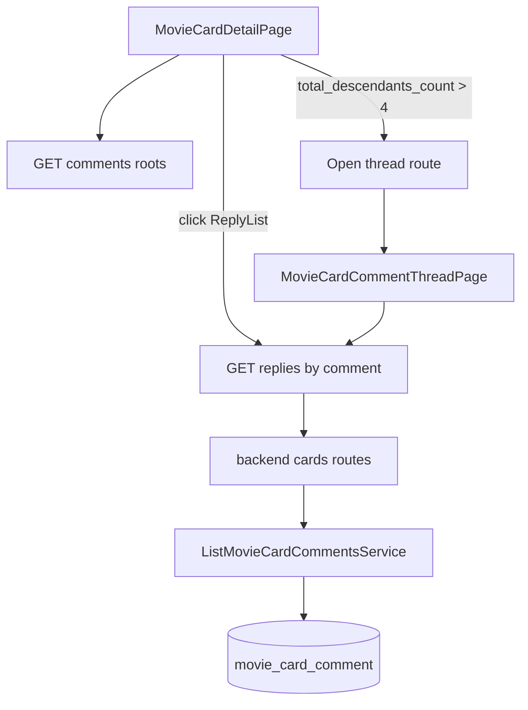

# План: UI дерева комментариев и отдельный экран ветки

## Что исправляем
- Устраняем текущий баг: ответы не отображаются, потому что [MovieCardDetailPage.tsx](/Users/r.makkhmudov/Projects/github/kino/frontend/src/pages/MovieCardDetailPage.tsx) строит дерево из одного списка, а backend endpoint `GET /comments` теперь возвращает только корневые комментарии.
- Добавляем UX-поведение: при `total_descendants_count > 4` у корня/узла показываем кнопку «Показать остальные», которая переводит на отдельный экран ветки.

## Backend изменения
- Расширить response-модель комментария в [schemas.py](/Users/r.makkhmudov/Projects/github/kino/backend/src/api/cards/schemas.py):
  - добавить поле `total_descendants_count: int`.
- Обновить сервис/роуты в [routes.py](/Users/r.makkhmudov/Projects/github/kino/backend/src/api/cards/routes.py) и сервис листинга комментариев:
  - для списка корней и списка `replies` возвращать `total_descendants_count` для каждого элемента;
  - сохранить текущую пагинацию `cursor/limit` и `next_cursor`.
- (Опционально для производительности) в сервисе использовать агрегирующий запрос по поддереву/CTE, чтобы не делать N+1 при подсчете потомков.

## Frontend изменения
- В [cardApi.ts](/Users/r.makkhmudov/Projects/github/kino/frontend/src/api/cardApi.ts):
  - добавить `getMovieCardCommentReplies(cardId, commentId, cursor?, limit?)`;
  - расширить тип данных комментария полем `total_descendants_count`.
- В [MovieCardDetailPage.tsx](/Users/r.makkhmudov/Projects/github/kino/frontend/src/pages/MovieCardDetailPage.tsx):
  - заменить текущую сборку дерева из «плоского списка» на загрузку по уровням (`roots` + `replies` по клику);
  - хранить state раскрытия веток (`openByCommentId`), кэш загруженных ответов (`repliesByParentId`), пагинацию по каждой ветке (`nextCursorByParentId`);
  - добавить кнопку:
    - если `total_descendants_count > 4` -> `Показать остальные` (переход в отдельный экран ветки);
    - иначе стандартное раскрытие ответов inline.
- В [routes.tsx](/Users/r.makkhmudov/Projects/github/kino/frontend/src/routes.tsx):
  - добавить роут отдельной ветки, например `/cards/:cardId/comments/:commentId/thread`.
- Добавить новую страницу, например [MovieCardCommentThreadPage.tsx](/Users/r.makkhmudov/Projects/github/kino/frontend/src/pages/MovieCardCommentThreadPage.tsx):
  - показывает выбранный комментарий и полное дерево/ленту его ответов без ограничения по глубине;
  - поддерживает дозагрузку через `cursor` до конца ветки.

## Фикс бага отображения ответов
- В текущем UI-слое удалить допущение «API возвращает все уровни сразу».
- Для каждого комментария явно запрашивать детей через `GET /api/cards/{card_id}/comments/{comment_id}/replies`.
- После создания ответа обновлять соответствующую ветку (локально + рефетч узла при необходимости).

## Тестирование
- Backend tests (в [test_cards_routes.py](/Users/r.makkhmudov/Projects/github/kino/backend/src/tests/api/test_cards_routes.py)):
  - проверить наличие `total_descendants_count`;
  - проверить корректность значения для цепочек глубины >1;
  - не сломать существующую пагинацию comments/replies.
- Frontend checks:
  - для комментария без детей кнопка раскрытия отсутствует;
  - для `<=4` потомков ответы раскрываются inline;
  - для `>4` появляется `Показать остальные` и работает переход на thread route;
  - в thread-page ответы отображаются полностью (через последовательную дозагрузку).

## Поток данных

## Риски и смягчение
- Риск: тяжелый подсчет `total_descendants_count` на больших ветках.
- Смягчение: агрегировать на стороне SQL (CTE), кешировать в пределах запроса, не пересчитывать на клиенте.

## Результат
- Ответы начинают отображаться корректно.
- Глубокие/большие ветки не ломают UX карточки: пользователь уходит в отдельный экран конкретного треда.
