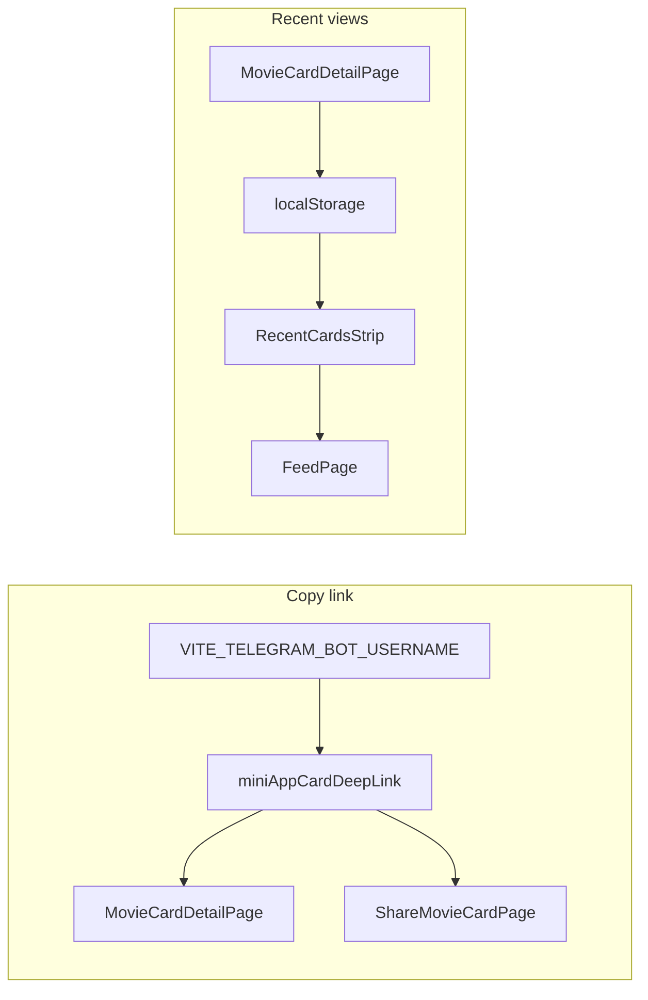

# План: копирование ссылки и «Недавно открывали»

## Контекст

- Формат deep link уже зафиксирован на бэкенде: `https://t.me/<bot>/app?startapp=c<card_id>` ([backend/src/services/telegram/mini_app_link.py](backend/src/services/telegram/mini_app_link.py)); клиент обрабатывает `start_param` вида `c123` в [frontend/src/navigation/TelegramMiniAppStartParamRedirect.tsx](frontend/src/navigation/TelegramMiniAppStartParamRedirect.tsx).
- Запросов к API для этих двух фич **не требуется**.

## 1. Ссылка на карточку (копирование)

**Конфиг:** добавить `VITE_TELEGRAM_BOT_USERNAME` (без `@`), синхронно с `TELEGRAM_BOT_USERNAME` на бэкенде. Обновить [frontend/src/vite-env.d.ts](frontend/src/vite-env.d.ts), [vars/.env.example](vars/.env.example), при необходимости закомментировать в [vars/.env.development](vars/.env.development) (не подставлять реальное значение в ответе агента).

**Утилита:** новый модуль, например [frontend/src/lib/miniAppCardDeepLink.ts](frontend/src/lib/miniAppCardDeepLink.ts): функция `buildMiniAppCardDeepLink(cardId: number): string | null` — trim `@`, валидация непустого имени, сборка URL как в Python (`/app?startapp=c${id}`).

**Копирование:** небольшой хелпер `copyTextToClipboard(text: string): Promise<boolean>` (если подходящего нет) с `navigator.clipboard.writeText` и безопасным fallback через `document.execCommand('copy')` для редких контекстов.

**UI — деталка:** в [frontend/src/pages/MovieCardDetailPage.tsx](frontend/src/pages/MovieCardDetailPage.tsx) рядом с существующими `IconButton` (Share2 / CopyPlus) добавить ещё одну иконку (например `Link` или `Copy` из `lucide-react`) **для всех пользователей**, у которых есть валидная ссылка: по нажатию копировать URL; при отсутствии `VITE_TELEGRAM_BOT_USERNAME` — кнопку скрыть или показать короткое сообщение (предпочтительно скрыть).

**UI — шаринг:** в [frontend/src/pages/ShareMovieCardPage.tsx](frontend/src/pages/ShareMovieCardPage.tsx) или в [frontend/src/components/share/ShareFollowersPicker.tsx](frontend/src/components/share/ShareFollowersPicker.tsx) добавить вторичную кнопку «Скопировать ссылку» (текстовая `Button` mode gray под превью), чтобы можно было поделиться мимо выбора подписчиков.

Опционально при `isTMA()` из `@telegram-apps/sdk`: после успешного копирования вызвать лёгкий haptic, если уже используется в проекте (не обязательно).

## 2. «Недавно открывали» (только клиент)

**Хранилище:** `localStorage`, ключ вида `filmony.recent_cards.<viewerUserId>` (UUID строкой). Использовать тот же `viewerId`, что уже подтягивается на деталке из кеша профиля ([MovieCardDetailPage](frontend/src/pages/MovieCardDetailPage.tsx) — паттерн с `readMyProfileBundleCache`). Если `viewerId` ещё `null`, не писать (или отложить запись до появления id — один повторный `useEffect` при смене `viewerId`).

**Формат значения:** JSON-массив из не более **5** элементов `{ id: number; film_title: string; film_poster_url: string | null; at: number }`. При открытии карточки: удалить дубликат по `id`, добавить в начало, обрезать до 5.

**Модуль:** [frontend/src/lib/recentCardViews.ts](frontend/src/lib/recentCardViews.ts) — `recordRecentCardView(viewerId: string, snapshot)` и `readRecentCardViews(viewerId: string)`.

**Запись:** в `MovieCardDetailPage` после успешной загрузки `card` и при известном `viewerId` вызвать `recordRecentCardViews`.

**UI:** компонент [frontend/src/components/feed/RecentCardsStrip.tsx](frontend/src/components/feed/RecentCardsStrip.tsx): горизонтальный ряд миниатюр постера + усечённое название, `Link` на `/cards/:id`. Показывать только если массив непустой.

**Лента:** в [frontend/src/pages/FeedPage.tsx](frontend/src/pages/FeedPage.tsx) под sticky header (перед списком карточек), вставить полоску: при монтировании прочитать `viewerId` из `readMyProfileBundleCache()` (и при необходимости подписаться на обновление через простой `storage` event или повтор при фокусе вкладки — минимально достаточно читать при mount + `visibilitychange` для актуальности после возврата с деталки).

## 3. Проверка

- Локально: открыть деталку → вернуться на ленту — полоска с последней карточкой; копирование даёт URL, открываемый в Telegram.
- Без `VITE_TELEGRAM_BOT_USERNAME`: кнопки копирования не ломают страницу (скрыты).

## Зависимости

