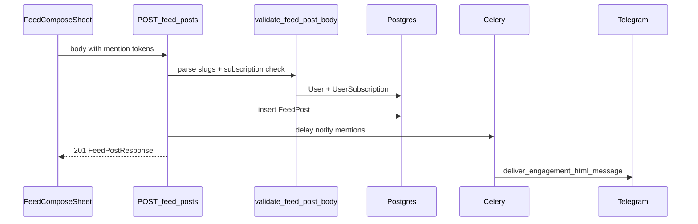

# Упоминания @ в постах ленты

## Контекст и выбор «уникального ника»

В модели [`backend/src/models/user.py`](backend/src/models/user.py) уникальный стабильный идентификатор профиля — поле **`profile_slug`** (`String(32)`, `unique=True`). Именно его стоит показывать в подсказке и вшивать в сохраняемый текст; `username` (Telegram) опционален и не гарантирует уникальности в продукте.

Список пользователей, **на кого текущий пользователь подписан**, уже есть: [`GET /api/users/{user_id}/subscriptions?type=following`](backend/src/api/profile/users_routes.py) → [`ListUserSubscriptionsService`](backend/src/services/subscriptions/list_user_subscriptions.py). На фронте — [`getUserSubscriptions`](frontend/src/api/profileApi.ts).

## Хранение текста (как у реакций)

Использовать **не** сырой `@nick` в сохранённом теле (иначе коллизии, длина, валидация), а канонический инлайн-токен по аналогии с `r{id}`:

- Формат: **`@<profile_slug>`** (slug в нижнем регистре при вставке/валидации, как в [`GetPublicUserBySlugService`](backend/src/services/profile/get_public_user_by_slug.py)).

**Бэкенд**

1. Расширить [`backend/src/services/feed_posts/validate_feed_post_body.py`](backend/src/services/feed_posts/validate_feed_post_body.py): regex на токены `@…`, для каждого slug:
   - найти пользователя по `profile_slug` (нормализация `strip().lower()`);
   - проверить строку в `user_subscription`: `follower_user_id == author_id` и `following_user_id == mentioned_user_id`;
   - при ошибке — `FeedPostBodyValidationError` с понятным текстом (неизвестный slug / нельзя упомянуть не-подписку).
2. Дедупликация получателей уведомлений по `user_id`.
3. После успешного `commit` в [`CreateFeedPostService`](backend/src/services/feed_posts/create_feed_post.py) **не** блокировать ответ: поставить в очередь Celery (как комментарии в [`backend/src/api/cards/routes.py`](backend/src/api/cards/routes.py) строки ~585–597).

**Telegram**

- Новый модуль по образцу [`notify_comment_reply.py`](backend/src/services/telegram/notify_comment_reply.py): `run_notify_feed_post_mention_safe(actor_user_id, feed_post_id, recipient_user_id)` внутри `disposable_async_session`, HTML через [`deliver_engagement_html_message`](backend/src/services/telegram/engagement_delivery.py).
- Текст: кто упомянул + короткий сниппет поста (без сырого HTML из пользователя — только `html.escape` обрезка).
- Deep link на конкретный пост: сейчас в [`TelegramMiniAppStartParamRedirect.tsx`](frontend/src/navigation/TelegramMiniAppStartParamRedirect.tsx) обрабатывается только `c<card_id>`. **Варианты:** (A) v1 — ссылка «Открыть ленту» без якоря на пост (или общий `startapp` без нового парсера); (B) сразу добавить `p<post_id>` в редирект + маршрут ленты с `postId` в state/query — лучше для UX, чуть больше объёма. Имеет смысл заложить **B** в тот же PR, если маршрут `/feed` уже есть ([`FeedPage.tsx`](frontend/src/pages/FeedPage.tsx)).

**Celery**

- В [`backend/src/tasks/telegram_engagement.py`](backend/src/tasks/telegram_engagement.py) зарегистрировать задачу (например `notify_feed_post_mentions`) с аргументами `actor_user_id`, `feed_post_id`, `recipient_user_ids` (JSON/строка со списком UUID), внутри — цикл с `run_..._safe` на каждого.
- Обновить [`backend/src/tests/test_celery_app.py`](backend/src/tests/test_celery_app.py) на наличие новой задачи.

**Тесты API**

- Расширить [`backend/src/tests/api/test_feed_posts_routes.py`](backend/src/tests/api/test_feed_posts_routes.py): успешное создание с валидным токеном подписки; 422/400 при неизвестном slug; при slug не из подписок; мок Celery `.delay` и проверка, что задача вызывается с ожидаемыми id.

## Фронтенд

1. **Данные для подсказки**: при открытии [`FeedComposeSheet`](frontend/src/components/feed/FeedComposeSheet.tsx) (или при первом `@`) — `getUserSubscriptions(me.id, 'following')`, кэш в `useQuery` / локальный state. Фильтрация по префиксу `profile_slug` (и опционально `display_name` для поиска, но **вставлять** всё равно токен по `profile_slug`).

2. **Поведение `@`**: отслеживать `onChange`/`onKeyUp` у textarea (через расширение пропсов [`CommentDraftMultiline`](frontend/src/components/comments/CommentDraftMirrorField.tsx) — передать `onKeyDown`/`onKeyUp` уже поддерживается частично): если перед кареткой паттерн `@` + необязательный query без пробелов — показать **Popover/List** (TGUI) над полем с совпадениями; Enter/клик — вставить `@${slug}` и закрыть.

3. **Подсветка «жёлтый бейдж»**:
   - Расширить [`frontend/src/lib/commentReactionTokens.ts`](frontend/src/lib/commentReactionTokens.ts) (или вынести `splitFeedPostTextIntoSegments`) — сегменты `text | reaction | mention`.
   - Обновить [`CommentBodyWithReactionTokens.tsx`](frontend/src/components/comments/CommentBodyWithReactionTokens.tsx) **или** ввести обёртку `FeedPostBodyWithTokens`, используемую в [`FeedPostCard`](frontend/src/components/feed/FeedPostCard.tsx) и в зеркале черновика (`MirrorBody` в `CommentDraftMirrorField`), чтобы в зеркале и в карточке `@` отображались одинаково (inline `rounded-md` + amber/mint как в существующих бейджах в [`FeedPostCard`](frontend/src/components/feed/FeedPostCard.tsx)).

4. **Хелпер вставки**: по аналогии с [`insertSnippetAtCaret`](frontend/src/lib/commentReactionTokens.ts) + `mentionTokenFromSlug(slug)`.

## Диаграмма потока

## Риски и ограничения

- Уведомление дойдёт только если у получателя есть чат с ботом (как у других engagement-уведомлений).
- После смены `profile_slug` старые токены в тексте перестанут резолвиться — приемлемо для v1 (как и с любыми @-handle).

## Документация и артефакты фичи

По правилам репозитория после реализации обновить: [`docs/features/feed-posts.md`](docs/features/feed-posts.md), `.cursor/active/feed-posts/progress.md` / `result.md`, фрагмент в [`.cursor/memory/logs/action-log.md`](.cursor/memory/logs/action-log.md).
