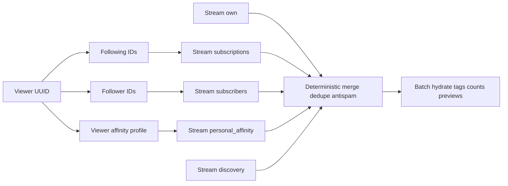

# План: рекомендательная лента `feed-recommendation-engine`

## Исходное состояние

- Эндпоинт: [`backend/src/api/cards/routes.py`](backend/src/api/cards/routes.py) — `GET /api/cards/feed`, ответ [`MovieCardFeedPageResponse`](backend/src/api/cards/schemas.py) (`items`, `next_cursor`).
- Логика: [`ListMovieCardFeedService`](backend/src/services/cards/list_movie_card_feed.py) — **без `viewer_id`**: `ORDER BY movie_card.id DESC` + cursor `MovieCard.id < int(cursor)`.
- Граф подписок: модель [`UserSubscription`](backend/src/models/user_subscription.py) — `follower_user_id` подписан на `following_user_id`.
- Карточка наследует [`Base`](backend/src/models/base.py): есть `id`, `created_at` (для свежести в скоринге).
- Тесты: [`backend/src/tests/api/test_cards_routes.py`](backend/src/tests/api/test_cards_routes.py) (`test_movie_card_feed_*`) завязаны на глобальный порядок по `id` — их нужно переписать под новую семантику.

## Архитектура решения

### Источники кандидатов (спека + сохранение «своих» карточек)

| Источник | Определение (зафиксировать в комментарии к константам / в `docs/features/feed-recommendation-engine.md`) |
|----------|-------------------------------------------------------------------------------------------------------------|
| **own** (технический поток) | Карточки `user_id == viewer`, чтобы пользователь видел свои записи как сейчас. Не отдельный продуктовый «источник» в спеке из 4-х, но обязателен для UX. |
| **subscriptions** | Авторы из множества following: `following_user_id` для строк где `follower_user_id = viewer`. |
| **subscribers** | Авторы-подписчики: `follower_user_id` где `following_user_id = viewer`. |
| **personal_affinity** (MVP) | Карточки других пользователей (исключить `viewer`), где скоринг по пересечению интересов: нормализованные жанры фильма (`Film.genres`) + теги карточки (`MovieCardTag`) с **профилем зрителя** — объединение жанров и тегов по карточкам самого зрителя (агрегация одним-двумя SQL без цикла по карточкам). Формула: например `overlap = \|G_v ∩ G_f\| + \|T_v ∩ T_c\|` (веса жанр/тег в константах); сортировка внутри потока: `overlap DESC`, затем `created_at DESC`, затем `id DESC`. **Без** Redis/векторов; в docs отметить следующий шаг (008 / «двойники») как усиление сигнала. |
| **discovery** | Карточки, автор которых **не** входит в объединение `{viewer} ∪ following ∪ followers` (прямой граф). Сортировка: `created_at DESC`, `id DESC`. |

Квота discovery: константы вида `DISCOVERY_EVERY_N_SLOTS` (например **7**, диапазон 5–10 из спеки) + при необходимости `DISCOVERY_MIN_INTERVAL` — вынести в [`backend/src/conf/feed.py`](backend/src/conf/feed.py) (или модуль `settings` с небольшим `FeedSettings`, если хотите env позже). Паттерн слотов: циклическая последовательность источников (например own/sub/sub/subr/aff/**disc**/…) с **fallback**: если у слота пусто — брать по приоритету `subscriptions > subscribers > affinity > discovery` (или пропускать слот — зафиксировать одно поведение и покрыть тестом «пустой граф»).

**Дедуп**: множество уже выданных `movie_card.id` в рамках цепочки merge.

**Anti-spam** (лёгкий): при выборе следующей карточки отклонять кандидата, если в последних `K` выданных слотах уже есть тот же `author_id` или тот же `film_id` (`K` = 1 или 2 в константах); при отклонении — следующий кандидат из того же потока.

### Стабильный cursor (без Redis)

Кодировать **состояние итераторов** по потокам после выдачи страницы: например JSON с версией `v` и словарём смещений `offsets: {own, subscriptions, subscribers, personal_affinity, discovery}` (индекс следующего непросмотренного кандидата в **предварительно отсортированном** списке ID каждого потока). Кодирование: URL-safe base64 или строка с префиксом `v1.` для явной эволюции.

Повтор запроса с тем же cursor: восстановить offsets → заново загрузить те же отсортированные списки (детерминированный ORDER BY) → прокрутить merge до тех же offsets → выдать следующую порцию `limit`. При неизменной БД результат совпадает.

**Важно**: для каждого потока задать верхнюю границу выборки (например 200–500 ID на запрос) и документировать в docs: при очень глубокой пагинации возможна «нехватка» кандидатов — тогда `next_cursor = null` или частичная страница (как сейчас с `limit+1`).

### Запросы к БД (без N+1)

Один проход на merge использует только ID и метаданные для анти-спама:

1. Запрос following UUIDs и follower UUIDs (2 коротких `SELECT`).
2. Запрос профиля affinity зрителя: один агрегирующий запрос по `movie_card` + `film` + `movie_card_tag` для `user_id = viewer`.
3. Четыре–пять запросов на списки ID по потокам (фильтры `WHERE user_id IN …` / `NOT IN …` / условия affinity с `JOIN film` и подзапросом тегов **или** два этапа: сначала batch карточек с film_id + user_id, скоринг affinity в Python на ограниченном множестве — проще для MVP, всё ещё без N+1 по карточкам страницы).
4. После определения финального порядка `card_ids`: **один** раз переиспользовать существующую логику загрузки `Film`, `User`, тегов, counts, previews из текущего [`list_movie_card_feed.py`](backend/src/services/cards/list_movie_card_feed.py) (вынести в приватные методы `_hydrate_items(card_rows)` чтобы не дублировать).

Цель: O(1) запросов на «шаг» относительно размера страницы, не относительно глубины социального графа через цикл.

### Сервисный слой

- Один публичный entrypoint: `ListMovieCardFeedService.execute(viewer_id: UUID, cursor: str | None, limit: int) -> MovieCardFeedPage`.
- Роут: передать `user.id` из [`CurrentUser`](backend/src/deps/auth.py) в сервис (сейчас `_viewer` не используется — исправить).

Опционально внутри файла: `@dataclass` для курсора и для элементов merge — без второго публичного сервис-класса (соответствует правилу «один execute на класс»).

### Контракт API

- **Не менять** JSON ответа и query-параметров (`cursor`, `limit`), чтобы [`FeedMovieCardPage`](frontend/src/api/profileTypes.ts) оставался валидным.
- Диагностику источников не добавлять в тело ответа (спека упоминала отладку); при желании — только debug-лог на backend.

## Тесты (pytest + AsyncClient)

Файл: расширить [`backend/src/tests/api/test_cards_routes.py`](backend/src/tests/api/test_cards_routes.py) или добавить `backend/src/tests/api/test_movie_card_feed_recommendation.py`.

Сценарии:

1. **Happy path**: несколько пользователей, подписки, карточки — лента не пустая, структура ответа как раньше.
2. **Пустой граф**: у зрителя нет подписок/подписчиков и нет своих карточек с пересечениями — лента заполняется **discovery** (и при необходимости глобальными недавними карточками по правилам).
3. **Стабильность cursor**: два последовательных `GET` с одинаковым `cursor` и `limit` → те же `items` (по `id` в порядке).
4. **Discovery доля**: фикстура с контролируемым числом «графовых» и «чужих» карточек и широким лимитом — проверить, что доля discovery в окне соответствует ожидаемому интервалу (с допуском из-за дедупа/anti-spam).
5. **Дедуп**: искусственно пересекающиеся кандидаты в нескольких потоках — один `id` в странице один раз.
6. Обновить **существующий** `test_movie_card_feed_cursor_pagination`: вместо «max id первым глобально» — стабильная вторая страница относительно **нового** cursor.

Прогон: `make backend-test` / `make backend-test-one target=…` в Docker ([`.cursor/tech.md`](.cursor/tech.md)).

## Документация и артефакты фичи (после реализации)

По требованиям репозитория:

- Обновить [`.cursor/active/feed-recommendation-engine/progress.md`](.cursor/active/feed-recommendation-engine/progress.md) и [`result.md`](.cursor/active/feed-recommendation-engine/result.md).
- Обновить [`docs/features/feed-recommendation-engine.md`](docs/features/feed-recommendation-engine.md): формула affinity, формат cursor, константы квот, ограничения (лимит глубины, отсутствие ML).
- Фрагмент в [`.cursor/memory/logs/`](.cursor/memory/logs/) + строка в индексе [`action-log.md`](.cursor/memory/logs/action-log.md).

## Риски и сознательные ограничения

- Глубокая пагинация может исчерпать заранее загруженные пулы ID — задокументировать.
- Новые карточки, появившиеся между запросами, не ломают старый cursor (смещения относятся к снимку отсортированных списков на момент запроса — при строгой интерпретации «снимка» можно считать это приемлемым для MVP).
