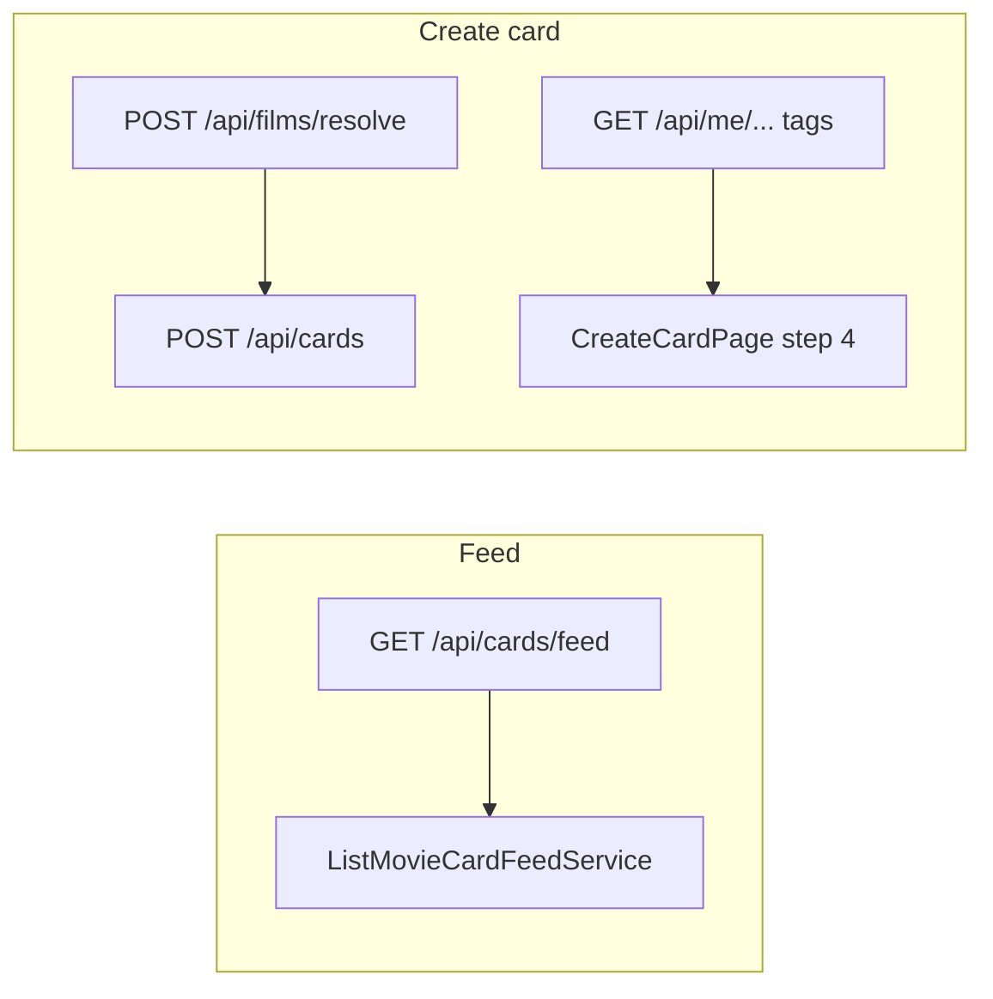

# План: шесть UX-фич (точки входа и реализация)

## Контекст по кодовой базе

- **Подписки / подписчики:** [`frontend/src/pages/SubscriptionsPage.tsx`](frontend/src/pages/SubscriptionsPage.tsx) — строки списка: `Avatar` + имя без `Link` на профиль (профиль: [`/u/:userId`](frontend/src/routes.tsx), свой — [`/profile`](frontend/src/routes.tsx)).
- **Комментарии в ленте и на карточке:** [`frontend/src/components/feed/FeedCard.tsx`](frontend/src/components/feed/FeedCard.tsx) (`input`, `maxLength={100}`), [`frontend/src/pages/MovieCardDetailPage.tsx`](frontend/src/pages/MovieCardDetailPage.tsx) (`textarea`, `maxLength={100}`). Бэкенд: [`backend/src/services/cards/create_movie_card_comment.py`](backend/src/services/cards/create_movie_card_comment.py) — только plain `text`, лимит 100.
- **Реакции:** каталог — картинки по `reaction_type.id` ([`backend/src/services/reactions/list_reaction_catalog.py`](backend/src/services/reactions/list_reaction_catalog.py)); UI — [`frontend/src/components/reactions/reactionStrip/ReactionStrip.tsx`](frontend/src/components/reactions/reactionStrip/ReactionStrip.tsx) (попап с каталогом).
- **«Назад» с карточки:** [`frontend/src/pages/MovieCardDetailPage.tsx`](frontend/src/pages/MovieCardDetailPage.tsx) (~392–396) — `navigate(-1)`. Deep link из Telegram: [`frontend/src/navigation/TelegramMiniAppStartParamRedirect.tsx`](frontend/src/navigation/TelegramMiniAppStartParamRedirect.tsx) делает `navigate(..., { replace: true })`, из‑за чего в стеке нет ленты — «Назад» часто ничего не даёт внутри мини‑приложения.
- **Лента и свои карточки:** [`backend/src/services/cards/list_movie_card_feed.py`](backend/src/services/cards/list_movie_card_feed.py) — поток `'own'` заполняется картами зрителя (`MovieCard.user_id == viewer`); режимы в [`backend/src/const/feed.py`](backend/src/const/feed.py). API: [`backend/src/api/cards/routes.py`](backend/src/api/cards/routes.py) `GET /api/cards/feed`. Фронт: [`frontend/src/pages/FeedPage.tsx`](frontend/src/pages/FeedPage.tsx), [`frontend/src/api/cardApi.ts`](frontend/src/api/cardApi.ts) (`mode`).
- **Теги при создании карточки:** лимиты на бэкенде — 40 символов, до 5 штук ([`backend/src/services/cards/create_movie_card.py`](backend/src/services/cards/create_movie_card.py) `_normalize_tags`). Шаг 4 UI — [`frontend/src/pages/CreateCardPage.tsx`](frontend/src/pages/CreateCardPage.tsx); сейчас при длине &gt; 40 ошибка только на submit.
- **Дубликат по фильму:** создаётся конфликт при `POST /api/cards` ([`MovieCardAlreadyExistsError`](backend/src/services/cards/create_movie_card.py)); на шаге 2 после resolve показываются три кнопки («Оценить…», «К просмотру», «Другая ссылка») без проверки «у меня уже есть карточка». Отдельного «моя карточка по `film_id`» в API сейчас нет.

---

## 1) Аватар в подписках / подписчиках → профиль

**Точка входа:** [`SubscriptionsPage.tsx`](frontend/src/pages/SubscriptionsPage.tsx) — блок `items.map`, строка с `Avatar`.

**Реализация:** обернуть аватар (или всю «левую» часть строки кроме кнопки подписки) в `Link` на `/u/${encodeURIComponent(item.id)}`. Для `selfRow` — `Link` на `/profile` (или отключить навигацию, если не хотите уходить на свой публичный профиль; логичнее вести на `/profile`).

**Бэкенд:** не требуется.

**Дизайн (TGUI):** сохранить текущий `Avatar` 40px; кликабельная область — весь круг, `aria-label` с именем.

---

## 2) «Те же» реакции в тексте комментария

Реакции в продукте — **изображения из каталога**, не Unicode-эмодзи, поэтому вставка «как в мессенджере» делается через **маркер в тексте + рендер**.

**Предлагаемый контракт текста**

- Разрешить в `text` встроенные токены вида `r{reaction_type_id}` (редкая последовательность для пользовательского ввода). Пример: `Классно r12`.
- При сохранении: нормализовать/валидировать id через `ReactionType` (существует ли).
- Лимит длины: оставить **100 символов итоговой строки** (как сейчас) *или* слегка поднять (например 120), если токены «съедают» бюджет — зафиксировать в `MovieCardCommentCreateRequest` и `_normalize_text`.

**Бэкенд**

- [`create_movie_card_comment.py`](backend/src/services/cards/create_movie_card_comment.py): парсинг токенов, валидация id, опционально ограничение числа токенов (например ≤3).
- [`MovieCardCommentCreateRequest`](backend/src/api/cards/schemas.py): при необходимости увеличить `max_length`.
- Тесты: создание комментария с валидным токеном, невалидным id, превышение длины — [`backend/src/tests/api/test_cards_routes.py`](backend/src/tests/api/test_cards_routes.py) (рядом с существующими тестами комментариев).

**Фронтенд**

- Вынести **переиспользуемый компактный пикер** (обёртка над логикой загрузки каталога из [`ReactionStrip`](frontend/src/components/reactions/reactionStrip/ReactionStrip.tsx) / `ReactionStripPopover`), чтобы по выбору элемента в **позицию курсора** вставлялся `r{id}`.
- Подключить **рядом с полем** в [`FeedCard.tsx`](frontend/src/components/feed/FeedCard.tsx) и [`MovieCardDetailPage.tsx`](frontend/src/pages/MovieCardDetailPage.tsx) (`IconButton` + `Smile` по правилам проекта).
- **Отображение:** маленький компонент `CommentBody` — разбить строку на сегменты, для токенов рендерить `img` с `image_url` из кэша каталога (или лениво подгружать каталог один раз на экран).

---

## 3) «Назад» с карточки после уведомления / start_param

**Точка входа:** [`TelegramMiniAppStartParamRedirect.tsx`](frontend/src/navigation/TelegramMiniAppStartParamRedirect.tsx) — сейчас `navigate(`/cards/${cardId}`, { replace: true })`.

**Реализация**

- Передавать **location state**, например `{ cardEntry: 'telegram_start_param' }`:
  `navigate(`/cards/${cardId}`, { replace: true, state: { cardEntry: 'telegram_start_param' } })`.
- В [`MovieCardDetailPage.tsx`](frontend/src/pages/MovieCardDetailPage.tsx) обработчик стрелки:
  - если `location.state?.cardEntry === 'telegram_start_param'` → `navigate('/')` (лента);
  - иначе → `navigate(-1)` как сейчас.

**Дополнительно:** любые другие «внешние» заходы на `/cards/:id` без истории (если появятся) — тот же флаг через `state` при программном `navigate`.

**Бэкенд:** не требуется.

---

## 4) Кнопка в ленте: скрыть мои карточки

**Бэкенд**

- Расширить [`ListMovieCardFeedService.execute`](backend/src/services/cards/list_movie_card_feed.py) опциональным флагом `hide_own_cards: bool` (query `hide_own=true` на [`GET /api/cards/feed`](backend/src/api/cards/routes.py)).
- В [`_MergeState`](backend/src/services/cards/list_movie_card_feed.py) сохранить флаг в cursor payload (аналогично `feed_mode`), чтобы при смене тоггла курсор сбрасывался и пагинация не ломалась.
- При `hide_own_cards`: при сборке потоков задать `streams['own'] = []` (или не включать own в allowed — проще очистить список после `_build_streams`).
- Обновить/добавить тест в [`backend/src/tests/api/test_movie_card_feed_recommendation.py`](backend/src/tests/api/test_movie_card_feed_recommendation.py): при включённом флаге в выдаче нет карточек с `user_id == viewer`.

**Фронтенд**

- [`getMovieCardFeedPage`](frontend/src/api/cardApi.ts): проброс query `hide_own`.
- [`movieCardFeedQueryKey`](frontend/src/feed/feedQueryKeys.ts): включить флаг в ключ, чтобы кэш раздельный.
- [`FeedPage.tsx`](frontend/src/pages/FeedPage.tsx): переключатель (например `Switch` / компактная кнопка рядом с режимом ленты), подпись вроде «Без моих карточек».

**Дизайн:** один ряд с существующим выбором режима; не дублировать тяжёлый sheet.

---

## 5) Теги при создании карточки: лимит на шаге 4 + автодополнение

**Клиентская валидация (сразу в форме)**

- Константа `MAX_TAG_LEN = 40` (синхронно с бэкендом); при `addTag` и при `onChange` показывать ошибку/подсказку, блокировать «Далее», если есть невалидный ввод.

**Автодополнение и «топ популярных»**

- **Новый эндпоинт**, например `GET /api/me/movie-card-tags` (тонкий route + сервис в стиле проекта): агрегация `movie_card_tag` + `movie_card` по `user_id`, `GROUP BY tag`, `COUNT(*)`, сортировка по `count DESC`, лимит отдачи (например 300–500 строк) — достаточно для клиентского фильтра.
- **UI на шаге 4** [`CreateCardPage.tsx`](frontend/src/pages/CreateCardPage.tsx):
  - Пока поле пустое — горизонтальный скролл «Частые теги» (топ N из ответа, исключая уже выбранные).
  - При вводе — фильтр по префиксу (case-insensitive); список подсказок в `max-height` + scroll (много тегов — только отфильтрованный топ, без рендера тысяч DOM-узлов).
  - Тап по подсказке добавляет тег (как chip).

**Тесты:** `GET /api/me/movie-card-tags` — несколько карточек с пересекающимися тегами, проверка порядка и счётчиков.

---

## 6) Уже есть карточка на этот фильм: другой шаг 2 и сценарий `fromCard`

**Данные**

- Либо расширить ответ **`POST /api/films/resolve`** (при авторизованном пользователе): поле `my_card_id: int | null` (или `existing_card: { id } | null`), либо отдельный лёгкий `GET /api/me/movie-cards/by-film/{film_id}` — предпочтительно **в том же ответе resolve**, чтобы не плодить лишний RTT.

**Сервис:** по `viewer_user_id` + `film.id` из результата резолва — `select MovieCard.id where user_id & film_id` (уникальность уже обеспечивается бизнес-правилом создания).

**Фронт [`CreateCardPage.tsx`](frontend/src/pages/CreateCardPage.tsx) шаг 2**

- Если `my_card_id != null`: не показывать «Оценить просмотр» / «К просмотру» / «Другая ссылка» как основной сценарий; показать:
  - **«Открыть мою карточку»** → `navigate(/cards/${my_card_id})`;
  - **«Ввести другую ссылку»** — сброс как сейчас «Другая ссылка»;
  - опционально **«Изменить в редакторе»** → `/cards/${my_card_id}/edit` (эквивалент «перейти», но сразу в редактирование).

**Ветка `fromCard`:** после загрузки чужой карточки и `getFilmById` вызвать ту же проверку (или использовать поле из расширенного `getMovieCardById` / отдельный запрос по `film.id`) — если у пользователя уже есть карточка на этот фильм, показать тот же UI вместо перехода на шаг 3.

**Тесты бэкенда:** resolve с сессией пользователя, у которого уже есть карточка на этот `film_id` — в теле ответа присутствует `my_card_id`.

---

## Порядок внедрения (рекомендуемый)

1. Подписки → профиль (быстро, без API).
3. Назад с карточки (state из start_param).
4. Лента `hide_own` (бэкенд + фронт, курсор).
5. Теги: API статистики + UI шага 4 + клиентский лимит 40.
6. Дубликат фильма: расширение resolve + UI шага 2 + `fromCard`.
2. Комментарии с токенами реакций (самый объёмный: бэкенд + парсер + UI вставки + рендер).

---

## Артефакты workflow репозитория

Когда будете переходить от плана к коду, по правилам filmony стоит завести feature slug (например `feed-and-create-ux-2026-05`), оформить `.cursor/features/.../feature.md`, `plan/progress/result`, тесты в Docker (`make backend-test`), и запись в action-log — это можно сделать одним пакетом после согласования плана.
