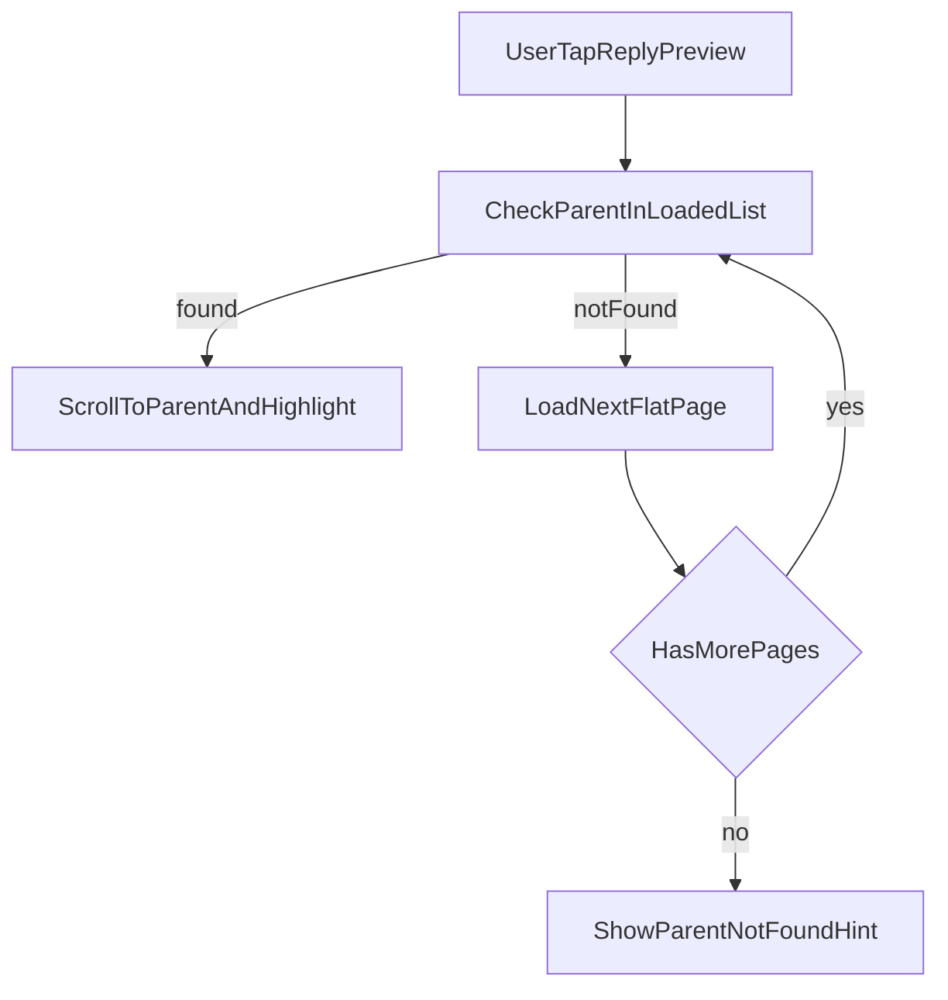

# Переработка комментариев под Telegram-like

## Цель
Убрать древовидный рендер и ветки из UI карточки фильма, перейти на плоский список комментариев с визуальным блоком «ответ на сообщение» и переходом к родительскому комментарию по нажатию.

## Область изменений
- Backend API комментариев карточки:
  - [backend/src/api/cards/routes.py](backend/src/api/cards/routes.py)
  - [backend/src/services/cards/list_movie_card_comments.py](backend/src/services/cards/list_movie_card_comments.py)
  - [backend/src/api/cards/schemas.py](backend/src/api/cards/schemas.py) (при расширении response)
  - [backend/src/tests/api/test_cards_routes.py](backend/src/tests/api/test_cards_routes.py)
- Frontend API/types:
  - [frontend/src/api/cardApi.ts](frontend/src/api/cardApi.ts)
  - [frontend/src/api/profileTypes.ts](frontend/src/api/profileTypes.ts)
- Frontend страницы/роутинг:
  - [frontend/src/pages/MovieCardDetailPage.tsx](frontend/src/pages/MovieCardDetailPage.tsx)
  - [frontend/src/pages/MovieCardCommentThreadPage.tsx](frontend/src/pages/MovieCardCommentThreadPage.tsx)
  - [frontend/src/routes.tsx](frontend/src/routes.tsx)
- Обязательные артефакты фичи:
  - `.cursor/features/<feature-slug>/feature.md`
  - `.cursor/active/<feature-slug>/plan.md`
  - `.cursor/active/<feature-slug>/progress.md`
  - `.cursor/active/<feature-slug>/result.md`
  - `docs/features/<feature-slug>.md`
  - `.cursor/memory/logs/*` + индекс `.cursor/memory/logs/action-log.md`

## Ключевые решения
- Бэкенд отдает **плоскую пагинацию** комментариев карточки (не только корни), сохраняя `parent_comment_id`.
- UI рендерит один список по времени/ID (как сейчас по убыванию ID), без вложенных child-узлов.
- Ответ отображается в Telegram-like виде: компактная цитата родительского сообщения над текстом комментария.
- Клик по reply-блоку: поиск родителя в уже загруженном списке; если нет — автодогрузка следующих страниц до нахождения или исчерпания данных; затем прокрутка/подсветка целевого комментария.

## Поток данных

## План реализации
1. Зафиксировать фичу и критерии приемки в `.cursor/features/<feature-slug>/feature.md` (Telegram-like UI, плоская лента, переход к родителю).
2. Изменить сервис листинга комментариев в [backend/src/services/cards/list_movie_card_comments.py](backend/src/services/cards/list_movie_card_comments.py):
   - добавить режим плоского листинга для карточки (без фильтра только `parent_comment_id IS NULL`),
   - сохранить пагинацию и существующие проверки существования карточки.
3. Обновить API слой в [backend/src/api/cards/routes.py](backend/src/api/cards/routes.py):
   - адаптировать `GET /cards/{card_id}/comments` на плоский режим,
   - определить судьбу `.../replies` (оставить для backward-compat или пометить как deprecated и перестать использовать на фронте).
4. При необходимости расширить схему ответа (например, мета для parent-preview, если решим собирать её на бэке) в [backend/src/api/cards/schemas.py](backend/src/api/cards/schemas.py).
5. Переписать и дополнить API-тесты в [backend/src/tests/api/test_cards_routes.py](backend/src/tests/api/test_cards_routes.py):
   - покрыть плоский список с root+replies,
   - проверить порядок, пагинацию, наличие `parent_comment_id`,
   - сохранить валидации `parent_comment_id` при создании комментария.
6. Обновить frontend API-клиент и типы:
   - [frontend/src/api/cardApi.ts](frontend/src/api/cardApi.ts): убрать зависимость UI от replies endpoint, оставить единый comments endpoint,
   - [frontend/src/api/profileTypes.ts](frontend/src/api/profileTypes.ts): при необходимости добавить поля для parent-preview модели.
7. Переработать [frontend/src/pages/MovieCardDetailPage.tsx](frontend/src/pages/MovieCardDetailPage.tsx):
   - удалить древовидные структуры (`buildLoadedTree`, `repliesByParentId`, expand/collapse),
   - рендерить плоский список комментариев,
   - добавить telegram-like reply-preview для комментариев с `parent_comment_id`,
   - реализовать переход к родителю: индекс комментариев, автодогрузка страниц, скролл и краткая подсветка.
8. Удалить/вывести из роутинга страницу ветки:
   - [frontend/src/pages/MovieCardCommentThreadPage.tsx](frontend/src/pages/MovieCardCommentThreadPage.tsx),
   - [frontend/src/routes.tsx](frontend/src/routes.tsx).
9. Добавить/обновить frontend-тесты (если в проекте есть покрытие для страниц/комментариев) на:
   - отображение reply-preview,
   - переход к родительскому комментарию,
   - поведение автодогрузки при отсутствии родителя в текущем наборе.
10. Верификация:
   - backend: запуск соответствующих pytest в Docker (`make backend-test-one ...`, затем `make backend-test` при необходимости),
   - frontend: запуск текущих проверок (`lint/test/build` по проектным скриптам) и ручная проверка UX сценариев.
11. Обновить обязательные артефакты delivery workflow (`progress.md`, `result.md`, `docs/features/...`, action-log).

## Критерии приемки
- Комментарии в карточке отображаются плоским списком без вложенных деревьев и без перехода в отдельную thread-страницу.
- Для комментария-ответа виден блок «ответ на сообщение» в telegram-like стиле.
- Тап по reply-блоку приводит к родительскому комментарию: если не загружен — выполняется автодогрузка и затем скролл.
- Создание комментариев/ответов продолжает работать с `parent_comment_id`.
- Бэкенд и фронтенд проверки проходят, изменения задокументированы в feature-артефактах.
