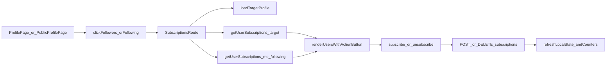

# Frontend Subscriptions UI Plan

## Цель
Реализовать UX подписок в стиле текущего приложения: под именем показывать 3 счётчика (подписчики, подписки, фильмы), по клику на первые два переходить на отдельную страницу подписок (как `Редактирование`), поддержать сценарии для своего и чужого профиля, плюс блок шаринга ссылки для своего профиля.

## Подтверждённые решения
- Навигация: отдельная страница, по аналогии с `Редактирование`.
- Scope: страница подписок нужна и для своего, и для чужого профиля.
- Источник счётчиков: ждать отдельные backend-поля `followers_count` / `following_count` в профильных ответах (не использовать `friends_count` как временный хак).

## Затрагиваемые файлы
- Роутинг: [`frontend/src/routes.tsx`](frontend/src/routes.tsx)
- Страница своего профиля: [`frontend/src/pages/ProfilePage.tsx`](frontend/src/pages/ProfilePage.tsx)
- Страница чужого профиля: [`frontend/src/pages/PublicProfilePage.tsx`](frontend/src/pages/PublicProfilePage.tsx)
- API-клиент профиля: [`frontend/src/api/profileApi.ts`](frontend/src/api/profileApi.ts)
- Типы API: [`frontend/src/api/profileTypes.ts`](frontend/src/api/profileTypes.ts)
- Утилита публичной ссылки: [`frontend/src/lib/publicProfileUrl.ts`](frontend/src/lib/publicProfileUrl.ts)
- (новое) страница подписок: `frontend/src/pages/SubscriptionsPage.tsx`

## План изменений

### 1) Обновить API-типизацию и клиент
- В [`frontend/src/api/profileTypes.ts`](frontend/src/api/profileTypes.ts):
  - добавить в `MyProfile` и `PublicProfile` поля `followers_count`, `following_count` (оставив `friends_count` для совместимости, пока фронт не очищен полностью).
  - добавить типы для списка подписок: `SubscriptionRelationType`, `SubscriptionListItem`, `SubscriptionListResponse`.
- В [`frontend/src/api/profileApi.ts`](frontend/src/api/profileApi.ts):
  - добавить `subscribeToUser(userId)` -> `POST /api/users/{userId}/subscriptions`
  - добавить `unsubscribeFromUser(userId)` -> `DELETE /api/users/{userId}/subscriptions`
  - добавить `getUserSubscriptions(userId, type)` -> `GET /api/users/{userId}/subscriptions?type=...`

### 2) Сделать отдельную страницу подписок
- Создать `frontend/src/pages/SubscriptionsPage.tsx`.
- Паттерн страницы — как у `ProfileEditPage`: sticky header с back, загрузка состояния через `useEffect/useState`, ошибки/пустое состояние.
- Поведение:
  - route принимает target user (`/profile/subscriptions` для себя и `/u/:identifier/subscriptions` для чужого).
  - сегмент-переключатель `Подписки / Подписчики`.
  - для своего профиля: блок «поделись ссылкой» + копирование URL из `publicProfilePageUrl(slug)`.
  - список пользователей и кнопка действия:
    - если user уже в `following` текущего пользователя -> `Отписаться`
    - иначе -> `Подписаться`
  - после action: оптимистично обновлять кнопку и, при необходимости, локально пересчитывать счётчики.

### 3) Добавить маршруты
- В [`frontend/src/routes.tsx`](frontend/src/routes.tsx):
  - добавить `/profile/subscriptions`
  - добавить `/u/:identifier/subscriptions`
- Сохранить текущую архитектуру: собственные страницы внутри `AppShell`, публичные — вне `AppShell`.

### 4) Интегрировать счётчики и переходы в профильные страницы
- В [`frontend/src/pages/ProfilePage.tsx`](frontend/src/pages/ProfilePage.tsx):
  - заменить текущий блок `друзей` на 3 KPI под именем: `подписчиков`, `подписок`, `фильмов`.
  - сделать кликабельными `подписчиков` и `подписок` -> переход на `/profile/subscriptions` с предвыбранным фильтром через query (`?tab=followers|following`).
- В [`frontend/src/pages/PublicProfilePage.tsx`](frontend/src/pages/PublicProfilePage.tsx):
  - отобразить те же 3 KPI.
  - клики по `подписчиков`/`подписок` -> `/u/:identifier/subscriptions?...`.
  - добавить кнопку `Подписаться/Отписаться` на экране чужого профиля (по макету) с вызовом новых API-функций.

### 5) Синхронизация состояния подписки
- При открытии публичного профиля и подписок-страницы держать in-memory set `myFollowingIds` (запрос `getUserSubscriptions(me.id, 'following')`) для определения кнопок.
- Не вводить новый глобальный стор: придерживаться текущего локального state-подхода проекта.

### 6) Проверка и артефакты
- Прогнать frontend проверки (`build/lint`, и тесты если есть покрытие на эти страницы).
- Обновить workflow-артефакты для feature slug (active/result/docs/action-log) по правилам проекта.

## Поток данных

## Риски и как закрываем
- Backend-поля `followers_count/following_count` могут ещё отсутствовать: добавить feature-flag fallback (показывать `—`) до готовности API, но не возвращаться к `friends_count`.
- На списках кнопки могут «мигать» без статуса `myFollowingIds`: грузить `myFollowingIds` параллельно и блокировать actions до готовности.
- Разные layout для `/profile` и `/u/:identifier`: сделать одну переиспользуемую внутреннюю секцию списка подписок и два лёгких контейнера для разных хедеров/оболочек.
