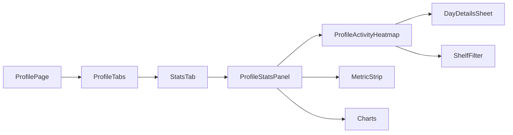

# GitHub-Style Activity Heatmap Implementation Plan

> **For agentic workers:** REQUIRED SUB-SKILL: Use superpowers:subagent-driven-development (recommended) or superpowers:executing-plans to implement this plan task-by-task. Steps use checkbox (`- [ ]`) syntax for tracking.

**Goal:** Add a GitHub-like activity heatmap to the profile `Статистика` view so users can see completed films/games by day, filter by shelf/category, and tap into the underlying cards.

**Architecture:** Keep the new visualization inside the existing profile analytics surface instead of creating a new top-level profile tab. The backend should expose time-bucketed activity data based on a stable completion timestamp and exclude `Позже`/planned cards by construction; the frontend should render one compact summary card that reuses the current profile stats shell, shelf vocabulary, and URL-synced filter state.

**Tech Stack:** React, Telegram UI, FastAPI, Pydantic, pytest, pytest-asyncio.

---

### Task 1: Define the data contract for activity heatmap buckets

**Files:**
- Modify: `[backend/src/models/user_card.py](backend/src/models/user_card.py)`
- Modify: `[backend/src/services/profile/get_user_card_stats.py](backend/src/services/profile/get_user_card_stats.py)`
- Modify: `[backend/src/api/profile/users_routes.py](backend/src/api/profile/users_routes.py)`
- Test: `[backend/src/tests/api/test_profile_routes.py](backend/src/tests/api/test_profile_routes.py)`

**What to build:**
Add a stable completion timestamp to support day-level aggregation without relying on mutable `updated_at`, and extend the profile stats response with heatmap buckets. The response should keep the existing stats fields, but add an explicit activity series that can be filtered by `category_id` and limited to completed cards only.

- [ ] **Step 1: Write the failing backend tests**

```python
# Illustrative test shape only; verify the profile stats payload includes day buckets
# and excludes planned cards from the activity series.
def test_profile_stats_exposes_activity_heatmap_for_completed_cards_only():
    ...
```

- [ ] **Step 2: Implement the minimal backend shape**

```python
# Add a stable completion timestamp on UserCard, then aggregate buckets in stats.
# Keep the existing stats payload intact and append activity data.
```

- [ ] **Step 3: Verify shelf/category filtering stays consistent**

Ensure the activity buckets accept the same `category_id` semantics already used by the rated-cards list and stats drill-down.

- [ ] **Step 4: Run the targeted backend test file**

Run inside the backend environment used by the repo, then confirm the new stats response covers completed-only behavior and category filtering.

---

### Task 2: Add the heatmap UI to the profile analytics surface

**Files:**
- Modify: `[frontend/src/components/profile/ProfileStatsPanel.tsx](frontend/src/components/profile/ProfileStatsPanel.tsx)`
- Modify: `[frontend/src/components/profile/ProfileStatsCharts.tsx](frontend/src/components/profile/ProfileStatsCharts.tsx)`
- Modify: `[frontend/src/components/profile/ProfileStatsFilters.tsx](frontend/src/components/profile/ProfileStatsFilters.tsx)`
- Create: `[frontend/src/components/profile/ProfileActivityHeatmap.tsx](frontend/src/components/profile/ProfileActivityHeatmap.tsx)`
- Modify: `[frontend/src/pages/ProfilePage.tsx](frontend/src/pages/ProfilePage.tsx)`
- Modify: `[frontend/src/pages/PublicProfilePage.tsx](frontend/src/pages/PublicProfilePage.tsx)`
- Modify: `[frontend/src/api/profileTypes.ts](frontend/src/api/profileTypes.ts)`
- Test: `[frontend/src/api/profileApi.test.ts](frontend/src/api/profileApi.test.ts)`

**What to build:**
Render the heatmap at the top of the `Статистика` tab, before the current metric strip and charts, so it reads as a high-level activity summary. Keep the cards/feed areas unchanged. The same component should work for both the user’s own profile and the public profile page, driven by the shared stats payload.

- [ ] **Step 1: Design the layout hierarchy**



- [ ] **Step 2: Build the compact desktop + mobile card**

The card should use a dense grid on desktop and a horizontally usable, touch-friendly layout on mobile. Keep labels minimal; use a legend and a small shelf selector rather than per-cell text.

- [ ] **Step 3: Wire tap/click drill-down**

A day cell should open the existing rated-cards list context for that day and shelf, so the user can jump from summary to cards without leaving the profile.

- [ ] **Step 4: Update the stats payload typing**

Add the new activity series to the frontend profile stats types and keep existing stats consumers working unchanged.

- [ ] **Step 5: Add frontend coverage for the new surface**

Test the heatmap rendering, empty state, selected shelf state, and the fact that the summary lives in `Статистика` rather than in the cards list.

---

### Task 3: Keep the visibility rules explicit

**Files:**
- Modify: `[frontend/src/lib/ratedCardsListQuery.ts](frontend/src/lib/ratedCardsListQuery.ts)`
- Modify: `[frontend/src/hooks/useRatedCardsQueryFromUrl.ts](frontend/src/hooks/useRatedCardsQueryFromUrl.ts)`
- Modify: `[backend/src/services/cards/list_user_card_feed.py](backend/src/services/cards/list_user_card_feed.py)` if needed for shared semantics
- Test: `[frontend/src/lib/__tests__/ratedCardsListQuery.test.ts](frontend/src/lib/__tests__/ratedCardsListQuery.test.ts)`
- Test: `[frontend/src/hooks/__tests__/useRatedCardsQueryFromUrl.test.tsx](frontend/src/hooks/__tests__/useRatedCardsQueryFromUrl.test.tsx)`

**What to build:**
Make the exclusion rules obvious in the shared query model so the heatmap, shelf filter, and rated-cards list all tell the same story. `Позже`/planned cards must stay out of the heatmap, and the query state should continue to round-trip cleanly through the URL.

- [ ] **Step 1: Verify the existing URL/query mapping still supports shelf filtering**
- [ ] **Step 2: Align the heatmap filter inputs with the existing rated-cards filter model**
- [ ] **Step 3: Add regression coverage for completed-only semantics**

---

### Task 4: Document the feature and its placement rules

**Files:**
- Create or modify: `[docs/features/profile-filters-persistence.md](docs/features/profile-filters-persistence.md)` if the current docs should be extended, or add a dedicated feature doc for the new heatmap behavior.
- Update: `.cursor/features/index.yaml` if the feature registry needs a new entry.
- Update: `.cursor/memory/logs/action-log.md` plus a matching log fragment for the feature work.

**What to build:**
Record the final placement decision: the heatmap belongs to the profile `Статистика` view, not the cards list; it uses completed activity only; and shelf/category filtering reuses the existing `category_id` vocabulary.

- [ ] **Step 1: Write the final feature note**
- [ ] **Step 2: Add the implementation summary and verification notes**
- [ ] **Step 3: Record the action log entry**

---

### Notes on product behavior

- The heatmap should summarize only completed watched films/games.
- `Позже` cards are excluded by design.
- Shelf/category filtering should reuse the existing profile vocabulary so users do not learn a second shelf system.
- On mobile, the heatmap should stay compact and touch-friendly; it can scroll horizontally or collapse into a denser summary card, but it should not become a wide desktop-only matrix.
- The best default placement is the top of `Статистика`, above the current charts, because it reads as a summary instead of another list filter.

### Suggested implementation sequence

1. Backend contract and tests.
2. Frontend heatmap card and typing.
3. Drill-down and filter wiring.
4. Docs and verification.
