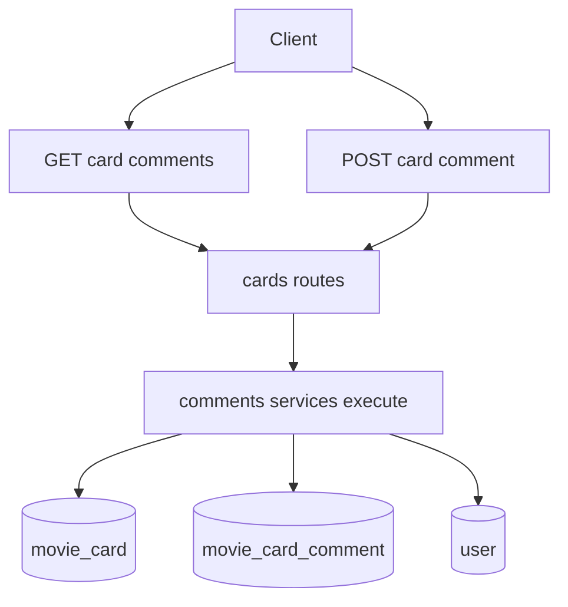

# План: комментарии под карточкой фильма

## Что делаем
- Добавляем backend-only API для комментариев к карточке фильма (`movie_card`) и ответов любой глубины.
- Чтение комментариев делаем публичным (без сессии), создание комментариев/ответов — только для авторизованных пользователей.
- Сохраняем текущие архитектурные паттерны проекта: тонкие роуты + сервисы с `execute()`, курсорная пагинация, явные доменные ошибки.

## Целевые изменения по файлам
- Модели и миграции:
  - Добавить новую модель, например [`/Users/r.makkhmudov/Projects/github/kino/backend/src/models/movie_card_comment.py`](/Users/r.makkhmudov/Projects/github/kino/backend/src/models/movie_card_comment.py).
  - Обновить экспорт в [`/Users/r.makkhmudov/Projects/github/kino/backend/src/models/__init__.py`](/Users/r.makkhmudov/Projects/github/kino/backend/src/models/__init__.py).
  - Добавить Alembic-миграцию в [`/Users/r.makkhmudov/Projects/github/kino/backend/src/migrations/versions/`](/Users/r.makkhmudov/Projects/github/kino/backend/src/migrations/versions/).
- API:
  - Расширить схемы в [`/Users/r.makkhmudov/Projects/github/kino/backend/src/api/cards/schemas.py`](/Users/r.makkhmudov/Projects/github/kino/backend/src/api/cards/schemas.py).
  - Добавить endpoints в [`/Users/r.makkhmudov/Projects/github/kino/backend/src/api/cards/routes.py`](/Users/r.makkhmudov/Projects/github/kino/backend/src/api/cards/routes.py).
- Сервисный слой:
  - Добавить сервис(ы) в [`/Users/r.makkhmudov/Projects/github/kino/backend/src/services/cards/`](/Users/r.makkhmudov/Projects/github/kino/backend/src/services/cards/) для создания и листинга комментариев.
- Тесты:
  - Добавить API-тесты в [`/Users/r.makkhmudov/Projects/github/kino/backend/src/tests/api/`](/Users/r.makkhmudov/Projects/github/kino/backend/src/tests/api/).

## Предлагаемый API контракт
- `GET /api/cards/{card_id}/comments?cursor=&limit=`
  - Публичный endpoint.
  - Возвращает только корневые комментарии (где `parent_comment_id is null`) с `next_cursor`.
  - Для каждого комментария отдаёт `replies_count`.
- `GET /api/cards/{card_id}/comments/{comment_id}/replies?cursor=&limit=`
  - Публичный endpoint.
  - Возвращает ответы конкретного комментария с `next_cursor`.
- `POST /api/cards/{card_id}/comments`
  - Только авторизованный пользователь.
  - Тело: `text` (обязательно), `parent_comment_id` (nullable).
  - Если `parent_comment_id` задан, создаётся ответ на комментарий любой глубины (при проверке, что parent принадлежит тому же `card_id`).

## Модель данных (БД)
- Таблица `movie_card_comment`:
  - `id` (PK, int), `created_at` (из текущих mixin-паттернов).
  - `movie_card_id` FK -> `movie_card.id` (`ondelete='CASCADE'`).
  - `user_id` FK -> `user.id` (`ondelete='CASCADE'`).
  - `parent_comment_id` FK -> `movie_card_comment.id` (`ondelete='CASCADE'`, nullable).
  - `text` (`String`, ограничение длины, например 2000).
- Индексы:
  - `movie_card_id`, `parent_comment_id`, и композитный индекс для курсорного листинга веток (например `(movie_card_id, parent_comment_id, id DESC)`).

## Бизнес-правила в сервисах
- Создание комментария:
  - Проверить существование `movie_card`.
  - Проверить `text` (trim, непустой, max length).
  - Если есть `parent_comment_id`, проверить существование parent и что он принадлежит той же карточке.
- Листинг:
  - Cursor-пагинация по `id` в стиле проекта (`limit + 1`, `id < cursor`).
  - Публичная выдача без зависимости `CurrentUser`.
- Ошибки:
  - Доменные исключения в сервисе (`CardNotFoundError`, `CommentNotFoundError`, `CommentValidationError`, `ParentCommentMismatchError`) и маппинг в `HTTPException` в роутере (`404/422`).

## Поток данных

## Тест-план
- Публичное чтение:
  - `GET` комментариев/ответов без авторизации -> `200`.
  - Пагинация `cursor/limit` работает стабильно.
- Создание (auth only):
  - Без сессии -> `401`.
  - С сессией -> `200`, комментарий сохраняется.
  - Ответ на комментарий другой карточки -> `422`.
  - Неcуществующий `card_id` / `parent_comment_id` -> `404`.
  - Пустой/слишком длинный текст -> `422`.
- Регрессия:
  - Каскадное удаление (карточка удаляется -> комментарии удаляются) покрыть на уровне модели/интеграции.

## Обязательные артефакты процесса (по правилам репозитория)
- Создать/обновить:
  - [`.cursor/features/{feature-slug}/feature.md`](.cursor/features/{feature-slug}/feature.md)
  - [`.cursor/active/{feature-slug}/plan.md`](.cursor/active/{feature-slug}/plan.md)
  - [`.cursor/active/{feature-slug}/progress.md`](.cursor/active/{feature-slug}/progress.md)
  - [`.cursor/active/{feature-slug}/result.md`](.cursor/active/{feature-slug}/result.md)
  - [`docs/features/{feature-slug}.md`](docs/features/{feature-slug}.md)
  - запись в [`.cursor/memory/logs/action-log.md`](.cursor/memory/logs/action-log.md) (и связанный log fragment).
- Верификация запусков делать в docker-контуре проекта (`make backend-test` / `make backend-test-one`).
