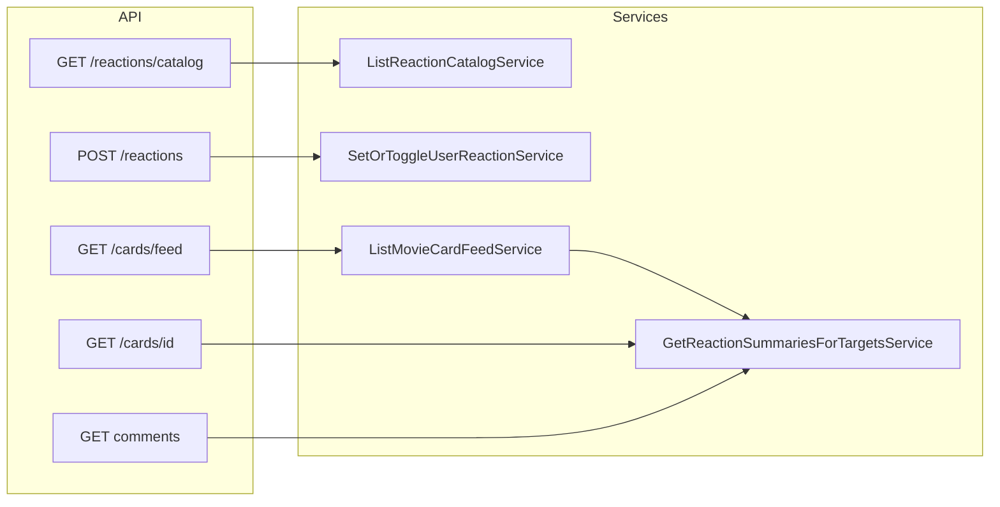

# План: movie-card-custom-reactions

## Продукт и инварианты

- Одна реакция пользователя на цель: уникальность `(user_id, target_kind, target_id)`. Повторный выбор того же `reaction_type_id` — **удалить строку** (toggle off). Выбор другого типа — **UPDATE** `reaction_type_id`.
- Self-react: по умолчанию **разрешён** (константа уровня модуля в сервисе, например `ALLOW_SELF_REACTION = True`, со ссылкой на спеку); при смене политики — одно место.
- Реакции только из каталога: при установке проверять `reaction_type.is_active` и наличие строки; неактивный/несуществующий тип → **422**.
- Telegram-уведомления не делать; после успешного коммита в `SetOrToggleUserReactionService` допустим **комментарий-плейсхолдер** для будущего события.

## Данные и миграция

Новая ревизия Alembic после текущего хэда [`33622715f72c`](backend/src/migrations/versions/33622715f72c_edit_len_comm.py).

**Таблица `reaction_type`** (модель `ReactionType`, наследник [`Base`](backend/src/models/base.py)):

- `id`, `created_at` (как у остальных моделей)
- `label`: nullable string (короткая подпись для UI)
- `image_url`: string (полный URL или стабильный путь из конфига продукта — без хранения бинарников в репо)
- `sort_order`: int, индекс для сортировки
- `is_active`: bool, default true

**Таблица `user_reaction`**:

- FK `user_id` → `user.id` (ON DELETE CASCADE)
- FK `reaction_type_id` → `reaction_type.id` (ON DELETE RESTRICT — нельзя удалить тип с реакциями без миграции данных)
- `target_kind`: string (`movie_card` | `movie_card_comment`) — те же имена, что в API
- `target_id`: int (id карточки или комментария)
- **UniqueConstraint** `(user_id, target_kind, target_id)`
- Индексы для агрегаций: `(target_kind, target_id)`, при необходимости `(user_id, target_kind, target_id)` покрывает unique

Полиморфная цель без FK на две таблицы — существование цели проверять в сервисе (как и для комментариев уже делается логика в других сервисах).

**Сид каталога**: минимальный SQL в [`fixtures/`](fixtures/) или документированный фрагмент + опционально загрузка через существующий [`scripts/load-fixtures.sh`](scripts/load-fixtures.sh); 2–3 типа с placeholder `image_url` (например стабильный CDNURL), чтобы UI и тесты были детерминированны.

## Сервисы (один публичный `execute` на класс)

Имена с глаголом действия, по стандарту репозитория:

| Сервис | Назначение |
|--------|------------|
| `ListReactionCatalogService` | Активные типы, порядок `sort_order`, поля для клиента (`id`, `label`, `image_url`). |
| `SetOrToggleUserReactionService` | Валидация типа и цели; toggle/update; явные исключения для 404/422. Политика self-react через константу. |
| `GetReactionSummariesForTargetsService` | Вход: `viewer_user_id`, списки `movie_card_ids`, `comment_ids`. Выход: два словаря `card_id → summary`, `comment_id → summary` (или один объединённый тип данных). Один запрос агрегатов `GROUP BY target_kind, target_id, reaction_type_id` с join на `reaction_type` для `image_url`/`label`; второй запрос — текущая реакция viewer для тех же целей (или фильтр по viewer в том же проходе — предпочесть отдельный узкий запрос для ясности). |

Логику «без N+1» сосредоточить в **`GetReactionSummariesForTargetsService`** и вызывать её из:

- [`ListMovieCardFeedService`](backend/src/services/cards/list_movie_card_feed.py): после получения `card_ids` и превью комментариев собрать множество id комментариев из превью; передать `viewer_user_id` (новый параметр `execute`).
- [`GetMovieCardDetailsService`](backend/src/services/cards/get_movie_card_details.py): для одной карточки — запрос сводки по одному `movie_card_id`.
- [`ListMovieCardCommentsService`](backend/src/services/cards/list_movie_card_comments.py): для `comment_ids` страницы.

Так сохраняется один стиль с уже существующими батчами тегов и счётчиков комментариев.

## API

Новый роутер, например [`backend/src/api/reactions/routes.py`](backend/src/api/reactions/routes.py), подключить в [`backend/src/api/router.py`](backend/src/api/router.py).

- **`GET /api/reactions/catalog`** — список активных типов (как минимум `CurrentUser`, по аналогии с защищённой лентой).
- **`POST /api/reactions`** — тело: `target_kind`, `target_id`, `reaction_type_id`. Ответ: итоговое состояние для этой цели (например `my_reaction_type_id: int | null` + опционально обновлённые счётчики для упрощения фронта), либо минимальный ответ + клиент опирается на уже встроенные поля в списках при следующем refetch.

Схемы в `backend/src/api/reactions/schemas.py`; доменные ошибки маппить в 404 (нет карточки/комментария) и 422 (тип неактивен/не найден).

### Встраивание агрегатов в существующие ответы

Добавить в Pydantic-модели ([`backend/src/api/cards/schemas.py`](backend/src/api/cards/schemas.py)) общее поле, например:

`reactions: ReactionSummaryResponse` с полями:

- `counts`: список `{ reaction_type_id, count, image_url, label? }` — только типы с `count > 0` (или включая нули для стабильных слотов — проще для UI без нулей).
- `my_reaction_type_id: int | null`

Расширить:

- `MovieCardFeedItemResponse` / страница ленты — [`routes.py` `list_movie_card_feed`](backend/src/api/cards/routes.py)
- `CardDetailResponse` — GET карточки по id
- `MovieCardCommentResponse` — списки комментариев и ответов

**Обоснование против отдельного batch-эндпоинта**: как со [`comments_count`](backend/src/api/cards/schemas.py), один round-trip и предсказуемый контракт для ленты и детальной страницы; дополнительный HTTP не нужен, если сводки считаются 1–2 SQL на запрос.

Прокинуть `viewer` (`CurrentUser.id`) в сервисы ленты и комментариев (сигнатуры `execute(..., viewer_user_id: UUID)`).

## Тесты (pytest в Docker, [`Makefile`](Makefile))

Новый файл, например `backend/src/tests/api/test_reactions_routes.py`, плюс при необходимости точечные дополнения к `test_cards_routes.py` только если проверяете встроенные поля в feed/comments.

Покрыть:

- Каталог возвращает активные типы (после фикстур/записи в БД в тесте).
- Happy path: поставить реакцию на карточку и на комментарий.
- Toggle: повторный POST с тем же типом снимает реакцию.
- Замена типа обновляет строку (одна запись на пользователя).
- Невалидный / выключенный `reaction_type_id` → 422.
- Несуществующая цель → 404.
- Без аутентификации → 401 (где применимо).

Запуск: `make backend-test` или `make backend-test-one target=...` по [`.cursor/tech.md`](.cursor/tech.md).

## Frontend

- Типы в [`frontend/src/api/profileTypes.ts`](frontend/src/api/profileTypes.ts): `ReactionSummary`, `ReactionTypeCatalogItem`, расширить `FeedMovieCard`, `MovieCard`, `MovieCardComment`.
- API: новый небольшой модуль (например `frontend/src/api/reactionApi.ts`) — `getReactionCatalog`, `setReaction`.
- Кэш каталога: один раз при монтировании ленты/детальной страницы или ленивый модульный кэш (по аналогии с [`myProfileBundleCache`](frontend/src/lib/myProfileBundleCache.ts)).
- UI ([`FeedCard.tsx`](frontend/src/components/feed/FeedCard.tsx), [`MovieCardDetailPage.tsx`](frontend/src/pages/MovieCardDetailPage.tsx)):
  - Горизонтальный ряд «иконка + count» из `reactions.counts` + кнопка открытия пикера (`Modal`, `Button`, `Cell` / сетка аватарок-картинок из `@telegram-apps/telegram-ui`).
  - После успешного `setReaction` обновлять локальный state сводки (merge), чтобы не перегружать всю ленту.

Профильная сетка карточек (`MovieCardItemResponse`) можно **не** трогать в MVP, если там нет комментариев и реакции не критичны для списка — это уменьшает дифф; при необходимости позже те же поля.

## Артефакты процесса (после реализации)

Обновить по факту:

- [`.cursor/active/movie-card-custom-reactions/progress.md`](.cursor/active/movie-card-custom-reactions/progress.md) и [`result.md`](.cursor/active/movie-card-custom-reactions/result.md)
- [`docs/features/movie-card-custom-reactions.md`](docs/features/movie-card-custom-reactions.md) — контракт API, модель данных, как грузить каталог, ограничения MVP
- Новый фрагмент в [`.cursor/memory/logs/`](.cursor/memory/logs/) + строка в [`.cursor/memory/logs/action-log.md`](.cursor/memory/logs/action-log.md)

## Зависимости (mermaid)

