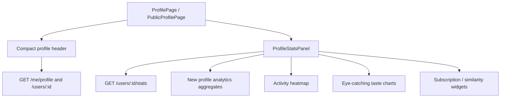

# Profile Analytics Redesign

## Goal
Redesign the profile page so it feels like a living taste-and-social graph instead of a plain stats dashboard. The current five-tile counter block should be replaced with a denser, more expressive header, while the statistics tab should become a structured analytics view anchored by the existing heatmap.

## Proposed direction
- Keep the GitHub-style activity heatmap as the strongest visual anchor.
- Replace the large `8 подписчиков / 7 подписок / 9 оценено / 5 позже / 2 в любимых` grid with compact social and activity summaries.
- Reframe stats around three ideas: overview, taste, and social influence.
- Reuse existing card/profile/subscription data where possible, and add backend aggregates only for the new interactions that cannot be derived on the client.

## Architecture sketch

## Backend changes
- Extend `[backend/src/api/profile/schemas.py](backend/src/api/profile/schemas.py)` so profile responses can expose a compact analytics summary without forcing the UI to compute everything from scratch.
- Update `[backend/src/services/profile/get_user_profile_counts.py](backend/src/services/profile/get_user_profile_counts.py)` if we want the header to show derived social metrics like mutual subscriptions or recent activity counts.
- Extend `[backend/src/services/profile/get_user_card_stats.py](backend/src/services/profile/get_user_card_stats.py)` with any extra aggregates needed for richer charts, such as score buckets, tag clusters, or social-facing rollups.
- If the social widgets need anything beyond existing counts, add a dedicated profile analytics service under `backend/src/services/profile/` rather than overloading the current stats service.
- Add or update tests in `[backend/src/tests/api/test_profile_routes.py](backend/src/tests/api/test_profile_routes.py)` for the new response fields, filtering behavior, and any new derived analytics.

## Frontend changes
- Redesign the top section in `[frontend/src/pages/ProfilePage.tsx](frontend/src/pages/ProfilePage.tsx)` and `[frontend/src/pages/PublicProfilePage.tsx](frontend/src/pages/PublicProfilePage.tsx)` so the counters become a compact social strip instead of five large tiles.
- Refactor `[frontend/src/components/profile/ProfileHeader.tsx](frontend/src/components/profile/ProfileHeader.tsx)` to support a stronger hero block with concise social context.
- Rework `[frontend/src/components/profile/ProfileStatsPanel.tsx](frontend/src/components/profile/ProfileStatsPanel.tsx)` into a more editorial analytics layout with clear subsections: overview, taste, social, rankings.
- Rebuild or extend `[frontend/src/components/profile/ProfileStatsCharts.tsx](frontend/src/components/profile/ProfileStatsCharts.tsx)` so the stats use more distinctive visuals: compact radial charts, flows, bubbles, and denser but readable bars.
- Keep `[frontend/src/components/profile/ProfileActivityHeatmap.tsx](frontend/src/components/profile/ProfileActivityHeatmap.tsx)` as the core interaction point, but make it feel like the primary analytic surface instead of one card among many.
- Simplify or replace `[frontend/src/components/profile/ProfileStatsSummaryCard.tsx](frontend/src/components/profile/ProfileStatsSummaryCard.tsx)` if the new layout no longer needs the current repetitive row-based pattern.
- Update `[frontend/src/api/profileTypes.ts](frontend/src/api/profileTypes.ts)` and `[frontend/src/api/profileApi.ts](frontend/src/api/profileApi.ts)` to match any new profile analytics fields returned by the backend.

## UI concept
- Top hero: avatar, name, short identity line, and a compact social/taste summary.
- First analytics row: heatmap plus 1-2 high-signal insight cards.
- Taste section: richer charting for ratings, tags, company, mood, and era preference.
- Social section: mutuals, overlap, and similarity-to-followers widgets instead of isolated counters.
- Rankings section: top/worst cards, but visually compressed and secondary to the insight panels.

## Verification
- Run backend API coverage for the updated profile endpoints and analytics response shape via pytest inside Docker.
- Add focused frontend checks if any chart helpers or query normalization logic changes.
- Verify the redesigned profile on mobile widths and desktop-like widths to avoid a tall, repetitive dashboard.
- Confirm both owner profile and public profile still render correctly with the new compact header and analytics flow.

## Delivery notes
- This should stay compatible with the existing profile navigation and stats tab entrypoint.
- Prefer additive API changes over breaking response reshapes unless the UI needs a cleaner contract.
- The main success criterion is that the profile feels like a social-taste narrative, not a list of counters and bar charts.
