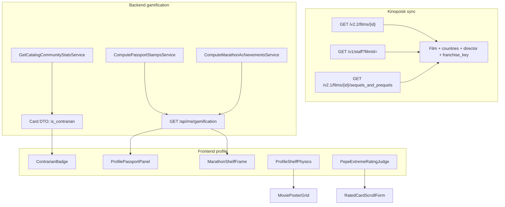

# Profile Gamification: паспорт, бейджи, марафоны, полка, Pepe

## Контекст и ограничения v1

Изучена кодовая база. Ключевые факты:

- [`Film`](backend/src/models/film.py) хранит только `title`, `year`, `genres` — **countries/director/franchise не персистятся**, хотя Kinopoisk DTO уже парсит `countries` ([`kinopoisk_film_dto.py`](backend/src/providers/kinopoisk/kinopoisk_film_dto.py)).
- Community pages отдают **список карточек**, но **не среднюю оценку** ([`list_catalog_community_cards.py`](backend/src/services/catalog/list_catalog_community_cards.py)).
- Профильная аналитика film-only (inner join `Film` в [`get_user_card_stats.py`](backend/src/services/profile/get_user_card_stats.py)) — для паспорта/марафонов v1 **только film-backed rated cards**.
- Паттерны бейджей: [`RatingStreakBadge.tsx`](frontend/src/components/streaks/RatingStreakBadge.tsx), microFun pools в [`microFunCopy.ts`](frontend/src/lib/microFun/microFunCopy.ts).

**Решение по фиче 15 (от пользователя):** расширить синк Kinopoisk — `staff` (режиссёр) + `sequels_and_prequels` (франшиза), только film-backed карточки.

**Feature slug (workflow):** `profile-gamification-stamps`

---

## Kinopoisk API — подтверждение по openapi

Источник: [`.cursor/other/openapi-kinopois.json`](.cursor/other/openapi-kinopois.json) (kinopoiskapiunofficial).

**Режиссёр — да, отдельный эндпоинт:**

- `GET /api/v1/staff?filmId={kinopoisk_id}` — «получить данные об актерах, режисерах и т.д. по kinopoisk film id»
- Ответ: массив `StaffResponse` с полями `staffId`, `nameRu`, `nameEn`, `professionKey`
- `professionKey` enum включает **`DIRECTOR`** (также WRITER, PRODUCER, ACTOR, …)
- Лимит: 20 req/s; 404 если данных нет

**Логика выбора режиссёра v1:** первый элемент с `professionKey == "DIRECTOR"`; если несколько — первый в ответе API (или с минимальным `staffId` — зафиксировать в сервисе). Если DIRECTOR нет — `primary_director_* = null`, фильм не участвует в режиссёрском марафоне.

**Франшиза — да:**

- `GET /api/v2.1/films/{id}/sequels_and_prequels` — массив `FilmSequelsAndPrequelsResponse` (`filmId`, `nameRu`, `relationType`: SEQUEL | PREQUEL | REMAKE | UNKNOWN)
- `franchise_key = f"kp_franchise:{min_kinopoisk_id}"` среди `{current_film} ∪ related_films`

**Страны — уже есть в текущем sync:**

- `GET /api/v2.2/films/{id}` → `countries[]` — уже парсится в [`kinopoisk_film_dto.py`](backend/src/providers/kinopoisk/kinopoisk_film_dto.py), но **не пишется в БД**

**Не использовать (ошибка в черновике плана):** `/v2.2/films/{id}/staff` и `/v2.2/films/{id}/sequels` — **таких путей в openapi нет**.

**Опционально v2:** `GET /api/v2.2/films/{id}/relations` (более широкие связи) или `/api/v2.2/films/collections` (подборки Kinopoisk, не per-film).

---

## Архитектура



---

## Фаза 0 — Артефакты и общая инфраструктура

### Delivery artifacts
- [`.cursor/features/profile-gamification-stamps/feature.md`](.cursor/features/profile-gamification-stamps/feature.md) — scope + acceptance criteria для всех 5 фич
- [`.cursor/active/profile-gamification-stamps/plan.md`](.cursor/active/profile-gamification-stamps/plan.md) — этот план

### 0.1 Расширение модели Film + миграция

Добавить колонки в [`Film`](backend/src/models/film.py):

| Column | Type | Purpose |
|--------|------|---------|
| `countries` | `JSON list[str]` | штампы стран |
| `primary_director_kinopoisk_id` | `int \| null` | марафон режиссёра |
| `primary_director_name` | `str \| null` | отображение |
| `franchise_key` | `str \| null` | стабильный ключ серии, напр. `kp_franchise:301` |

Миграция Alembic в [`backend/src/migrations/versions/`](backend/src/migrations/versions/).

### 0.2 Kinopoisk provider: staff + sequels_and_prequels

Расширить [`kinopoisk_provider_transport.py`](backend/src/providers/kinopoisk/kinopoisk_provider_transport.py) — добавить в `KinopoiskEndpointEnum`:

| Method | OpenAPI path | Transport method |
|--------|--------------|------------------|
| Staff list | `GET /api/v1/staff?filmId={id}` | `get_staff_by_film_id(kinopoisk_id)` |
| Sequels | `GET /api/v2.1/films/{id}/sequels_and_prequels` | `get_sequels_and_prequels(kinopoisk_id)` |

Новые DTO:
- `kinopoisk_staff_dto.py` → `KinopoiskStaffMemberDTO` (`staffId`, `nameRu`, `nameEn`, `professionKey`)
- `kinopoisk_sequels_dto.py` → `KinopoiskSequelFilmDTO` (`filmId`, `nameRu`, `relationType`)

Сервис `EnrichFilmGamificationMetadataService`:
1. Staff → первый `DIRECTOR` → `primary_director_kinopoisk_id`, `primary_director_name`
2. Sequels → `franchise_key` из min id кластера
3. 404 / пустой массив → поля остаются null, upsert не падает

Ошибки парсинга — typed errors; HTTP 404 → empty result, не exception для upsert.

### 0.3 Обновить sync-пути

В [`resolve_kinopoisk_film.py`](backend/src/services/kinopoisk/resolve_kinopoisk_film.py) и upsert в [`search_kinopoisk_films_local_first.py`](backend/src/services/catalog/search_kinopoisk_films_local_first.py):

- Писать `countries` из уже имеющегося DTO
- **Lazy enrichment:** staff + sequels вызывать при resolve/create (не при каждом search hit)

### 0.3a Backfill существующих Film из Kinopoisk (одноразовый скрипт)

**Зачем:** в БД уже сотни/тысячи `Film` без `countries`, `primary_director_*`, `franchise_key`. Новый sync покрывает только новые resolve; для паспорта и марафонов нужен массовый догон.

**Паттерн:** как [`scripts/manage_backfill_film_descriptions.py`](scripts/manage_backfill_film_descriptions.py) — asyncio, `get_session_factory`, `KinopoiskClient` / transport, rate-limit через `--sleep`.

**Файл (mountable в Docker):** [`backend/src/manage_backfill_film_gamification_metadata.py`](backend/src/manage_backfill_film_gamification_metadata.py)

**Makefile-цель:** `make backfill-film-gamification-metadata` (опционально `DRY_RUN=1`, `LIMIT=100`, `FORCE=1`)

**Запуск внутри backend-контейнера:**

```bash
# dry-run на 20 фильмах
docker compose exec -w /opt/app backend \
  python src/manage_backfill_film_gamification_metadata.py --dry-run --limit 20

# боевой прогон (пауза ~0.15s ≈ 3 KP-запроса/фильм, ~6–7 rps суммарно)
docker compose exec -w /opt/app backend \
  python src/manage_backfill_film_gamification_metadata.py --sleep 0.15

# только страны (без staff/sequels — один запрос get_film на фильм)
docker compose exec -w /opt/app backend \
  python src/manage_backfill_film_gamification_metadata.py --skip-staff --skip-sequels
```

**Сниппет скрипта (каркас):**

```python
"""Догон metadata для gamification: countries, director, franchise_key.

Запуск внутри backend (DATABASE_URL, KINOPOISK_* из env):

  docker compose exec -w /opt/app backend \\
    python src/manage_backfill_film_gamification_metadata.py [--dry-run] [--limit N]

Опции: --dry-run, --force, --sleep SEC (default 0.15), --limit N,
       --skip-staff, --skip-sequels (только countries из get_film)
"""

from __future__ import annotations

import argparse
import asyncio
import logging

from sqlalchemy import or_, select

from core.database import get_session_factory
from models.film import Film
from services.gamification.enrich_film_gamification_metadata import (
    EnrichFilmGamificationMetadataService,
)

_log = logging.getLogger(__name__)


def _needs_enrichment(force: bool) -> object:
    if force:
        return True
    return or_(
        Film.countries.is_(None),
        Film.countries == [],  # type: ignore[comparison-overlap]
        Film.primary_director_kinopoisk_id.is_(None),
        Film.franchise_key.is_(None),
    )


async def _run(
    *,
    dry_run: bool,
    force: bool,
    sleep_s: float,
    limit: int | None,
    skip_staff: bool,
    skip_sequels: bool,
) -> None:
    logging.basicConfig(level=logging.INFO, format='%(levelname)s %(message)s')
    factory = get_session_factory()
    enricher = EnrichFilmGamificationMetadataService.build()
    processed = updated = errors = 0

    async with factory() as session:
        q = (
            select(Film.id, Film.kinopoisk_id)
            .where(_needs_enrichment(force))
            .order_by(Film.id.asc())
        )
        if limit is not None:
            q = q.limit(limit)
        rows: list[tuple[int, int]] = list((await session.execute(q)).all())

    for film_id, kinopoisk_id in rows:
        processed += 1
        try:
            if dry_run:
                preview = await enricher.preview(kinopoisk_id=kinopoisk_id)
                _log.info(
                    'dry-run film id=%s kp=%s countries=%s director=%s franchise=%s',
                    film_id,
                    kinopoisk_id,
                    preview.countries,
                    preview.primary_director_name,
                    preview.franchise_key,
                )
            else:
                async with factory() as session:
                    film = await session.get(Film, film_id)
                    if film is None:
                        continue
                    await enricher.execute(
                        session=session,
                        film=film,
                        skip_staff=skip_staff,
                        skip_sequels=skip_sequels,
                    )
                    await session.commit()
                updated += 1
                _log.info('updated film id=%s kinopoisk_id=%s', film_id, kinopoisk_id)
        except Exception as exc:  # noqa: BLE001 — CLI: лог и continue
            errors += 1
            _log.warning('film id=%s kp=%s failed: %s', film_id, kinopoisk_id, exc)

        await asyncio.sleep(sleep_s)

    _log.info(
        'done processed=%s updated=%s errors=%s dry_run=%s',
        processed,
        updated,
        errors,
        dry_run,
    )


def main() -> None:
    p = argparse.ArgumentParser(description=__doc__)
    p.add_argument('--dry-run', action='store_true')
    p.add_argument('--force', action='store_true', help='перезаписать все Film')
    p.add_argument('--sleep', type=float, default=0.15)
    p.add_argument('--limit', type=int, default=None)
    p.add_argument('--skip-staff', action='store_true')
    p.add_argument('--skip-sequels', action='store_true')
    args = p.parse_args()
    asyncio.run(
        _run(
            dry_run=args.dry_run,
            force=args.force,
            sleep_s=max(0.0, args.sleep),
            limit=args.limit,
            skip_staff=args.skip_staff,
            skip_sequels=args.skip_sequels,
        )
    )


if __name__ == '__main__':
    main()
```

**Сервис `EnrichFilmGamificationMetadataService`** (вызывается и из resolve, и из backfill):

- `execute(session, film, skip_staff=False, skip_sequels=False)` — пишет в переданный `Film`
- `preview(kinopoisk_id)` — для `--dry-run`, без commit
- Внутри: `get_film` → countries; опционально `get_staff_by_film_id` → DIRECTOR; опционально `get_sequels_and_prequels` → franchise_key

**Критерии выборки (без `--force`):** фильмы, у которых хотя бы одно из полей `countries` / `primary_director_kinopoisk_id` / `franchise_key` пустое.

**Verification после backfill:**

```bash
docker compose exec -w /opt/app backend python -c "
import asyncio
from sqlalchemy import func, select
from core.database import get_session_factory
from models.film import Film

async def main():
    async with get_session_factory()() as s:
        total = await s.scalar(select(func.count()).select_from(Film))
        with_dir = await s.scalar(
            select(func.count()).select_from(Film).where(Film.primary_director_kinopoisk_id.isnot(None))
        )
        with_fr = await s.scalar(
            select(func.count()).select_from(Film).where(Film.franchise_key.isnot(None))
        )
        print(f'total={total} with_director={with_dir} with_franchise={with_fr}')

asyncio.run(main())
"
```

**DoD backfill:** скрипт в репо; `make backfill-film-gamification-metadata` с `DRY_RUN=1`; документирован в `result.md` и `docs/features/profile-gamification-stamps.md` § Migration/backfill.


### 0.4 Community average для контр-культа

Новый сервис `GetCatalogCommunityStatsService` в `backend/src/services/catalog/`:

```python
# execute(catalog_item_id: int) -> CommunityStatsDTO
# avg_rating: float | None  # AVG(UserCard.rating), is_planned=false, rating not null
# ratings_count: int
```

Правила контр-культа:
- `ratings_count >= 3`
- `abs(user_rating - avg_rating) >= 4.0`
- Только для карточек с `catalog_item_id` или resolvable `film_id`

Batch-вариант `BatchCatalogCommunityStatsService` для списков карточек профиля/ленты.

Expose:
- Поле `community_avg_rating`, `is_contrarian` в [`CardDetailResponse`](backend/src/api/cards/schemas.py) и list card DTO профиля
- Опционально KPI на [`FilmDetailPage`](frontend/src/pages/FilmDetailPage.tsx) / [`CatalogDetailPage`](frontend/src/pages/CatalogDetailPage.tsx) (не обязательно для MVP бейджа)

### 0.5 Gamification API

`GET /api/me/gamification` в новом router [`backend/src/api/gamification/routes.py`](backend/src/api/gamification/routes.py):

```typescript
type GamificationResponse = {
  passport: { stamps: PassportStamp[]; unlocked_count: number }
  marathons: MarathonAchievement[]
  shelf_physics: { mode: 'neutral' | 'slump' | 'glow'; streak_length: number }
}
```

Сервисы (один use-case = один service):
- `ComputePassportStampsService` — см. фазу 2
- `ComputeMarathonAchievementsService` — см. фазу 3
- `ComputeShelfPhysicsService` — последние 5 rated cards по `completed_at DESC`; slump если 3+ подряд `<= 3`, glow если 3+ подряд `>= 9`

Register в [`backend/src/api/router.py`](backend/src/api/router.py).

---

## Фаза 1 — Pepe-судья (фича 17, frontend-only)

**Цель:** при выборе `1` или `10` показать случайную фразу Pepe. Zero backend.

### Изменения
- [`microFunCopy.ts`](frontend/src/lib/microFun/microFunCopy.ts): pools `extreme_rating_low`, `extreme_rating_high` (~8–12 русских фраз в тоне продукта)
- Новый hook `usePepeExtremeRatingJudge.ts` — срабатывает при **пересечении** порога (debounce, не спам при drag slider)
- UI в [`RatedCardScrollForm.tsx`](frontend/src/components/create/RatedCardScrollForm.tsx) и [`EditMovieCardPage.tsx`](frontend/src/pages/EditMovieCardPage.tsx):
  - Inline bubble с Pepe GIF ([`pepeGif.ts`](frontend/src/lib/pepeGif.ts)) или TGUI `Snackbar`/toast
  - `prefers-reduced-motion`: только текст, без анимации
- Vitest: hook triggers once per threshold crossing

**DoD:** создание/редактирование карточки с 1/10 показывает фразу; повторный drag без пересечения — молчит.

---

## Фаза 2 — Полка-физика (фича 16)

**Цель:** визуальное состояние полки на вкладке «Карточки → Оценённые» своего профиля.

### Backend (лёгкий)
- `ComputeShelfPhysicsService` уже в gamification API (фаза 0.5)
- Альтернатива fallback: чистый client-side из загруженных карточек, если API недоступен

### Frontend
- [`ProfileShelfPhysics.tsx`](frontend/src/components/profile/gamification/ProfileShelfPhysics.tsx) — wrapper над [`MoviePosterGrid.tsx`](frontend/src/components/profile/MoviePosterGrid.tsx)
- CSS module `profileShelfPhysics.css`:
  - `neutral` — без эффекта
  - `slump` — `transform: rotate(-0.6deg)` + `translateY(2px)` на декоративной полке-рейке над grid, desaturate
  - `glow` — mint box-shadow + subtle pulse (`@keyframes`, отключается при reduced-motion)
- Декоративная «полка-рейка» (horizontal bar) над grid, не ломает layout grid-cols-3
- Hook `useGamification()` → React Query `GET /api/me/gamification`, staleTime ~5 min, invalidate on card create

**DoD:** 3 низкие оценки подряд → slump; 3 высокие → glow; reduced-motion → только статичный border tint.

---

## Фаза 3 — Штамп «Контр-культ» (фича 14)

**Цель:** медаль «я один так думаю» на **своих** карточках при расхождении >= 4 с community avg.

### Backend
- `BatchCatalogCommunityStatsService` в list paths:
  - [`list_user_cards.py`](backend/src/services/profile/list_user_cards.py) (owner viewing own cards)
  - card detail [`get_user_card_detail`](backend/src/services/cards/) path
- Map to `is_contrarian: bool`, `community_avg_rating: float | null` in API schemas

### Frontend
- [`ContrarianBadge.tsx`](frontend/src/components/gamification/ContrarianBadge.tsx) — pill/medal, tooltip «Средняя в Filmony: X; ты поставил Y»
- Показывать только когда `is_contrarian && isOwnCard`:
  - [`MoviePosterGrid.tsx`](frontend/src/components/profile/MoviePosterGrid.tsx) — top-left corner
  - [`MovieCardDetailPage.tsx`](frontend/src/pages/MovieCardDetailPage.tsx) — рядом с rating ring
  - [`FeedCard.tsx`](frontend/src/components/feed/FeedCard.tsx) — только для своих карточек в ленте (viewer === author)

**DoD:** при >=3 community ratings и delta >=4 бейдж виден; при count<3 — скрыт; чужие карточки — без бейджа.

---

## Фаза 4 — Кино-паспорт (фича 13)

**Цель:** коллекция штампов на профиле (Stats tab или новый sub-tab «Коллекция»).

### Stamp catalog (константа)

`backend/src/const/passport_stamps.py` + mirror TS [`passportStamps.ts`](frontend/src/lib/gamification/passportStamps.ts):

| Stamp ID | Unlock rule |
|----------|---------------|
| `country_first_{slug}` | Первая оценка фильма из страны |
| `decade_first_{1960..2020}` | Первая оценка фильма десятилетия (floor(year/10)*10) |
| `countries_5_in_{year}` | 5+ distinct countries среди cards с `completed_at.year == year` |
| `countries_total_{5,10,20}` | N уникальных стран за всё время |
| `year_first_rated` | Первая оценка в календарном году (meta-stamp) |

**v1 исключение:** «первая ч/б» — **не включать** (нет надёжного metadata); зафиксировать в feature.md как v2 после расширения Film или tag-heuristic.

### Backend
- `ComputePassportStampsService.execute(user_id)`:
  - Query: rated film-backed cards JOIN Film
  - Для каждого stamp: `unlocked_at` (min completed_at), `progress` (current/target для прогрессивных)
  - Возвращать locked + unlocked (locked показывают silhoutte + progress)

### Frontend
- [`ProfilePassportPanel.tsx`](frontend/src/components/profile/gamification/ProfilePassportPanel.tsx)
  - Grid штампов 3–4 колонки, locked/unlocked states
  - Tap → modal с описанием + «какой фильм открыл» (poster thumb)
- Встроить в [`ProfileStatsPanel.tsx`](frontend/src/components/profile/ProfileStatsPanel.tsx) как sub-tab **«Коллекция»** (4-й tab рядом с overview/taste/social/rankings)
- Public profile: read-only view unlocked stamps only (`GET /api/users/{id}/gamification/passport` — без shelf_physics/marathon secrets если нужно)

**DoD:** после оценки фильма из новой страны штамп unlock; «5 стран в 2026» прогрессирует; pytest покрывает edge cases (null year, duplicate country).

---

## Фаза 5 — Режиссёрский / франшизный марафон (фича 15)

**Цель:** achievement без PvP — «5+ оценок одному режиссёру / одной франшизе» → рамка полки.

### Backend
- `ComputeMarathonAchievementsService.execute(user_id)`:
  - **Director marathon:** GROUP BY `primary_director_kinopoisk_id` HAVING count >= 5
  - **Franchise marathon:** GROUP BY `franchise_key` HAVING count >= 5 (exclude null franchise_key)
  - Return: `{ kind: 'director'|'franchise', key, label, count, unlocked_at, sample_poster_urls[3] }`

### Frontend
- [`MarathonShelfFrame.tsx`](frontend/src/components/profile/gamification/MarathonShelfFrame.tsx):
  - Декоративная рамка вокруг `MoviePosterGrid` / shelf header когда есть unlocked marathon
  - Chips «Режиссёр: Nolan · 7 фильмов» / «Франшиза: Matrix · 5 фильмов» — tap фильтрует grid через drill-down (`onDrillToRatedCards` pattern из stats)
- Показ в passport panel как отдельная секция «Марафоны»
- Фильтр режиссёра/franchise: новые query params `?director_kp_id=` / `?franchise_key=` в [`list_user_cards.py`](backend/src/services/profile/list_user_cards.py) + [`ProfileRatedCardsFilters.tsx`](frontend/src/components/profile/ProfileRatedCardsFilters.tsx) (optional v1.1 — можно начать с chip → manual title search)

**DoD:** после 5-й оценки фильма одного режиссёра (с synced staff) marathon unlock; franchise аналогично; games/manual cards не участвуют.

---

## Тестирование

| Area | Tests |
|------|-------|
| Kinopoisk DTOs | unit parse staff/sequels fixtures |
| Film upsert | countries + director + franchise_key persisted |
| Community stats | avg, min count threshold, planned excluded |
| Contrarian flag | delta 3.5 vs 4.0 boundary |
| Passport stamps | country/decade/year aggregation |
| Marathons | group by director/franchise, count=5 threshold |
| Gamification API | auth required, own vs public passport |
| Frontend | Pepe hook, shelf physics CSS classes, badge visibility |

Запуск: `make backend-test`, `make backend-test-one target=src/tests/api/test_gamification_routes.py`, `cd frontend && npm run lint && npm run build`.

---

## Порядок поставки (рекомендуемый)

```mermaid
gantt
  title Delivery order
  dateFormat X
  axisFormat %s

  section QuickWins
  PepeJudge           :0, 1
  ShelfPhysics        :1, 2

  section Infra
  FilmMetadata        :0, 3
  CommunityAvg        :2, 4
  GamificationAPI     :3, 5

  section Features
  ContrarianBadge     :4, 6
  Passport            :5, 7
  Marathons           :3, 8
```



1. **Pepe-судья** — сразу, без блокеров
2. **Film metadata + Kinopoisk staff/sequels** — параллельно с community avg
3. **Contrarian badge** — после community avg
4. **Shelf physics** — после gamification API (или client fallback раньше)
5. **Passport + Marathons** — после metadata backfill

---

## Файлы (основные touchpoints)

**Backend (новые/изменённые):**
- `backend/src/models/film.py` + migration
- `backend/src/providers/kinopoisk/kinopoisk_staff_dto.py`, `kinopoisk_sequels_dto.py`
- `backend/src/services/gamification/enrich_film_gamification_metadata.py`
- `backend/src/manage_backfill_film_gamification_metadata.py` — backfill существующих Film
- `Makefile` — target `backfill-film-gamification-metadata`
- `backend/src/services/catalog/get_catalog_community_stats.py`
- `backend/src/services/gamification/compute_passport_stamps.py`
- `backend/src/services/gamification/compute_marathon_achievements.py`
- `backend/src/services/gamification/compute_shelf_physics.py`
- `backend/src/api/gamification/routes.py`
- `backend/src/tests/api/test_gamification_routes.py`

**Frontend (новые/изменённые):**
- `frontend/src/components/gamification/ContrarianBadge.tsx`
- `frontend/src/components/profile/gamification/ProfilePassportPanel.tsx`
- `frontend/src/components/profile/gamification/MarathonShelfFrame.tsx`
- `frontend/src/components/profile/gamification/ProfileShelfPhysics.tsx`
- `frontend/src/hooks/usePepeExtremeRatingJudge.ts`
- `frontend/src/api/gamificationApi.ts`
- `ProfileStatsPanel.tsx`, `ProfilePage.tsx`, `MoviePosterGrid.tsx`, `RatedCardScrollForm.tsx`

**Docs (по workflow):**
- `docs/features/profile-gamification-stamps.md`
- action-log entry in `.cursor/memory/logs/`

---

## Риски и mitigations

| Risk | Mitigation |
|------|------------|
| Kinopoisk rate limits на staff/sequels (20 rps) | Lazy fetch on resolve only; backfill script с sleep; не вызывать staff/sequels на search hit |
| Фильм без DIRECTOR в staff (404/пусто) | `primary_director_* = null`; режиссёрский марафон не считает этот фильм |
| sequels_and_prequels не покрывает все «франшизы» | v1 достаточно для Matrix-like; v2 — relations/collections |
| Старые Film без metadata | Backfill-скрипт + lazy enrich на resolve; UI показывает «N фильмов ждут синка» до прогона |
| Community avg шум на 3 ratings | Порог count>=3; опционально скрывать avg в UI если count<5 |
| Shelf physics на public profile | Только own profile (`ProfilePage`), не `PublicProfilePage` |
