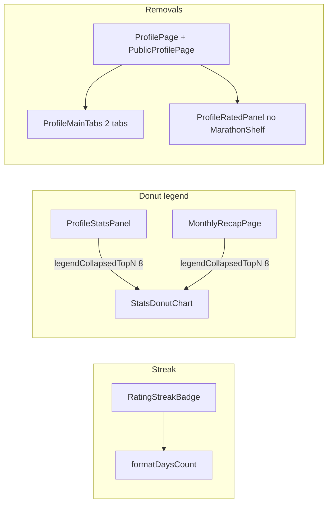

# Profile streak / stats / posts UX — Implementation Plan

> **For agentic workers:** Use subagent-driven-development or executing-plans after approval. Spec SoT: [docs/superpowers/specs/2026-08-07-profile-streak-stats-legend-ux-design.md](docs/superpowers/specs/2026-08-07-profile-streak-stats-legend-ux-design.md).

**Goal:** Clarify streak meaning, shorten long donut legends, remove rated marathon shelf and profile Posts tab.

**Architecture:** Frontend-only. Streak explainer lives in `RatingStreakBadge` (all call sites inherit). Legend collapse is a prop on `StatsDonutChart`. Posts tab and marathon shelf are removed from profile wiring only; feed posts, `ProfilePostsPanel.tsx`, and passport marathons stay.

**Tech stack:** React + Telegram UI, existing CSS streak styles, `formatRuPlural`.

## Global constraints

- No backend API changes
- No avatar cloud animation
- Do not delete `MarathonShelfFrame.tsx`, gamification API, `ProfilePostsPanel.tsx`, or `FeedPage` posts segment
- RU copy and `legendCollapsedTopN={8}` as in the spec
- Verify with `cd frontend && npm run lint && npm run build`
- Feature artifacts: update `.cursor/active/profile-streak-stats-legend-ux/{plan,progress}.md` during work; commit only if the user asks

## File map

| Responsibility | Files                                                                                                                                                                                                         |
| -------------- | ------------------------------------------------------------------------------------------------------------------------------------------------------------------------------------------------------------- |
| Plural days    | [frontend/src/lib/formatRuPlural.ts](frontend/src/lib/formatRuPlural.ts)                                                                                                                                      |
| Streak tooltip | [frontend/src/components/streaks/RatingStreakBadge.tsx](frontend/src/components/streaks/RatingStreakBadge.tsx)                                                                                                |
| Donut legend   | [frontend/src/components/profile/ProfileStatsCharts.tsx](frontend/src/components/profile/ProfileStatsCharts.tsx)                                                                                              |
| Pass `8`       | [frontend/src/components/profile/ProfileStatsPanel.tsx](frontend/src/components/profile/ProfileStatsPanel.tsx), [frontend/src/pages/MonthlyRecapPage.tsx](frontend/src/pages/MonthlyRecapPage.tsx)            |
| Rated shelf    | [frontend/src/components/profile/ProfileRatedPanel.tsx](frontend/src/components/profile/ProfileRatedPanel.tsx), [frontend/src/pages/ProfilePage.tsx](frontend/src/pages/ProfilePage.tsx)                      |
| Posts tab      | [frontend/src/components/profile/ProfileMainTabs.tsx](frontend/src/components/profile/ProfileMainTabs.tsx), ProfilePage, [frontend/src/pages/PublicProfilePage.tsx](frontend/src/pages/PublicProfilePage.tsx) |

---

### Task 1: `formatDaysCount` + streak badge explainer

**Files:** Modify `formatRuPlural.ts`, `RatingStreakBadge.tsx` (AuthorBadge unchanged).

- Add `formatDaysCount(count)` via existing `ruPluralForm` (`день` / `дня` / `дней`).
- In `RatingStreakBadge`: keep `current <= 3 → null` and digit pop animation.
- Wrap in `relative inline-flex` + `button` like [TasteQuizKnowledgeBadge.tsx](frontend/src/components/tasteQuiz/TasteQuizKnowledgeBadge.tsx): click toggles open, `stopPropagation` / `preventDefault`.
- Add `onMouseEnter` / `onMouseLeave` on wrapper to open/close on desktop hover.
- Tooltip: `role="tooltip"`, title «Серия оценок», body «{N} {день|дня|дней} подряд вы ставите оценки фильмам.»
- `aria-label`: «Серия оценок: {N} {день|дня|дней} подряд»

**Check:** Badge still hidden for streak ≤ 3; tap/hover shows tooltip on feed/profile.

---

### Task 2: Donut legend collapse

**Files:** `ProfileStatsCharts.tsx` (`StatsDonutChart` ~89–161), then callers.

- Add optional `legendCollapsedTopN?: number`.
- Donut ring: unchanged full `visibleSegments` (count > 0).
- Legend: if prop set and `visibleSegments.length > topN`, show first `topN` (preserve API order), else full list.
- Local `expanded` state; buttons «Ещё {remaining}» / «Свернуть».
- When `activeValue` is set and not in the top-N slice, auto-expand (`useEffect` or derived initial expand).
- Pass `legendCollapsedTopN={8}` on ProfileStatsPanel: жанры, режиссёры, серии, десятилетия only (not rating/company/mood/shelf).
- Pass `legendCollapsedTopN={8}` on MonthlyRecapPage genre + decade charts.

**Check:** Long taste legends show ≤8 rows until expand; active filter outside top-8 auto-expands.

---

### Task 3: Remove rated marathon shelf

**Files:** `ProfileRatedPanel.tsx`, `ProfilePage.tsx`.

- Drop `unlockedMarathons`, `onMarathonDrill`, `MarathonShelfFrame`, `hasGamification`.
- If `shelfPhysicsMode != null`, wrap grid in `ProfileShelfPhysics` only; else render grid bare.
- On ProfilePage: stop passing marathon props to `ProfileRatedPanel`; keep `gamificationQuery` for `shelfPhysicsMode` / stats drill.
- Leave `ProfilePassportPanel` + `MarathonShelfFrame.tsx` intact.

**Check:** Rated tab has no franchise/director list above posters; passport marathons still work.

---

### Task 4: Remove profile Posts tab

**Files:** `ProfileMainTabs.tsx`, `ProfilePage.tsx`, `PublicProfilePage.tsx`.

- `ProfileMainTab = 'movies' | 'stats'`; remove posts segment; `grid-cols-2`.
- ProfilePage / PublicProfilePage: remove `ProfilePostsPanel` import, posts infinite query, load-more ref, delete handlers used only for that panel, and `mainTab === 'posts'` render (including public `Section header="Посты"`).
- Keep `ProfilePostsPanel.tsx` file and FeedPage «Посты» segment.
- No URL redirect (main tab is local state only).

**Check:** Own + public profile show only Карточки / Статистика; Feed posts still work.

---

### Task 5: Delivery artifacts + verify

- Write/update `[.cursor/active/profile-streak-stats-legend-ux/plan.md](.cursor/active/profile-streak-stats-legend-ux/plan.md)` and `progress.md` (HOT already lists slug).
- Run `cd frontend && npm run lint && npm run build`.
- On closeout later: `result.md`, `docs/features/profile-streak-stats-legend-ux.md`, action-log fragment (not blocking this plan’s code tasks).

---

## Spec coverage

| Spec §            | Task   |
| ----------------- | ------ |
| §4 Posts tab      | Task 4 |
| §5 Streak         | Task 1 |
| §6 Legend         | Task 2 |
| §7 Marathon shelf | Task 3 |
| §8–9 AC / verify  | Task 5 |

