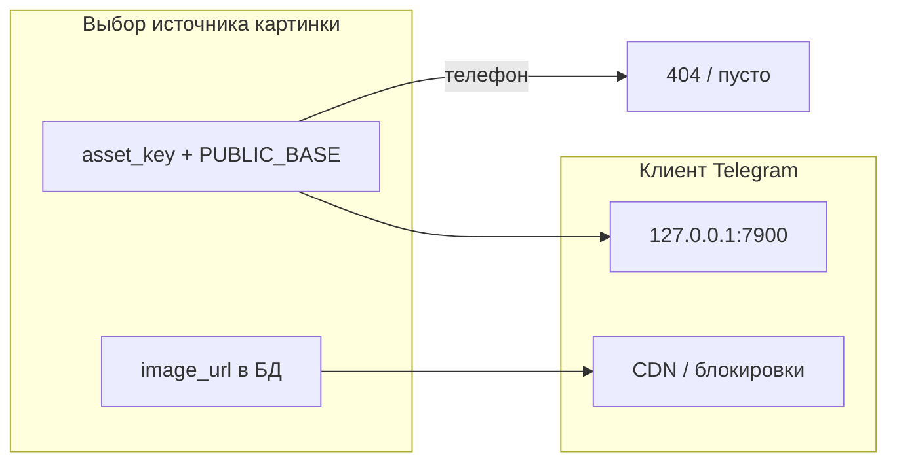

# Переработка реакций: картинки + UI по эталону

## Почему сейчас «не грузится» и выглядит плохо

### 1) То, что видно как R1/R2/R3

В [`fixtures/reaction_type.sql`](fixtures/reaction_type.sql) стоят URL вида **`https://placehold.co/48x48/png?text=R1`**. Это намеренно «картинка с текстом R1», а не битые assets из RustFS. В WebView Telegram внешние CDN часто режутся — тогда браузер покажет только подпись/серый блок.

Отдельно: если для типов указан **`asset_key`**, бэкенд собирает URL как **`REACTION_MEDIA_PUBLIC_BASE_URL + '/' + asset_key`** ([`reaction_urls.py`](backend/src/utils/reaction_urls.py)). В [`vars/.env.development`](vars/.env.development) base = **`http://127.0.0.1:7900/filmony-reactions`** — это **работает только с той машины**, где крутится RustFS (браузер на ПК). В **Mini App на телефоне** `127.0.0.1` — телефон, а не ваш ПК; картинки из RustFS **никогда не откроются**, пока base не будет **достижим с устройства** (LAN IP ПК/сервера, туннель ngrok/cloudflared, или прод-домен).

### 2) «Прозрачный фон» и смайлик

В попапере: подложка `bg-black/20` + переменная `bg-(--tgui--bg_color)` — на тёмной теме панель воспринимается как стекло, сквозь неё виден постер. Триггер — цветная эмодзи **😊**, а в эталоне — **нейтральная круглая кнопка с контурным лицом** (икона, не декоративный emoji).

---

## Что менять по шагам

### Шаг A — сделать картинки предсказуемыми (данные и URL)

| Действо | Цель |
|--------|-----|
| Проверка в DevTools Network на **реальный запрос**: статус и URL для каждого `img` в пикере | Отделить «placehold заблокирован» от «RustFS 403» от «нет сети» |
| Для тестов **не на localhost телефона**: выставить `REACTION_MEDIA_PUBLIC_BASE_URL=http://<LAN-IP-ПК>:7900/filmony-reactions` (тот же base, что открывает Safari с телефона) | RustFS доступен по сети |
| Длинный горизонт (рекомендация к прод-среде отдельно): один **публичный HTTPS-домен** для медиа реакций или прокси с того же origin, что API (исключает mixed content/CSP Mini App) | Стабильные иконки в TG |

Замена плейсхолдеров в dev (минимально из кода без «магии»):

- Обновить [`fixtures/reaction_type.sql`](fixtures/reaction_type.sql): вместо `placehold.co` — **локальные или inline** решения для демо: например маленькие PNG в [`frontend/public/`](frontend/public/) + `image_url=https://your-vite-origin/...` **или** довести синк RustFS до полного набора строк в `reaction_type` с **`asset_key`** и не использовать placehold вообще.

*(Проксирование `/api/reactions/asset/…` через бэкенд к RustFS — отдельный объём миграции; в плане зафиксировать как опционально, если LAN/tunnel недоступны.)*

---

### Шаг B — переработка UI под эталон (только `[ReactionStrip.tsx](frontend/src/components/reactions/ReactionStrip.tsx)` + при необходимости общий утилити-класс)

Сверка с вашим скрином №3 ([сохранённый ассет](image-879441b9-2b66-4eb4-a478-f734164691ee)):

1. **Ряд счётчиков**: выровнять как **светлые / вторичные капсулы** в духе `bg-(--tgui--secondary_bg_color)` или `section_bg`, более выраженное **скругление** как у эталона, без «тяжёлого» кольца; число рядом с мини-превью — как эталон.
2. **Кнопка «добавить реакцию»**: заменить Unicode 😊 на **SVG outline smile** (~24px внутри **круга `size-8`**), те же телеграм-поверхности что Card. `aria-label` оставить «Выбрать реакцию».
3. **Попап (portal)**:
   - панель: **сплошной** фон `bg-(--tgui--secondary_bg_color)` или `bg-(--tgui--bg_color)` + явная **`border`** и **тень**; убрать ощущение «стекла»;
   - оверлей: либо **более плотный** scrim (`bg-black/50–60`), либо **без затемнения**, только закрытие по клику вне (обследовать читаемость);
   - внутренние вкладки/сетка — те же переменные, что остальной UI.
4. **Сетка превью**: сохранить 5 колонок, одинаковый «воздух» как в эталоне; ошибки загрузки **одного** img — локальный skeleton (опционально) вместо пустых клеток.

Затронутые точки приложения уже используют один компонент: [`FeedCard.tsx`](frontend/src/components/feed/FeedCard.tsx), [`MovieCardDetailPage.tsx`](frontend/src/pages/MovieCardDetailPage.tsx) — менять обёртки не нужно, если всё решено внутри `ReactionStrip`.

---

### Шаг C — верификация

- Desktop: браузер, Network — все превью 200 или осознанный fallback.
- Если тестируете Mini App на телефоне: временно **`REACTION_MEDIA_PUBLIC_BASE_URL` с LAN-IP**, подтвердить открытие прямого URL картинки в Safari телефона.
- Регрессия: попап не обрезается `overflow-hidden` карточки (portal уже в `document.body`).

---

## Итог

| Проблема | Решение в плане |
|----------|----------------|
| Не ваши картинки из RustFS / R1,R2,R3 | Различать placehold, `127.0.0.1` на телефоне, блокировку CDN; настроить **достижимый PUBLIC_BASE**, при желании заменить placehold на локальные/синканутые ключи |
| Прозрачность и смайлик | Сплошные токены TG UI, затемнение/backdrop осознанно, триггер = **outline icon**, как на эталоне |
