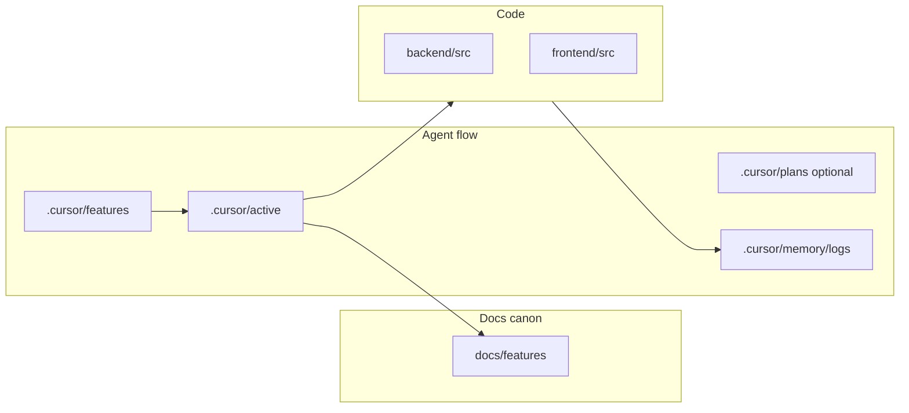

# Аудит структуры репозитория и гайд по стилю

## Что уже есть (артефакты и документация)

| Зона | Назначение | Заметки |
|------|------------|---------|
| [`.cursor/rules/`](.cursor/rules/) | Обязательные правила для агентов (workflow, FastAPI, React/TGUI) | Канон для процесса доставки фич |
| [`.cursor/tech.md`](.cursor/tech.md) | Краткая техархитектура и команды Docker | Часть описания **расходится** с текущим [`compose.yml`](compose.yml) (см. ниже) |
| [`.cursor/user-story.md`](.cursor/user-story.md) | Продуктовая подача | Полезно держать как «зачем», не дублировать в каждой фиче |
| [`.cursor/features/`](.cursor/features/) | Спеки: **два формата** — нумерованные `.md` (003–008) и папки `*/feature.md` | После [`roadmap-consolidation`](.cursor/memory/logs/2026-05-07T120000Z-roadmap-consolidation-docs.md) нумерованные файлы по сути legacy-указатели; имеет смысл явно пометить канон/наследие в одном индексе |
| [`.cursor/active/{slug}/`](.cursor/active/) | `plan.md` / `progress.md` / `result.md` по фичам | Соответствует workflow из правил |
| [`.cursor/plans/*.plan.md`](.cursor/plans/) | Отдельные планы (часто дублируют или дополняют `active/*/plan.md`) | Риск дублирования и устаревания; для гайда — **политика**: один источник правды для «живого» плана |
| [`.cursor/memory/logs/`](.cursor/memory/logs/) + [`action-log.md`](.cursor/memory/logs/action-log.md) | Поштучные логи действий | Формат зафиксирован в индексе |
| [`docs/features/`](docs/features/) | Итоговые outcome-доки фич ([`README`](docs/features/README.md)) | Канон для «что сделано» снаружи репо |

**Вывод по документации:** связка «правила → active → docs/features → action-log» уже зрелая; оптимизация — в **индексации**, **снятии дублей** и **синхронизации с реальным стеком**, а не в переломе flow.

---

## Расхождения документации и реальности (важно для гайда)

1. **Инфра в тексте vs Compose**
   - [`.cursor/tech.md`](.cursor/tech.md) §2 рисует Nginx, Redis, Celery, бота; в [`compose.yml`](compose.yml) сейчас **Postgres + RustFS + backend** (без Redis/Celery/Nginx в этом файле).
   - Корневой [`README.md`](README.md) уже осторожно формулирует «в целевой архитектуре» — **имеет смысл выровнять** `.cursor/tech.md` §2 с тем же языком (или вынести «целевая» диаграмма отдельно от «локальный compose»).

2. **Версии**
   - README: PostgreSQL **16**; compose: образ **`postgres:18-alpine`**.
   - [`backend/pyproject.toml`](backend/pyproject.toml): `requires-python = ">=3.12"` и `target-version = "py313"` — **несогласованность** для гайда (либо 3.13 везде, либо target 3.12).

3. **Ruff и «мусор» импортов**
   - В `pyproject` в `ignore` попадает **`F401`** — неиспользуемые импорты **не ловятся** стандартным линтом. Для гайда: либо ослабить игнор для новых модулей, либо периодически гонять отдельную проверку.

---

## Бэкенд: структура и единообразие

**Фактически слой уже тонкий и предсказуемый:**

- Точка входа: [`backend/src/main.py`](backend/src/main.py) → [`utils/app_utils.py`](backend/src/utils/app_utils.py) → [`api/router.py`](backend/src/api/router.py).
- Сервисы именуются `*Service` с единым стилем (по выборке из [`backend/src/services/`](backend/src/services/)); это **совпадает** с [`.cursor/rules/backend-fastapi-standards.mdc`](.cursor/rules/backend-fastapi-standards.mdc).

**Точки улучшения без смены flow:**

| Тема | Наблюдение | Рекомендация в гайде |
|------|------------|---------------------|
| Реэкспорты пакетов | [`services/cards/__init__.py`](backend/src/services/cards/__init__.py) содержит `__all__`, но импорты в роутерах идут **из подмодулей** (`from services.cards.create_movie_card import ...`), пакет как «баррель» почти не используется | Зафиксировать правило: **либо** везде подмодули (текущий де-факто стиль), **либо** постепенно перевести на тонкий `services.<domain>` API — без смешения |
| Пустой `__init__` | [`services/subscriptions/__init__.py`](backend/src/services/subscriptions/__init__.py) пустой при живых сервисах рядом | Либо минимальный `__all__`/докстринг «импорт только из подмодулей», либо удалить файл, если не нужен пакету |
| Алиасы API | `ListReactionCatalogService = ListReactionCatalogGroupedService` в [`list_reaction_catalog.py`](backend/src/services/reactions/list_reaction_catalog.py) | В гайде: явная пометка **deprecated alias** или срок удаления, чтобы не плодить два имени в новом коде |
| Миграции | Смесь коротких slug-ов (`*_react.py`) и описательных | В гайде: шаблон имени ревизии Alembic (`<rev>_<short_slug>.py`) |

**Поиск неиспользуемых Python-модулей:** автоматически «все .py без импортов» в проекте с динамическим роутингом FastAPI ненадёжен; в плане заложить: **vulture** (с whitelist), ручной проход по `src/utils`, `src/const`, и сравнение с `api/*` + `services/*` импортами.

---

## Фронтенд: структура и единообразие

**Масштаб небольшой (~37 `ts/tsx` в [`frontend/src/`](frontend/src/))** — риск «висячих» файлов ниже, чем на крупном монорепо.

**Уже задокументировано:** [`docs/frontend/ui-conventions.md`](docs/frontend/ui-conventions.md) + правило [`.cursor/rules/frontend-react-telegram-ui-standards.mdc`](.cursor/rules/frontend-react-telegram-ui-standards.mdc).

**Наблюдения для гайда:**

- Смешение стиля импортов страниц: в [`frontend/src/routes.tsx`](frontend/src/routes.tsx) и [`main.tsx`](frontend/src/main.tsx) часть импортов с суффиксом **`.tsx`**, часть — без (Vite/TS это терпят, но единообразие улучшает диффы и ревью).
- Доменные типы фильма (`Film`) живут в [`frontend/src/api/profileTypes.ts`](frontend/src/api/profileTypes.ts) при использовании из [`cardApi.ts`](frontend/src/api/cardApi.ts) — **не ошибка**, но в гайде можно зафиксировать: «общие API-типы в `api/types.ts` или по домену `api/filmTypes.ts`» как **мягкая** цель без немедленного рефакторинга.

**Поиск неиспользуемого TS:** в гайде описать запуск **knip** или **ts-prune** (однократно + CI-опционально) с исключениями для `vite.config`, `*.d.ts`.

---

## Предлагаемый результат (deliverable)

Один канонический документ, например **[`docs/engineering/project-structure-and-style.md`](docs/engineering/project-structure-and-style.md)** (новый файл), со структурой:

1. **Карта репозитория** — что где лежит (`backend/src`, `frontend/src`, `fixtures/`, `scripts/`, `.cursor/*`).
2. **Документация: что канонично** — `docs/features` vs `.cursor/active` vs `.cursor/plans` (политика дублей).
3. **Бэкенд** — слои, именование сервисов, импорты, тесты (Docker), Ruff, миграции, как искать мёртвый код.
4. **Фронтенд** — маршрутизация, API-слой, ссылка на `ui-conventions.md`, ESLint (`consistent-type-imports`), как искать неиспользуемое.
5. **Чеклист перед PR** — `make backend-lint` / `make backend-test`, `npm run lint` / `npm run build`.

Опционально (отдельным маленьким PR): одна строка в [`README.md`](README.md) со ссылкой на этот гайд.

---

## Ограничения (честно)

- **«Файл ни на что не ссылается»** для Python/FastAPI и Vite без статического графа зависимостей даёт ложные срабатывания (динамические импорты, pytest, Alembic). Гайд должен описывать **инструмент + ручную верификацию**, а не обещать 100% автоматом за один прогон.

