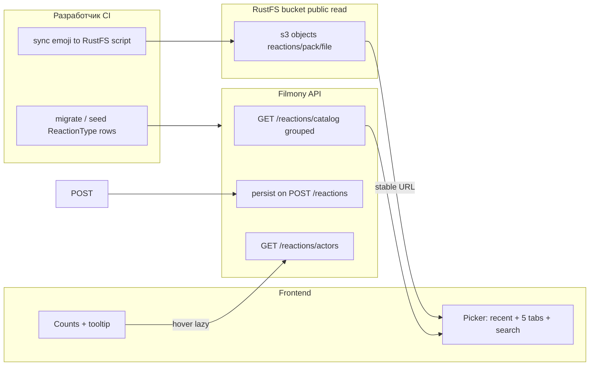

# План: RustFS + пикер реакций с вкладками и недавними

## Принятое решение (от вас)
- Отдача картинок: **публичное чтение** префикса в RustFS + стабильный **`PUBLIC_REACTION_MEDIA_BASE`** (или отдельный домен CDN) для сборки финального URL на клиенте/в API. Совместимо с советами RustFS про S3 и развёртывание в Docker ([Docker](https://docs.rustfs.com/installation/docker/), [Python Boto3](https://docs.rustfs.com/developer/sdk/python.html), [RustFS upstream](https://github.com/rustfs/rustfs)).

## Текущая база
- Реакции: [`ReactionType`](backend/src/models/reaction_type.py) с плоским `image_url`; пикер — [`ReactionStrip.tsx`](frontend/src/components/reactions/ReactionStrip.tsx) (единый список, без вкладок/недавних/тултипа реагентов).
- Локальные пакеты уже лежат в репозитории: `emoji/25781-pepe-emojigg-pack`, `emoji/57442-meme-pt1-emojigg-pack`, `emoji/80599-cats-emojigg-pack`, `emoji/89312-cat-memes-essentials-emojigg-pack`, `emoji/643214-frieren-emojigg-pack` (~94 файла png/gif).
- Compose сейчас без RustFS ([`compose.yml`](compose.yml)).

## Целевая архитектура

### 1) Инфраструктура RustFS
- Добавить сервис `rustfs` в [`compose.yml`](compose.yml): образ `rustfs/rustfs:latest`, порты как в офиц. гайде, volume для данных; отдельный **bucket**, например `filmony-reactions`, ключи вида **`reactions/<category_slug>/<filename>`**.
- Открыть политику **anonymous read только для префикса** `reactions/*` (через настройки bucket/policy RustFS/конфиг — после выбора способа в вашей сборке документировать точную конфигурацию в `docs/…`).
- В [`vars/.env.development`](vars/.env.development) (или аналог для prod): endpoint, ключи приложения-сервера при необходимости upload, **`REACTION_MEDIA_PUBLIC_BASE_URL`** без trailing slash для клиента.

### 2) Инвентаризация локальных эмоди и синхрон в RustFS
- Зафиксировать **YAML/JSON MANIFEST** в репозитории (генерируемый или ручной) с точным порядком 5 вкладок и слагами категорий, соответствующими вашим пяти директориям (можно использовать числовые префиксы как `slug`).
- Одноразовый/повторный скрипт (напр. [`scripts/sync_reactions_to_rustfs.py`](scripts/sync_reactions_to_rustfs.py)) на **`boto3`** с [`endpoint_url` + `signature_version='s3v4'`](https://docs.rustfs.com/developer/sdk/python.html): walk по `emoji/*`, загрузить новые файлы по stable key, сохранять `Content-Type` по расширению (gif/png).

### 3) Данные в Postgres
- Alembic-миграция: расширить `reaction_type` полями, минимально:
  - `category_slug` (string, index) — мапится на вкладку
  - `asset_key` (string, уникально) — S3 ключ без base URL или с полным ключом вида `reactions/pepe/foo.png`
  - при желании `file_name_original`, `sort_order` уже есть
  - **`image_url`**: либо оставить вычисляемым через `PUBLIC_BASE + asset_key`, либо депрекейт и заполнять при сидировании строкой уже известным публичным URL (выберите один источник правды для API — рекомендую **`asset_key` + сборка ответа** чтобы не строковите URL в БД отдельно от смены домена).

- Новая таблица **`user_recent_reaction`** (или аналог):
  - `user_id`, `reaction_type_id`, `last_used_at`
  - unique `(user_id, reaction_type_id)` + ограничение «последние N»: обновление по `UPSERT`; выбор топ-N ORDER BY last_used DESC.

При успешном **`POST /api/reactions`** (установке/не toggle-off) записывать/обновлять «недавние». Toggle-off можно не добавлять в недавние.

### 4) Backend API
- **Каталог** — заменить/расширить [`GET /reactions/catalog`](backend/src/api/reactions/routes.py):
  - ответ типа `{ recent: ReactionCatalogItem[], tabs: [{ category_slug, label, items[] }] }` с сортировкой внутри таба как в MANIFEST или по имени файла.
  - `ListReactionCatalogService` перевести в форму «групповой execute» или добавить второй метод + схемы в [`api/reactions/schemas.py`](backend/src/api/reactions/schemas.py).

- **Тултип stacked** — отдельный эндпоинт **`GET /api/reactions/by-target/details`** или `/actors` с query: `target_kind`, `target_id`, `reaction_type_id`, `limit` (по умолчанию до 50):
  - `ListReactionActorsService`: join `user_reaction`, `user` — вернуть `id`, `profile_slug`, `display_name`, `username`, `first_name`, `last_name`, `photo_url`.
  - В ленту **не добавлять** полный список по умолчанию (избежать раздува JSON); фронт грузит по hover с debounce.
  - Кэш на клиенте по ключу `(targetKind, targetId, reactionTypeId)` на короткое время допустимо.

### 5) Frontend UX (ориентир на ваш скрин)
- Компонент пикера (эволюция [`ReactionStrip.tsx`](frontend/src/components/reactions/ReactionStrip.tsx)):
  - **Поиск** по фильтрам: фильтровать уже загруженные `items[]` локально по `label` и basename `asset`.
  - **Блок «Недавние»** из `recent`; если пользователь впервые — можно показывать подсказку «нет недавних».
  - **Нижние 5 вкладок** — фиксированный массив `tabs` из API или константы фронта, совпадающий с именами ваших каталогов (`@telegram-apps/telegram-ui`: сегментированный таб бар на `Cell`/`Button`/`Caption`/`Tabs` если доступны в вашей версии — подобрать по фактическому API пакета). Контент — сетка 4–5 колонок как на референсе.
  - Превью счётчиков как сейчас (pill + иконка + число).

- **Тултип на hover** по элементу счётчика: `@telegram-apps/telegram-ui` `Tooltip`/встроенный `title` недостаточен для верстки — скорее **кастомный popover**: ряд маленьких `Avatar`, подписей; состояние loading.

- Обновить [`profileTypes`](frontend/src/api/profileTypes.ts) и [`reactionApi.ts`](frontend/src/api/reactionApi.ts) под новые ответы.

### 6) Тесты и документы
- Pytest: сгруппированный каталог; недавние обновляются после POST; эндпоинт актёров возвращает ожидаемых пользователей; 401 без auth где нужно (использовать Docker [`Makefile`](Makefile)).
- Обновить [`docs/features/movie-card-custom-reactions.md`](docs/features/movie-card-custom-reactions.md): RustFS bucket, синк, публичный base URL, вкладки, недавние, тултип.
- Память/лог процесса — по вашему регламенту в `.cursor/memory/logs/`.

## Риск и соответствие лицензий
Third-party meme packs под лицензией Emojigg — перед продом нужно соблюсти права использования этих сборок; техническая часть плана от этого не зависит.

## Объём (что можно отложить)
- Если список реагировавших на тултип > 50 — пагинация или «ещё…» вторым запросом.
- Серверное кеширование presigned для публичного режима не требуется.
