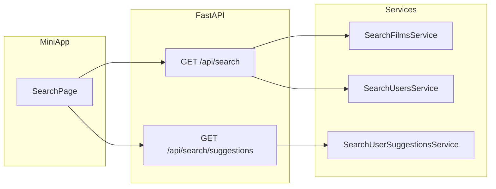

# План: вкладка «Поиск» (локальный каталог + люди + рекомендации)

## Продуктовая user story

**Как** залогиненный пользователь Filmony, **хочу** открыть отдельную вкладку «Поиск», **чтобы** быстро найти тайтл, который уже есть в каталоге приложения, или человека по имени/slug, и **чтобы** до ввода запроса видеть ограниченный набор подсказок «кого посмотреть».

**Сценарии**

1. Пользователь открывает «Поиск» → видит три секции рекомендаций людей (см. ниже) с короткими подзаголовками и лимитами; ниже — поле поиска.
2. Вводит текст (например от 2 символов) → debounce → два блока результатов: **Тайтлы** (из [`film`](backend/src/models/film.py)) и **Люди** (из [`user`](backend/src/models/user.py) по полям, уже используемым в публичном профиле: `display_name`, `username`, `profile_slug` — уточнить точный список в спеке).
3. Пустой поиск по тайтлам: текст **«Пока никто не добавлял этот тайтл. Можете первым — через ссылку с Кинопоиска.»** + кнопка «Добавить карточку» → [`/cards/new`](frontend/src/routes.tsx).
4. Пустой поиск по людям: отдельная короткая фраза (без смешения с тайтлами).
5. Тап по тайтлу → [`/films/:filmId`](frontend/src/routes.tsx); по человеку → [`/u/:userId`](frontend/src/routes.tsx) (как сейчас в приложении).

**Не в scope (явно)**

- Поиск через внешний API Кинопоиска (вариант C из прошлых обсуждений).
- Глобальный full-text без ограничений по длине `q` и rate limit (задать в спеке лимиты).

---

## Рекомендации людей: три источника + лимиты + дедуп

Идея: **три независимых запроса**, фиксированные **верхние лимиты на источник** (например 5+5+5), затем **слияние по `user.id`** с приоритетом порядка:

1. **«Рядом с вашим кругом»** (общие подписки): пользователи `U`, у которых максимально пересекается множество `following_user_id` с теми, на кого подписан **текущий** пользователь (граф [`UserSubscription`](backend/src/models/user_subscription.py): строки где `follower_user_id = viewer`). Исключить: `viewer`, уже подписанных. Сортировка: по убыванию размера пересечения. *Сложнее по SQL — отдельный сервис/DAO с одним запросом или двухшаговой логикой; покрыть тестами.*
2. **«Активные в ленте»** (популярные авторы за окно времени): агрегат по [`MovieCard`](backend/src/models/movie_card.py) за последние **7 дней** по `created_at` или `updated_at` (зафиксировать в спеке одно поле) — топ авторов по **числу новых/обновлённых карточек** за период. *Без отдельной таблицы лайков на первом этапе; при желании позже заменить метрикой по реакциям.*
3. **«Случайные с карточками»**: `ORDER BY random()` с фильтром «есть ≥1 `movie_card`», исключить viewer и уже попавших в объединённый список; лимит маленький (например 5), только при достаточном размере выборки (или кэшировать seed на сессию — опционально в v2).

**Итоговая карточка экрана:** например целевой **cap 12–15 уникальных** пользователей после дедупа; недобор допускается.

---

## Архитектура API (черновик)

- **`GET /api/search`**: query-параметр `q` (trim, min/max длина), `limit_films`, `limit_users` (с разумными дефолтами и верхней границей на сервере). Ответ: два массива DTO (минимум полей для списка: для фильма — id, title, year, poster_url; для пользователя — id, display_name, profile_slug, photo_url и т.д. как в существующих публичных ответах).
- **`GET /api/search/suggestions`**: без `q`; ответ: три массива **или** один массив с полем `source: mutual | popular | random` для отладки/UI подписей. Авторизация: [`CurrentUser`](backend/src/deps/auth.py) как на остальных защищённых маршрутах.

Регистрация роутера: новый модуль, например [`backend/src/api/search/routes.py`](backend/src/api/search/routes.py) + подключение в [`backend/src/api/router.py`](backend/src/api/router.py).

Индексация: **MVP** — `ILIKE '%q%'` с лимитом; отдельный slice (или подзадача) — миграция **`pg_trgm`** + GIN на `film.title` и нужные поля `user` для качества на кириллице.

---

## Фронтенд

- Маршрут: [`frontend/src/routes.tsx`](frontend/src/routes.tsx) — внутри `AppShell`: `<Route path="search" element={<SearchPage />} />`.
- Навигация: [`frontend/src/components/navigation/BottomNav.tsx`](frontend/src/components/navigation/BottomNav.tsx) — третий `NavLink` на `/search`, иконка «лупа» (например из `lucide-react` по правилам UI).
- Страница [`SearchPage`](frontend/src/pages/SearchPage.tsx) (новый файл):
  - сверху блок рекомендаций (три подсекции с заголовками из user story);
  - поле поиска + debounce;
  - результаты двумя секциями;
  - пустые состояния и CTA на [`CreateCardPage`](frontend/src/pages/CreateCardPage.tsx).
- API-слой: например [`frontend/src/api/searchApi.ts`](frontend/src/api/searchApi.ts) + типы (или расширение существующего [`profileTypes`](frontend/src/api/profileTypes.ts) — выбрать один стиль проекта).

Учесть **нижний отступ** под [`BottomNav`](frontend/src/components/navigation/BottomNav.tsx) в [`AppShell`](frontend/src/layout/AppShell.tsx) (уже есть `pb-[calc(5.75rem+...)]` — проверить, что контент поиска не обрезается).

---

## Документация и workflow репозитория

По [`.cursor/rules/feature-delivery-workflow.mdc`](.cursor/rules/feature-delivery-workflow.mdc) и [feature-agent-pipeline](.cursor/skills/feature-agent-pipeline/SKILL.md):

| Артефакт | Путь |
|----------|------|
| Спека фичи | [`.cursor/features/catalog-search-tab/feature.md`](.cursor/features/catalog-search-tab/feature.md) — цели, AC, user story, не-scope, лимиты API |
| План / прогресс / итог | [`.cursor/active/catalog-search-tab/`](.cursor/active/catalog-search-tab/) — `plan.md`, `progress.md`, `result.md` |
| Публичный итог | [`docs/features/catalog-search-tab.md`](docs/features/catalog-search-tab.md) |
| Action log | фрагмент в [`.cursor/memory/logs/`](.cursor/memory/logs/) + строка в индексе [`action-log.md`](.cursor/memory/logs/action-log.md) |

---

## SLICE_MATRIX (для orchestrator / агентов)

| Slice | Цель | Основные артефакты | AC (кратко) |
|-------|------|-------------------|-------------|
| **S1** | Контракт поиска + поиск тайтлов/людей по `q` | `api/search`, `SearchFilmsService`, `SearchUsersService`, миграция trigram *опционально отдельным под-slice* | 401 без сессии; валидация `q`; лимиты; pytest на happy/empty/validation |
| **S2** | Рекомендации `GET /api/search/suggestions` | `SearchUserSuggestionsService` (+ DAO/SQL), дедуп и лимиты | Три источника; исключение self; нет дублей; pytest на фикстурах подписок/карточек |
| **S3** | Фронт: вкладка + страница + API-клиент | `SearchPage`, `BottomNav`, `routes`, `searchApi` | Debounce; пустой текст тайтла как согласовано; навигация на film/user; `lint`/`build` |
| **S4** | Документация + memory | `docs/features/...`, `result.md`, action-log | Полное описание API и UX для ревью |

**AGENT_QUEUE (рекомендуемый порядок)**

1. `business-analyst` — зафиксировать SPEC + SLICE_MATRIX + AGENT_QUEUE в `feature.md` / `plan.md` (если спека ещё «живая»).
2. `code-explorer` — короткий CODE_MAP по `film`, `user`, `user_subscription`, `movie_card`, роутерам.
3. `backend-dev` — **S1**, затем контрольная точка (pytest slice / ruff).
4. `backend-dev` — **S2**, затем pytest.
5. `frontend-dev` — **S3**.
6. `code-reviewer` — накопленный diff или по слоям, как решите в `AGENT_QUEUE`.

Зависимость: **S3 после S1** (контракт стабилен); S2 может идти параллельно S1 только если контракт `suggestions` зафиксирован заранее — безопаснее последовательно **S1 → S2 → S3**.

---

## Верификация

- Backend: `make backend-test` / `make backend-test-one target=…` в Docker ([`.cursor/tech.md`](.cursor/tech.md)).
- Frontend: `cd frontend && npm run lint && npm run build`.

---

## Риски и явные решения в спеке

- **Производительность** `ORDER BY random()`: ограничить пул подзапросом (например только пользователи с карточками и `cards_count`-подобным критерием через EXISTS) и малый LIMIT.
- **Приватность**: не раскрывать существование пользователей вне правил публичного профиля — выровнять с текущей политикой [`users_routes`](backend/src/api/profile/users_routes.py).
- **Копирайт**: в UI везде «тайтл» / «каталог Filmony», избегая «фильм» в пустом состоянии (как вы согласовали).
