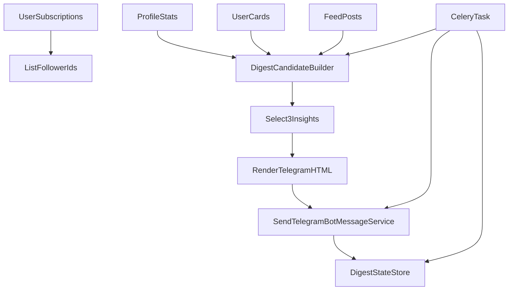

# Telegram Digest Подписанной Активности

## Цель
Сделать фоновую backend-фичу, которая раз в 48 часов отправляет каждому пользователю компактный Telegram digest по людям, на которых он подписан. Digest должен быть полезным, не шумным и основанным на 3 выбранных инсайтах из scored pool, а не на сыром списке фильмов.

## Контекст и опора на существующий код
Опираемся на существующие seams:
- подписки и список follower IDs: `backend/src/services/subscriptions/list_follower_user_ids_for_following_user.py`, `backend/src/services/subscriptions/list_user_subscriptions.py`, `backend/src/models/user_subscription.py`
- источники сигналов: `backend/src/services/profile/get_user_card_stats.py`, `backend/src/services/profile/get_user_profile_counts.py`, `backend/src/services/profile/list_user_feed_posts.py`, `backend/src/services/cards/list_user_card_feed.py`
- Telegram delivery: `backend/src/services/telegram/send_bot_message.py`, `backend/src/services/telegram/engagement_delivery.py`, `backend/src/services/telegram/mini_app_link.py`
- фоновые задачи: `backend/src/tasks/telegram_engagement.py`, `backend/src/celery_app.py`
- тестовые паттерны: `backend/src/tests/api/test_follower_publish_telegram_notifications.py`, `backend/src/tests/api/test_profile_routes.py`, `backend/src/tests/api/test_cards_routes.py`, `backend/src/tests/services/subscriptions/test_list_follower_user_ids_for_following_user.py`, `backend/src/tests/test_celery_app.py`

## План реализации
1. Спроектировать и добавить модель состояния digest для idempotency и дедупа.
   - Храним `recipient_user_id`, окно дайджеста, `last_digest_sent_at`, fingerprint/payload hash и служебные поля для повторных запусков.
   - Добавляем миграцию и экспорт модели в `backend/src/models/__init__.py`.

2. Вынести сервис сборки digest-кандидатов и выбора 3 инсайтов.
   - Собираем activity pool по подпискам пользователя за последние 48 часов.
   - Используем разные категории кандидатов: новая карточка, новый пост, сильный профильный сигнал, сводный авторский сигнал.
   - Ставим quality threshold и правила diversity: максимум 1 пункт на автора, максимум 2 пункта одного типа, предпочтение разным авторам.
   - Делегируем стабильность retries через deterministic seed от `recipient_user_id + digest_window_start`.

3. Реализовать сервис рендера и отправки Telegram digest.
   - Формируем HTML-сообщение с коротким заголовком, 3 инсайтами максимум и CTA через `mini_app_link` helpers.
   - Используем существующий `SendTelegramBotMessageService` для доставки.
   - Пропускаем пользователей без Telegram link, без qualifying activity и с уже обработанным окном.

4. Подключить digest к Celery-контурy.
   - Добавить отдельный task в `backend/src/tasks/telegram_engagement.py` или рядом с ним, без новых HTTP routes.
   - Task должен итерировать due recipients, изолировать ошибки на уровне пользователя и не валить batch из-за одного сбоя.
   - Обновить регистрацию task в `backend/src/celery_app.py`, если потребуется новый модуль.

5. Покрыть backend pytest-тестами весь новый surface.
   - Проверить candidate scoring/selection, caps по автору и типу, fallback при малом объёме, детерминированность выбора в рамках окна.
   - Проверить Telegram copy, HTML escaping, deep link/fallback-CTA и поведение при недоступном чате.
   - Проверить Celery orchestration: due/non-due recipients, отсутствие дублей при повторном запуске, изоляцию ошибок.
   - Проверить persistence/state update после успешной доставки и no-op при повторной обработке окна.

## Границы и решения
- Новых HTTP routes не добавляем.
- Фича живёт как backend + Celery + Telegram-only workflow.
- MVP сразу делаем полноценным по логике digest, но без пользовательских настроек частоты и без веб-интерфейса.
- `monthly-recap-shareable-summary` не трогаем: это отдельная фича.

## Тестовый контур
Добавить/расширить pytest в следующих местах:
- `backend/src/tests/services/telegram/test_subscribed_activity_digest.py` — scoring, selection, copy, delivery behavior
- `backend/src/tests/tasks/test_subscribed_activity_digest.py` — orchestration, due recipients, idempotency, error isolation
- `backend/src/tests/services/subscriptions/test_list_following_user_ids_for_follower_user.py` — если появится helper для recipient lookup
- `backend/src/tests/test_celery_app.py` — регистрация task, если нужен новый module import
- `backend/src/tests/api/test_profile_routes.py` и `backend/src/tests/api/test_cards_routes.py` — только если реализация затронет уже существующие контракты или общие helper-слои

## Критерии готовности
- Digest отправляется каждые 48 часов подписанным пользователям с Telegram link и qualifying activity.
- Выборка состоит из 3 инсайтов, если pool позволяет, и не деградирует в шумный список.
- Повторный запуск задачи не создает дубликаты в одном окне.
- Telegram delivery и отсутствие чата ведут себя по существующим проектным паттернам.
- Все новые и изменённые backend behavior покрыты pytest-тестами.

## Mermaid

