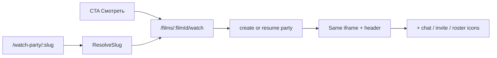
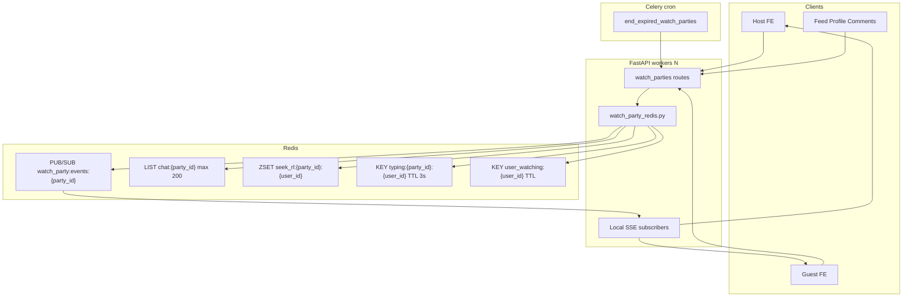

# Watch Party v2 — Redis, ephemeral chat, presence, bridge

**Feature slug:** `film-watch-party` (продолжение MVP)

**Важная находка по сообщениям:** сейчас чат **пишется в Postgres** (`watch_party_message`) — см. [`backend/src/services/watch_parties/watch_party_messages.py`](backend/src/services/watch_parties/watch_party_messages.py), snapshot в [`record_watch_party_heartbeat.py`](backend/src/services/watch_parties/record_watch_party_heartbeat.py). Это противоречит желаемому «комната временная, после reload пусто». План включает **миграцию чата в Redis** и **deprecate/drop таблицы**.

**UX-проблема MVP (скриншот):** отдельная страница [`WatchPartyPage.tsx`](frontend/src/pages/WatchPartyPage.tsx) с перегруженным UI + дубли чата + кривой `Input header="Сообщение"`. Пользователь не должен выбирать между «Смотреть» и «Смотреть вместе» — это один и тот же просмотр.

---

## Phase UX-0 — Единый экран просмотра (solo = party)

**Принцип:** просмотр один — с друзьями или без. Party — invisible infra; UI не меняется кардинально при join гостей.

### Что убрать

| Сейчас (неправильно) | Станет |
|----------------------|--------|
| Две кнопки «Смотреть» + «Смотреть вместе» на [`FilmDetailPage.tsx`](frontend/src/pages/FilmDetailPage.tsx), [`MovieCardDetailPage.tsx`](frontend/src/pages/MovieCardDetailPage.tsx) | Одна кнопка **«Смотреть»** |
| Отдельная [`FilmWatchPage.tsx`](frontend/src/pages/FilmWatchPage.tsx) без party | **Единая** watch-страница с party layer |
| Отдельная [`WatchPartyPage.tsx`](frontend/src/pages/WatchPartyPage.tsx) | **Удалить**; логика → composables на unified page |
| [`WatchPartyCreateSheet.tsx`](frontend/src/components/watchparty/WatchPartyCreateSheet.tsx) confirm sheet | **Убрать** — party создаётся silently при «Смотреть» |
| [`useWatchPartyCreateFlow.tsx`](frontend/src/hooks/useWatchPartyCreateFlow.tsx) navigate to `/watch-party/...` | Hook → `useEnsureWatchParty(filmId)` на watch page |

### Целевой flow



1. **Canonical route:** `/films/:filmId/watch` — единственный экран плеера.
2. **On mount:** `POST /api/watch-parties { film_id }` или resume active (409 → тот же slug). Solo = party с 1 member, **тот же UI**.
3. **Deep link** `/watch-party/:inviteSlug` — resolve slug → **redirect** на `/films/:filmId/watch` (party id в session/query `?party=` только для join-by-link гостей).
4. **Back** = `leaveWatchParty` + navigate to film (как сейчас, но без отдельной «guest panel»).

### Header (минимальный, одинаковый solo/group)

- Back · title · `{n}` участников (включая 1) · invite · chat
- Без горизонтальной ленты аватаров в основном layout (roster — в sheet по tap на `{n}`)

**Зачем:** один mental model «я смотрю фильм». **Даст:** меньше путаницы, нет лишнего шага create sheet.

**Tests:** vitest redirect slug→watch; e2e smoke solo watch creates party; guest deep link lands same page.

---

## Phase UX-1 — Упростить UI + починить чат

### 1. Упростить layout (убрать сложность MVP)

**Удалить / спрятать в sheet:**

- Большая панель host controls (slider + Play/Pause/Seek/3-2-1/Завершить) → **компактный bottom bar** или sheet «Управление» (только host, только если `members > 1` или host явно открыл)
- Отдельная guest panel («Ведущий: ▶», «Синхронизироваться», «Выйти») → **только drift banner** + sync CTA inline на видео; exit = back
- Кнопка «Открыть в браузере» — оставить одну, в overflow/menu, не primary
- Countdown 3-2-1 — optional в host sheet, не на видео overlay по умолчанию

**Новые компоненты** (вынести из monolith page):

| Component | Role |
|-----------|------|
| [`FilmWatchPage.tsx`](frontend/src/pages/FilmWatchPage.tsx) | Unified shell: iframe + header + party hooks |
| `WatchPartyHeader.tsx` | back, title, count, invite, chat icons |
| `WatchPartyRosterSheet.tsx` | avatars + host crown (tap on count) |
| `WatchPartyChatSheet.tsx` | chat list + input (fixed layout) |
| `WatchPartyHostControlsSheet.tsx` | play/pause/seek/countdown/end |

**Зачем:** текущий экран перегружен 4 слоями (roster + video + controls + chat). **Даст:** читаемый mobile UI как у solo watch.

### 2. Баг: дублирование сообщений

**Root cause** в [`WatchPartyPage.tsx`](frontend/src/pages/WatchPartyPage.tsx) lines 92–97 и 292–293:

- `submitChat` append из REST response: `setMessages(prev => [...prev, msg])`
- SSE `chat_message` append с dedup по id — но race / double SSE / snapshot overlap может дать два одинаковых body

**Fix (single source of truth):**

1. **`submitChat`:** только `setChatDraft('')`; **не** append из REST.
2. **`handleSseEvent` chat_message:** единственный путь добавления.
3. Helper [`mergeWatchPartyMessages.ts`](frontend/src/lib/mergeWatchPartyMessages.ts): upsert by `id`, stable sort by id.
4. Snapshot `messages`: replace via merge, not blind `setMessages(array)`.
5. Vitest: REST+SSE same id → 1 row; two events same id → 1 row.

### 3. Баг: кривой chat input

**Root cause:** TGUI `Input` с `header="Сообщение"` в `flex gap-2` рядом с `Button` — label ломает высоту row (видно на скрине).

**Fix in `WatchPartyChatSheet.tsx`:**

```tsx
<form className="flex items-center gap-2 border-t border-white/10 pt-2">
  <input
    className="min-w-0 flex-1 rounded-full bg-white/10 px-3 py-2 text-sm outline-none"
    placeholder="Сообщение…"
    /* без floating header */
  />
  <IconButton mode="filled" type="submit" aria-label="Отправить">
    <Send className="block size-4" />
  </IconButton>
</form>
```

- Без `Input header=…`; native input или TGUI без header
- Send = `IconButton` size `s`, не full `Button` с «→»
- Chat sheet: `flex flex-col h-[50dvh]` — list `flex-1 min-h-0 overflow-y-auto`, form `shrink-0`

**Зачем:** визуально ровный input bar. **Даст:** нормальный chat UX до virtual scroll (Phase 8).

---

## Архитектура (целевое состояние)



---

## Phase 0 — Подготовка артефактов

- Обновить [`.cursor/active/film-watch-party/plan.md`](.cursor/active/film-watch-party/plan.md) (этот план) и [`progress.md`](.cursor/active/film-watch-party/progress.md)
- Scope doc: ephemeral chat, Redis infra, badge, bridge — в [`docs/features/film-watch-party.md`](docs/features/film-watch-party.md)

---

## Phase 1 — Redis infra + settings

**Новые env** в [`backend/src/conf/settings.py`](backend/src/conf/settings.py) (`WatchPartySettings`):

| Setting | Default | Назначение |
|---------|---------|------------|
| `WATCH_PARTY_REDIS_URL` | fallback `CATALOG_CACHE_REDIS_URL` → `CELERY_BROKER_URL` | отдельный Redis для party |
| `WATCH_PARTY_CHAT_MAX_MESSAGES` | 200 | ring buffer в Redis LIST |
| `WATCH_PARTY_CHAT_PAGE_SIZE` | 50 | page size API |
| `WATCH_PARTY_SEEK_RATE_LIMIT` | 10/min | seek RL |
| `WATCH_PARTY_HEARTBEAT_INTERVAL_SECONDS` | 30 | клиентский interval |
| `WATCH_PARTY_MISSED_HEARTBEATS_AWAY` | 3 | → status `away` |
| `WATCH_PARTY_MISSED_HEARTBEATS_LEFT` | 20 | → status `left` |
| `WATCH_PARTY_TYPING_TTL_SECONDS` | 3 | typing key TTL |

**Новый модуль:** [`backend/src/services/watch_parties/watch_party_redis.py`](backend/src/services/watch_parties/watch_party_redis.py)
- Shared `Redis` client (pattern из [`redis_catalog_cache.py`](backend/src/services/catalog/redis_catalog_cache.py))
- Helpers: `publish_party_event`, `subscribe_party_events`, chat list ops, seek RL, typing, `set_user_watching` / `clear_user_watching` / `batch_user_watching`
- In test env (`ENV=test`): in-memory fake (как catalog cache) для unit/integration без Redis

**Зачем:** единая точка для всех ephemeral данных; multi-worker ready.

---

## Phase 2 — Redis SSE fan-out

**Refactor** [`watch_party_broker.py`](backend/src/services/watch_parties/watch_party_broker.py):

- `publish_watch_party_event` → serialize `{seq, type, payload}` → Redis PUBLISH `watch_party:events:{party_id}`
- `iter_watch_party_sse` → local `asyncio.Queue` + background task SUBSCRIBE; on message fan-out to queue
- Monotonic `seq` via Redis `INCR watch_party:seq:{party_id}` (не in-process counter)
- Snapshot on connect: unchanged builder, но messages из Redis (Phase 3)
- `since_seq`: фильтровать события с `seq <= since_seq` (уже частично есть)

**Зачем:** события доходят при `workers > 1`. **Даст:** стабильный play/pause/chat/presence в проде.

**Tests:**
- Unit: fake Redis pub/sub fan-out между двумя «worker» subscribers — [`test_watch_party_broker.py`](backend/src/tests/unit/services/watch_parties/test_watch_party_broker.py)
- Integration: publish on worker A, SSE read on B (можно через fake + two broker instances)

---

## Phase 3 — Ephemeral chat (убрать Postgres)

**Текущее:** `CreateWatchPartyMessageService` → `dao.insert_message` + commit.

**Целевое:**
1. Chat только в Redis LIST `watch_party:chat:{party_id}`:
   - `LPUSH` + `LTRIM` до `CHAT_MAX_MESSAGES`
   - Message id: monotonic `INCR watch_party:chat_id:{party_id}` (int, не BigSerial)
   - Payload JSON: `{id, author_user_id, body, created_at}`
2. **Убрать** DB writes/reads из message services; DAO methods `insert_message`, `list_messages`, `delete_message` — deprecate
3. **Убрать** author delete-within-2-min (не нужен для ephemeral) или оставить только Redis remove-by-id (optional, low priority)
4. Snapshot + `GET /messages` читают Redis с cursor `before_id` (scan list, filter id < before_id, take page_size)
5. **Migration:** новая Alembic — `DROP TABLE watch_party_message` (или оставить таблицу пустой + follow-up drop; предпочтительно drop если нет prod data)
6. **Model:** удалить `WatchPartyMessage` из [`watch_party.py`](backend/src/models/watch_party.py)

**Поведение для пользователя:**
- Reload страницы → чат пуст (если Redis key expired или party ended) — **это OK и документируем**
- Внутри активной сессии без reload — история до 200 сообщений + paginate вверх

**Зачем:** временная комната без мусора в БД. **Даст:** проще cleanup, меньше storage, соответствует продукту.

**Tests:** integration chat POST + GET cursor; snapshot includes last N from Redis; party end clears Redis keys.

---

## Phase 4 — Rate limits в Redis

**Seek** — [`update_watch_party_playback.py`](backend/src/services/watch_parties/update_watch_party_playback.py):
- Replace in-memory `_seek_timestamps` with Redis ZSET sliding window (same pattern as seek RL key above)
- Remove dict from `build()`

**Messages** — [`watch_party_messages.py`](backend/src/services/watch_parties/watch_party_messages.py):
- Replace `_message_timestamps` dict with Redis counter/window

**Party TTL metadata** (optional key `watch_party:meta:{party_id}` EX = ttl_hours) for Redis-only cleanup hints.

**Зачем:** RL работает cross-worker и переживает restart. **Даст:** защита от spam seek/chat.

---

## Phase 5 — Celery: закрыть протухшие party

**New:** [`backend/src/tasks/watch_party.py`](backend/src/tasks/watch_party.py) + register in [`celery_app.py`](backend/src/celery_app.py)

**Service:** `EndExpiredWatchPartiesService`
- Query DAO: `status=active` AND `created_at + ttl_hours < now()` (reuse [`ensure_active_watch_party.py`](backend/src/services/watch_parties/ensure_active_watch_party.py) `is_party_expired`)
- For each: set `ended`, `ended_at`, publish `party_ended`, clear Redis keys (chat, seq, typing, user_watching for members)
- Lazy path in `EnsureActive` **остаётся** как fast path

**Cron doc:** [`docs/engineering/prod-cron-filmony.md`](docs/engineering/prod-cron-filmony.md) — e.g. every 15 min

**Зачем:** users не застревают с `409 already active`. **Даст:** чистые party rows + Redis.

**Tests:** integration with frozen `created_at` + task call.

---

## Phase 6 — Heartbeat: offline после N пропусков

**Refactor** [`record_watch_party_heartbeat.py`](backend/src/services/watch_parties/record_watch_party_heartbeat.py) `_sweep_presence`:

| Было | Станет |
|------|--------|
| `_AWAY_AFTER_SECONDS = 90` fixed | `interval * MISSED_HEARTBEATS_AWAY` |
| `_LEFT_AFTER_AWAY_SECONDS = 30min` | `interval * MISSED_HEARTBEATS_LEFT` |

**On heartbeat success:**
- `set_user_watching(user_id, {film_id, title, party_id})` EX = interval * MISSED_HEARTBEATS_LEFT + buffer
- Publish `presence` SSE if status changed

**On leave/end/offline sweep → left:**
- `clear_user_watching(user_id)`

**Frontend:** [`FilmWatchPage.tsx`](frontend/src/pages/FilmWatchPage.tsx) — heartbeat interval sync with backend default 30s.

**Зачем:** предсказуемая модель «3 пропуска = away». **Даст:** честный roster + данные для global badge.

---

## Phase 7 — Typing «печатает…»

**Backend:**
- `POST /api/watch-parties/{id}/typing` (member only, rate limit 1/2s per user)
- SET Redis typing key + PUBLISH SSE `{type: "typing", payload: {user_id, display_name}}`
- Expire silently (no unpublish event needed; UI timeout client-side)

**Frontend:** debounced send on `chatDraft` in `WatchPartyChatSheet.tsx`
- State `typingUserIds: Map<userId, expiresAt>` from SSE
- UI under chat header: «Иван печатает…»

**Зачем:** live-room feel без WS. **Даст:** выше engagement в чате.

---

## Phase 8 — Chat pagination + virtual scroll

**Backend:** `GET /messages?before_id=&limit=` — cursor по Redis (already in routes, switch data source)

**Frontend:**
- Add `@tanstack/react-virtual` (нет в проекте сейчас)
- New [`WatchPartyChatList.tsx`](frontend/src/components/watchparty/WatchPartyChatList.tsx): virtualizer, load older on scroll top (`before_id` = oldest loaded id)
- Remove auto `scrollIntoView` on every message when user scrolled up; keep stick-to-bottom when at bottom

**Зачем:** 200 сообщений в long session без лагов DOM. **Даст:** плавный чат на слабых телефонах.

**Note:** pagination здесь — **in-session history из Redis**, не durable storage. Reload = пустой чат — expected.

---

## Phase 9 — SSE reconnect с `since_seq`

**Frontend** [`useWatchPartyEvents.ts`](frontend/src/hooks/useWatchPartyEvents.ts):

```typescript
// loop: consumeWatchPartySse(partyId, signal, onEvent, lastSeqRef.current)
// on disconnect (not aborted): exponential backoff 1s→8s, reconnect with since_seq
```

**Backend:** already supports `?since_seq=` in routes + broker filter.

**Зачем:** TMA рвёт long connections. **Даст:** восстановление state без full reload.

---

## Phase 10 — Auto-подсказка «отстали на N сек»

**Frontend** [`FilmWatchPage.tsx`](frontend/src/pages/FilmWatchPage.tsx) + [`watchPartyTime.ts`](frontend/src/lib/watchPartyTime.ts):

- Guest-only: track `guestAnchorMs` (позиция при последнем «Синхронизироваться» или join)
- Every 5s: `drift = |expectedPlaybackMs(hostState) - guestAnchorMs - elapsedLocal|`
- If `drift > DRIFT_THRESHOLD_SEC` (e.g. 8s): show persistent banner «Отстали на ~N сек» + CTA sync (reuse `syncHintOpen`)
- Host playing + guest paused → always show

**Зачем:** soft sync без Phase 2 player. **Даст:** меньше «рассинхрона не заметил».

---

## Phase 11 — Global badge «сейчас смотрит» (как серия оценок)

**Backend:**
- `POST /api/watch-parties/watching/batch` `{ user_ids: UUID[] }` (max 100, mirror streaks)
- Response: `Record<userId, { film_id, film_title, party_id? }>` only for users with active Redis `user_watching` key
- Populate key in heartbeat/join; clear on leave/end/offline

**Frontend** (pattern from [`RatingStreakBadge.tsx`](frontend/src/components/streaks/RatingStreakBadge.tsx)):

| File | Role |
|------|------|
| `components/watchparty/WatchingNowBadge.tsx` | Compact badge (film icon + truncated title), tooltip «Сейчас смотрит: …» |
| `components/watchparty/WatchingNowAuthorBadge.tsx` | Lookup wrapper |
| `hooks/useWatchingNowOfUsers.ts` | React Query batch |
| Extend [`FeedAuthorBadgesProvider.tsx`](frontend/src/context/FeedAuthorBadgesProvider.tsx) | batch watching + streaks |

**Wire badge next to name** (same slots as streak):
- [`CommentAuthorRow.tsx`](frontend/src/components/comments/CommentAuthorRow.tsx)
- [`ProfileHeader.tsx`](frontend/src/components/profile/ProfileHeader.tsx)
- [`FeedCard.tsx`](frontend/src/components/feed/FeedCard.tsx), [`FeedPostCard.tsx`](frontend/src/components/feed/FeedPostCard.tsx)
- [`CommunityRatingsList.tsx`](frontend/src/components/community/CommunityRatingsList.tsx)
- [`SubscriptionsPage.tsx`](frontend/src/pages/SubscriptionsPage.tsx)
- [`MovieCardDetailPage.tsx`](frontend/src/pages/MovieCardDetailPage.tsx)
- [`FilmWatchPage.tsx`](frontend/src/pages/FilmWatchPage.tsx) roster sheet

**Polling:** refetch batch every 60s on visible feed surfaces (streaks already batch on mount; add staleTime 30–60s for watching).

**Зачем:** social signal «занят просмотром». **Даст:** контекст для друзей, мотивация join via invite.

---

## Phase 12 — In-app invite mutual follows

**Backend:**
- `POST /api/watch-parties/{id}/invite` `{ user_ids: UUID[] }`
- Service `InviteWatchPartyMembersService`: host only, party active, each target = mutual follow ([`assert_mutual_watch_partner.py`](backend/src/services/watchlist/assert_mutual_watch_partner.py)), not already in party, room capacity
- Notification: new [`send_watch_party_invite_notification.py`](backend/src/services/telegram/send_watch_party_invite_notification.py) — reuse pattern from [`send_watchlist_invite_notification.py`](backend/src/services/telegram/send_watchlist_invite_notification.py) + deep link `wp_{slug}` via [`mini_app_link.py`](backend/src/services/telegram/mini_app_link.py)

**Frontend:**
- [`WatchPartyInviteSheet.tsx`](frontend/src/components/watchparty/WatchPartyInviteSheet.tsx) — reuse [`MutualWatchFriendsMultiPicker`](frontend/src/components/watchlist/MutualWatchFriendsMultiPicker.tsx) + subscriptions query + [`mutualSubscriptionFilter.ts`](frontend/src/lib/mutualSubscriptionFilter.ts)
- Invite icon in `WatchPartyHeader` (host only, visible when party active)

**Зачем:** выше join rate vs copy-paste link. **Даст:** organic growth inside TMA.

---

## Phase 13 — Phase 3 bridge → WatchSession (host opt-in)

**UX:** при «Завершить сеанс» host видит confirm sheet:
- «Завершить» / «Завершить и оценить вместе»
- Second option → end party + create WatchSession

**Backend:**
- New `BridgeWatchPartyToWatchSessionService`
- Input: party_id, host_user_id
- Load ended party (or end first in transaction), active roster user_ids (exclude `left`), `anchor_film_id` from party
- Call [`CreateWatchSessionService`](backend/src/services/watch_sessions/create_watch_session.py) with `source_watchlist_entry_id=None` (model already nullable; widen service signature to `int | None`)
- Add optional `source_watch_party_id: UUID | None` column on `watch_session` + migration (traceability)
- Return `{ watch_session_id }` to frontend → navigate to existing co-rating flow (find route from watch session UI)

**Also:** optional same sheet after TTL end is N/A (user gone); only manual host end.

**Tests:** integration — end party + bridge → WatchSession planned with correct participants.

**Зачем:** замкнуть live → async co-rating → feed post. **Даст:** retention после просмотра.

---

## Verification checklist

```bash
# Backend (Docker)
make backend-test-one target=src/tests/unit/services/watch_parties/
make backend-test-one target=src/tests/integration/api/test_watch_party_routes.py
make backend-test-one target=src/tests/integration/api/test_watch_party_sse_routes.py
make backend-test-one target=src/tests/integration/services/test_watch_party_bridge.py  # new

# Frontend
cd frontend && npm run lint && npm run build
```

Manual smoke:
0. Solo «Смотреть» → тот же экран что и с друзьями; нет второй кнопки «Смотреть вместе»
1. Chat: отправка без дублей; input row ровный
2. Two browsers: invite → join → typing → reload (chat empty) → SSE reconnect
3. Drift banner as guest when host seeks
4. Badge visible on friend profile while watching
5. End → «Оценить вместе» → WatchSession created

---

## Risks and mitigations

| Risk | Mitigation |
|------|------------|
| Redis unavailable | graceful degrade: REST still works; SSE falls back to local-only with log warning |
| Chat lost on reload | documented product behavior; optional «история только пока комната открыта» hint in chat UI |
| Badge stale | TTL on Redis keys tied to heartbeat; batch staleTime 60s |
| Drop `watch_party_message` | confirm no prod rows or migrate-drop in maintenance window |

---

## Suggested implementation order

**0. Phase UX-0 + UX-1 first** — unified watch page, simplified UI, chat dedup/input fix (user-visible immediately)

1. Phase 1–2 (Redis + SSE) — prod scale
2. Phase 3–4 (ephemeral chat + RL) — align with product
3. Phase 5–6 (cleanup + heartbeat) — reliability
4. Phase 9–10 (reconnect + drift) — mobile stability
5. Phase 7–8 (typing + virtual scroll) — chat polish on new `WatchPartyChatSheet`
6. Phase 11 (badge) — cross-cutting FE
7. Phase 12–13 (invites + bridge) — growth loop

### Files to delete/deprecate after UX-0

- [`frontend/src/pages/WatchPartyPage.tsx`](frontend/src/pages/WatchPartyPage.tsx) — merge into FilmWatchPage
- [`frontend/src/components/watchparty/WatchPartyCreateSheet.tsx`](frontend/src/components/watchparty/WatchPartyCreateSheet.tsx)
- Refactor [`frontend/src/hooks/useWatchPartyCreateFlow.tsx`](frontend/src/hooks/useWatchPartyCreateFlow.tsx) → `useEnsureWatchParty.ts`
- Route `/watch-party/:slug` in [`routes.tsx`](frontend/src/routes.tsx) → redirect component only
