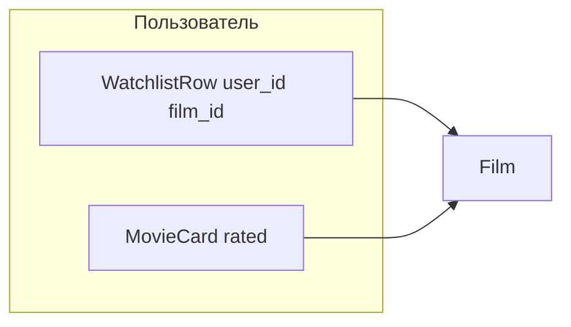

# План: список «К просмотру» (публичный) + UX

## Контекст и ограничения

- **Лента** ([`backend/src/services/cards/list_movie_card_feed.py`](backend/src/services/cards/list_movie_card_feed.py), [`frontend/src/pages/FeedPage.tsx`](frontend/src/pages/FeedPage.tsx)) остаётся только про **оценённые** `MovieCard`; записи списка желаний туда не попадают.
- **Точка входа**: как обсуждалось — один сценарий [`/cards/new`](frontend/src/routes.tsx) с кнопки «+»; второй FAB не добавляем.
- **Рекомендации пользователей** (пересечение «мой watchlist» × чужие `MovieCard`) — **не входят в эту итерацию**; зафиксировать в продуктовой памяти как фаза 2.

## Архитектура данных

- Новая таблица (название на выбор в коде, например `user_watchlist_film`): `user_id`, `film_id`, `created_at`, **UNIQUE(user_id, film_id)**.
- Инвариант: при успешном создании **`MovieCard`** для той же пары `(user_id, film_id)` строка watchlist **удаляется** в той же транзакции, что и создание карточки (в [`CreateMovieCardService`](backend/src/services/cards/create_movie_card.py) или тонком оркестраторе, чтобы не дублировать логику в роуте).
- Если фильм уже в списке — POST добавления отдаёт **409**; если уже есть карточка — добавление в список **не допускается** (422/409 с понятным `detail`).

## Backend

1. **Модель + миграция** Alembic по образцу [`backend/src/models/movie_card.py`](backend/src/models/movie_card.py).
2. **Сервисы** (одна задача — один `execute`, [`build`](backend/src/services/cards/create_movie_card.py)):
   - добавление в список (только свой пользователь);
   - удаление из списка;
   - постраничный список фильмов для **любого** `user_id` (аналог [`ListUserMovieCardsService`](backend/src/services/profile/list_user_movie_cards.py): те же проверки «пользователь существует», курсор опционально как у карточек для единообразия фронта).
3. **HTTP** (паттерны как у существующих профильных роутов):
   - `GET /api/users/{user_id}/watchlist` — публично для любого авторизованного зрителя (как [`GET .../cards`](backend/src/api/profile/users_routes.py)).
   - `POST /api/me/watchlist` — тело `{ film_id }` (и при необходимости проверка существования фильма).
   - `DELETE /api/me/watchlist/{film_id}` — убрать из списка.
   - Регистрация роутера в [`backend/src/api/router.py`](backend/src/api/router.py) (новый модуль рядом с `me_routes` / расширение `me_routes`).
4. **Счётчики профиля**: расширить [`UserProfileCounts`](backend/src/services/profile/get_user_profile_counts.py) полем `watchlist_count` и полями в [`MyProfileResponse` / `PublicProfileResponse`](backend/src/api/profile/schemas.py) + сборка в `build_*_profile_response`, чтобы на UI можно показать число без отдельного запроса (решение «четвёртая плитка vs только подвкладка» остаётся за версткой; данные должны быть доступны).
5. **Тесты** [`backend/src/tests/api/`](backend/src/tests/api/): CRUD watchlist, 404 user, дубликат, создание карточки снимает watchlist, нельзя добавить в список если карточка уже есть.

## Frontend

1. **API-слой**: функции в [`frontend/src/api/profileApi.ts`](frontend/src/api/profileApi.ts) (или отдельный модуль), типы в [`frontend/src/api/profileTypes.ts`](frontend/src/api/profileTypes.ts) — страница watchlist (items с `film_id`, заголовок, постер, курсор).
2. **Мастер создания** [`frontend/src/pages/CreateCardPage.tsx`](frontend/src/pages/CreateCardPage.tsx):
   - на **шаге 2** (после подтверждения фильма): две кнопки — **«Оценить просмотр»** (как сейчас → шаг 3) и **«В список»** / «Хочу посмотреть» → `POST /api/me/watchlist`, затем навигация (зафиксировать в коде один вариант: например `navigate(-1)` или переход на профиль; при необходимости query `?tab=watchlist` если добавите его в [`ProfilePage`](frontend/src/pages/ProfilePage.tsx) / [`PublicProfilePage`](frontend/src/pages/PublicProfilePage.tsx)).
   - Обработка состояний: уже в списке, уже есть оценённая карточка (сообщения из `detail`).
3. **Профиль** [`ProfilePage.tsx`](frontend/src/pages/ProfilePage.tsx) и [`PublicProfilePage.tsx`](frontend/src/pages/PublicProfilePage.tsx):
   - внутри вкладки «Фильмы» — сегмент **«Оценённые» | «К просмотру»** (тот же стиль pill, что `mainTab`).
   - Для «К просмотру» — загрузка `GET .../watchlist`, сетка постеров (можно обобщить [`MoviePosterGrid`](frontend/src/components/profile/MoviePosterGrid.tsx): принимать `filmId` + `linkTo` или завести `WatchlistPosterGrid` со ссылкой на страницу фильма).
4. **Новый маршрут** в [`frontend/src/routes.tsx`](frontend/src/routes.tsx): например `/films/:filmId` — страница «Фильм» (данные с существующего `GET /api/films/{id}` из [`backend/src/api/films/routes.py`](backend/src/api/films/routes.py)):
   - постер, название, год, жанры;
   - для **своего** пользователя: «Оценить просмотр» → `/cards/new?filmId=...` (уже поддерживается в CreateCardPage), «Убрать из списка» если фильм в watchlist (опционально вызвать `GET` профиля/me или флаг с бэкенда в будущем; минимум — попробовать удалить или знать из контекста перехода);
   - для **чужого** профиля — только информация (список у них уже виден в профиле).
5. **Кэш профиля**: при необходимости обновить [`myProfileBundleCache`](frontend/src/lib/myProfileBundleCache.ts) только если вы начнёте класть туда watchlist; иначе отдельный state на странице профиля достаточно.

## Документация по процессу репозитория

По [feature-delivery-workflow](.cursor/rules/feature-delivery-workflow.mdc): завести slug фичи (например `watchlist`), заполнить [`.cursor/features/{slug}/feature.md`](.cursor/features), план в [`.cursor/active/{slug}/plan.md`](.cursor/active), прогресс/результат, затем [`docs/features/{slug}.md`](docs/features), записи в [`.cursor/memory/logs/`](.cursor/memory/logs/action-log.md); тесты бэкенда в Docker через `make backend-test`.

## Фаза 2 (не в объёме текущей задачи)

- Endpoint + сервис: пользователи с `MovieCard` по `film_id` из watchlist текущего пользователя, ранжирование и лимиты.
- UI-блок на ленте или отдельном экране — отдельное обсуждение после стабилизации списка.
