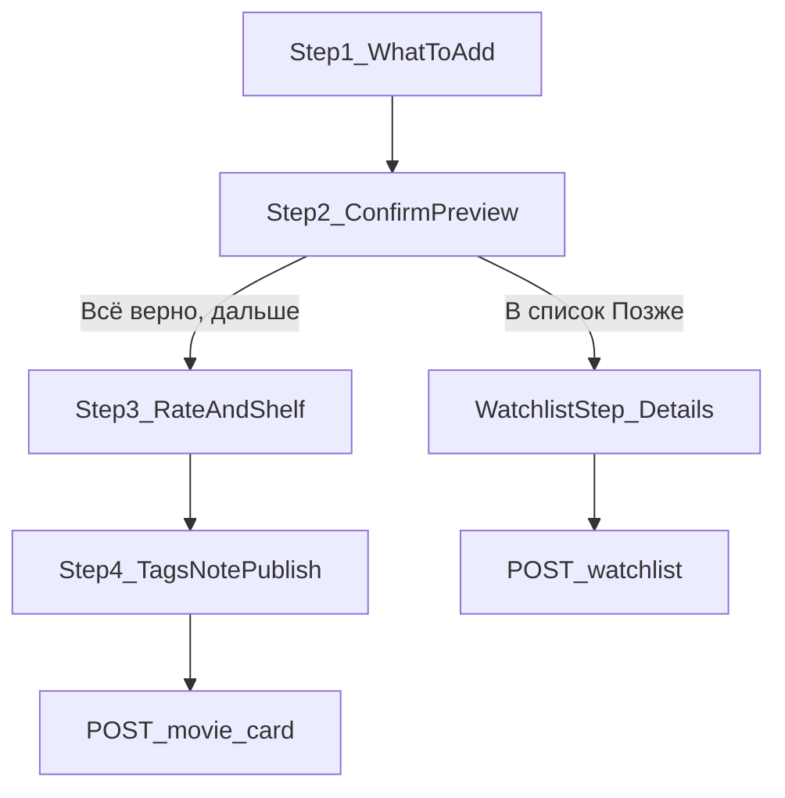

# Watchlist wizard: детали только для «Позже»

## Контекст и решение пользователя

- Детали карточки (company, полка, заметка, приглашения) — **только на ветке «Позже»**.
- Ветка «Оценить» (шаги 3–4) **остаётся как сейчас** — company/полка/заметка там не убираем.
- Источник друзей: **взаимные подписки** (`GET …/subscriptions?type=both`), как уже в [`MutualWatchFriendPicker.tsx`](.worktrees/watchlist-cards/frontend/src/components/watchlist/MutualWatchFriendPicker.tsx).

## Текущие пробелы

| Область | Сейчас |
|---------|--------|
| UI шаг 2 | Inline: метка + один друг + сразу submit без company/полки/заметки |
| API | [`WatchlistFilmCreateRequest`](.worktrees/watchlist-cards/backend/src/api/profile/schemas.py) — только `watch_tag`, `watch_with_user_id` |
| Planned card | [`CreatePlannedUserCardService`](.worktrees/watchlist-cards/backend/src/services/cards/create_planned_user_card.py) — hardcode `company=alone`, `watch_note=''`, default category; upsert **не обновляет** существующую planned |
| Rated create | [`create_user_card.py`](.worktrees/watchlist-cards/backend/src/services/cards/create_user_card.py) — **удаляет** planned card → заметка теряется |
| Film detail | [`FilmDetailPage.tsx`](.worktrees/watchlist-cards/frontend/src/pages/FilmDetailPage.tsx) — быстрый POST без мастера |



---

## 1. Backend: API и модель данных

### 1.1 Расширить create-request

В [`WatchlistFilmCreateRequest`](.worktrees/watchlist-cards/backend/src/api/profile/schemas.py) и зеркало в [`watchlist/schemas.py`](.worktrees/watchlist-cards/backend/src/api/watchlist/schemas.py):

- `company: CardCompany = CardCompany.alone`
- `category_id: int | None = None` (как в movie card create)
- `watch_note: str = Field(default='', max_length=500)`
- `watch_with_user_ids: list[UUID] = Field(default_factory=list, max_length=20)` — новое
- Оставить `watch_with_user_id` **deprecated alias**: если передан один id без списка — нормализовать в список; в ответах actor-entry заполнять первым id для обратной совместимости

Прокинуть через [`create_watchlist_entry_from_film.py`](.worktrees/watchlist-cards/backend/src/services/watchlist/create_watchlist_entry_from_film.py), `…_from_catalog.py`, [`me_routes.py`](.worktrees/watchlist-cards/backend/src/api/profile/me_routes.py), [`watchlist/routes.py`](.worktrees/watchlist-cards/backend/src/api/watchlist/routes.py).

### 1.2 Миграция для мульти-приглашений

Новая Alembic-ревизия после `w1x2y3z4a04`:

- Колонка `watchlist_entry.watch_with_user_ids JSONB NOT NULL DEFAULT '[]'` на [`WatchlistEntry`](.worktrees/watchlist-cards/backend/src/models/watchlist_entry.py)
- Backfill: где `watch_with_user_id IS NOT NULL` → `[that_uuid]`

Actor-entry хранит полный список; `watch_with_user_id` = первый элемент (legacy UI).

### 1.3 CreateWatchlistEntryService

[`create_watchlist_entry.py`](.worktrees/watchlist-cards/backend/src/services/watchlist/create_watchlist_entry.py):

- Нормализация: dedupe, убрать `actor_user_id`, если `company == alone` — очистить список
- Для каждого id: `AssertMutualWatchPartnerService`
- Цикл приглашений (как сейчас для одного): отдельная `WatchlistEntry` + Telegram push, skip если уже есть
- Перед feed post: вызов planned card с новыми полями

### 1.4 CreatePlannedUserCardService

Расширить `execute(..., company, category_id, watch_note)`:

- `category_id` через существующий [`ResolveUserCardCategoryIdForOwnerService`](.worktrees/watchlist-cards/backend/src/services/user_card_categories/resolve_user_card_category_id_for_owner.py)
- При `_find_planned` **не return early**: обновить `company`, `category_id`, `watch_note` и flush

### 1.5 Upgrade planned → rated (перенос заметки)

В [`create_user_card.py`](.worktrees/watchlist-cards/backend/src/services/cards/create_user_card.py) для film/catalog/custom paths:

- Вместо `delete(UserCard where is_planned)` — найти planned row
- Если найдена: **upgrade in place** (`is_planned=False`, rating/moods/tags из payload, `watch_note`/`company`/`category_id` из payload — фронт уже префиллит из planned)
- Сохранить тот же `user_card.id` (feed snippet не ломается)
- По-прежнему удалить `WatchlistEntry` для этого `card_id`

### 1.6 Prefill для rated-мастера

Новый read-only endpoint, например `GET /api/me/planned-card?card_id=kp:332`:

- Возвращает `{ user_card_id, company, category_id, watch_note }` если есть planned card владельца
- Используется при входе в мастер с `filmId` / из «Позже»

Альтернатива (если хотим меньше эндпоинтов): расширить `GET /api/me/watchlist/presence` — но отдельный planned-card чище для rated-flow без watchlist membership.

### 1.7 List response (опционально, для UI)

В [`WatchlistEntryItemResponse`](.worktrees/watchlist-cards/backend/src/api/profile/schemas.py) добавить `watch_with_user_ids: list[UUID]` — бейдж «Вместе» в [`WatchlistPosterGrid.tsx`](.worktrees/watchlist-cards/frontend/src/components/profile/WatchlistPosterGrid.tsx) при `len > 0` или `company != alone` (company можно не отдавать в list, достаточно ids).

---

## 2. Frontend: мастер «Позже»

Рабочий файл: [`CreateCardPage.tsx`](.worktrees/watchlist-cards/frontend/src/pages/CreateCardPage.tsx).

### 2.1 Новая ветка wizard

- Расширить `WizardStep`: добавить `'watchlist'` между 2 и 3
- **Шаг 2**: только превью + кнопки «Всё верно, дальше» / «В список «Позже»» — **убрать** inline `WATCH_TAG_OPTIONS` и `MutualWatchFriendPicker`
- **Шаг `'watchlist'`** («Детали для «Позже»»):
  1. **С кем смотрите** — `COMPANY_OPTIONS` (те же чипы, что шаг 3)
  2. Если `company !== 'alone'` — мульти-пicker взаимных друзей (новый компонент или расширение [`MutualWatchFriendPicker`](.worktrees/watchlist-cards/frontend/src/components/watchlist/MutualWatchFriendPicker.tsx): `selectedUserIds: string[]`, toggle без «Только я»)
  3. **Полка** — вынести блок select + «+ Новая полка» из шага 3 в переиспользуемый фрагмент/компонент (без дублирования логики `submitNewShelf`)
  4. **Заметка** — тот же textarea + reaction strip, что шаг 4 (`MAX_WATCH_NOTE_LEN = 500`)
  5. Submit → `handleAddToWatchlist` с полным payload

### 2.2 API client

[`profileApi.ts`](.worktrees/watchlist-cards/frontend/src/api/profileApi.ts) / [`profileTypes.ts`](.worktrees/watchlist-cards/frontend/src/api/profileTypes.ts):

```ts
company?: CardCompany
category_id?: number | null
watch_note?: string
watch_with_user_ids?: string[]
```

Обновить [`buildWatchlistCreatePayload`](.worktrees/watchlist-cards/frontend/src/pages/CreateCardPage.tsx) и тесты [`profileApi.test.ts`](.worktrees/watchlist-cards/frontend/src/api/profileApi.test.ts).

### 2.3 Prefill при оценке из «Позже»

- При `step === 2` и готовом `creationBinding`: если тема в watchlist — вызвать `GET planned-card` по `card_id`, `queueMicrotask` установить `company`, `selectedShelfId`, `watchNote`
- При переходе 2→3 пользователь видит уже перенесённую заметку на шаге 4 (и company/полку на шаге 3) — может отредактировать

### 2.4 FilmDetailPage

Кнопка «В список «Позже»» → навигация на `/cards/new?filmId=…&branch=watchlist` (или `setStep('watchlist')` через query), **не** прямой `postCreateWatchlistEntry` — чтобы всегда проходить детальный стейдж.

### 2.5 Back navigation

`goBack()` из `'watchlist'` → step 2; сброс watchlist-only ошибок.

---

## 3. Тесты

**Backend** (Docker: `make backend-test-one target=…`):

- `test_create_watchlist_entry_service.py`: multi-invite, mutual validation, company=alone clears ids
- `test_create_planned_user_card_service.py` (новый): company/category/note persist + upsert update
- `test_create_user_card.py` / API: planned upgrade preserves `watch_note`, deletes watchlist entry
- `test_watchlist_routes.py`: новые поля в POST body, JSONB roundtrip

**Frontend**:

- `profileApi.test.ts` — новые поля
- При наличии паттерна — smoke-тест payload builder (optional)

---

## 4. Delivery artifacts (worktree `watchlist-cards`)

- Обновить [`.cursor/active/watchlist-cards/plan.md`](.worktrees/watchlist-cards/.cursor/active/watchlist-cards/plan.md), `progress.md`, `result.md`
- Расширить [`docs/features/watchlist-cards.md`](.worktrees/watchlist-cards/docs/features/watchlist-cards.md)
- Запись в action-log

---

## 5. Verification

```bash
# backend (в Docker)
make backend-test-one target=src/tests/api/test_watchlist_routes.py
make backend-test-one target=src/tests/services/test_create_watchlist_entry_service.py

# frontend
cd frontend && npm test -- src/api/profileApi.test.ts && npm run lint && npm run build
```

Ручная проверка:

1. Create → «Позже» → company «С друзьями» + 2 друга + полка + заметка → feed «Запланировано», профиль «Позже»
2. Тот же тайтл → «Оценить» → заметка на шаге 4 предзаполнена, после submit — rated card, watchlist очищен
3. Film page «Позже» ведёт в мастер, не quick-add

---

## Риски и ограничения

- **Повторное добавление в «Позже»** (409) — upsert planned обновит поля только если разрешим re-submit; иначе отдельный PATCH planned (out of scope — документировать 409)
- **Legacy clients** с одним `watch_with_user_id` — сохраняем совместимость через alias
- **Invite spam** — cap 20 ids, dedupe на бэкенде
