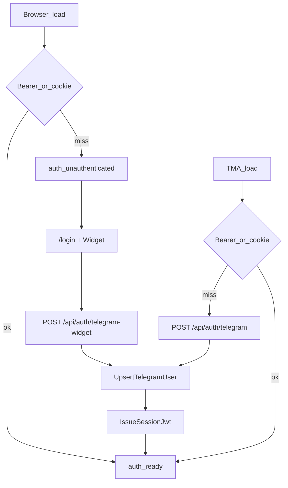

# Standalone Web Telegram Login — Implementation Plan

> **For agentic workers:** REQUIRED SUB-SKILL: Use `superpowers:subagent-driven-development` (recommended) or `superpowers:executing-plans` task-by-task. Checkboxes track progress.
>
> Spec: [docs/superpowers/specs/2026-08-10-standalone-web-telegram-login-design.md](docs/superpowers/specs/2026-08-10-standalone-web-telegram-login-design.md)

**Goal:** Open Filmony in Chrome/Safari → «Войти через Telegram» (Login Widget) → full app with the same account as Mini App.

**Architecture:** Browser resumes Bearer/cookie; on miss shows `/login` with official Telegram widget → `POST /api/auth/telegram-widget` (widget HMAC) → same `UpsertTelegramUser` + `IssueSessionJwt` as TMA. Mini App keeps `initData` → `POST /api/auth/telegram`. Remove auth `skipped`; add `unauthenticated`.

**Tech Stack:** FastAPI services (`build`/`execute`) · React + TGUI · Telegram Login Widget script · pytest in Docker · Vitest for auth bootstrap

## Global Constraints

- Identity key: `telegram_user_id` — one User for widget + Mini App.
- Widget HMAC: `secret_key = SHA256(bot_token)`; sorted `key=value` lines; `auth_date` max age **86400s** (same as initData).
- Do not change JWT shape, cookie name (`filmony_session`), or TMA `POST /api/auth/telegram`.
- No email/password, no bot deep-link login in v1.
- Bot username for widget: existing `VITE_TELEGRAM_BOT_USERNAME`; token: `settings.telegram.bot_token`.
- Docker-first backend tests: `make backend-test-unit` / `make backend-test-integration` / `make backend-test-one target=…`.
- Delivery artifacts for slug `standalone-web-telegram-login` (feature.md, active plan/progress/result, docs/features, HOT + action-log on closeout).

## File map

**Backend create**
- [backend/src/services/auth/verify_telegram_login_widget.py](backend/src/services/auth/verify_telegram_login_widget.py) — `VerifyTelegramLoginWidgetService`
- [backend/src/tests/support/telegram_login_widget.py](backend/src/tests/support/telegram_login_widget.py) — `build_widget_payload(...)` signer (mirror [telegram_init_data.py](backend/src/tests/auth/telegram_init_data.py); prefer `tests/support/` if that tree is used, else colocate with existing helper)
- [backend/src/tests/unit/auth/test_verify_telegram_login_widget.py](backend/src/tests/unit/auth/test_verify_telegram_login_widget.py)
- [backend/src/tests/integration/auth/test_telegram_widget.py](backend/src/tests/integration/auth/test_telegram_widget.py)

**Backend modify**
- [backend/src/services/auth/errors.py](backend/src/services/auth/errors.py) — `TelegramLoginWidgetInvalidError`
- [backend/src/api/auth/schemas.py](backend/src/api/auth/schemas.py) — `TelegramWidgetAuthRequest` (`id`, `auth_date`, `hash`, optional profile fields; snake_case)
- [backend/src/api/auth/routes.py](backend/src/api/auth/routes.py) — `POST /telegram-widget` → verify → upsert → JWT → `_set_session_cookie` → `TelegramAuthResponse`

**Frontend create**
- [frontend/src/components/auth/TelegramLoginWidget.tsx](frontend/src/components/auth/TelegramLoginWidget.tsx) — load `telegram-widget.js?22`, `data-telegram-login={VITE_TELEGRAM_BOT_USERNAME}`, `data-onauth`
- [frontend/src/pages/LoginPage.tsx](frontend/src/pages/LoginPage.tsx) — branding + widget + error; on success persist token/flag, navigate `returnTo` or `/`
- [frontend/src/auth/RequireAuth.tsx](frontend/src/auth/RequireAuth.tsx) — if `unauthenticated` → `<Navigate to={`/login?returnTo=…`} />`; if `loading`/`error` — existing shell patterns

**Frontend modify**
- [frontend/src/auth/auth-context.ts](frontend/src/auth/auth-context.ts) — replace `skipped` with `unauthenticated`
- [frontend/src/auth/AuthProvider.tsx](frontend/src/auth/AuthProvider.tsx) — always bootstrap; pass `environment: 'tma' | 'browser'`
- [frontend/src/auth/authBootstrap.ts](frontend/src/auth/authBootstrap.ts) (+ tests) — browser: resume then `unauthenticated` (no initData poll); TMA: resume then initData as today
- [frontend/src/api/profileApi.ts](frontend/src/api/profileApi.ts) — `authTelegramWidget(payload)` → `POST /api/auth/telegram-widget`
- [frontend/src/hooks/useAuthReadyGate.ts](frontend/src/hooks/useAuthReadyGate.ts) — pending = `loading` only; `unauthenticated` is not ready
- [frontend/src/routes.tsx](frontend/src/routes.tsx) — sibling `<Route path="/login" element={<LoginPage />} />`
- Gate pages that branch on `skipped` (Feed, Profile, ProfileEdit, Subscriptions, PublicProfile, FilmDetail, CatalogDetail, CreateWatchlist, ShareMovieCard, MonthlyRecap, TasteQuiz*): replace with `RequireAuth` or `unauthenticated` → redirect; drop hard “откройте в Telegram” as sole path

**Docs / ops**
- Deployment note: BotFather `/setdomain` for each hostname (prod/stage/dev tunnel) in feature doc + short checklist in [docs/features/standalone-web-telegram-login.md](docs/features/standalone-web-telegram-login.md)
- Feature lifecycle: `.cursor/features/standalone-web-telegram-login/feature.md`, `.cursor/active/standalone-web-telegram-login/{plan,progress,result}.md`, copy plan also to `docs/superpowers/plans/2026-08-10-standalone-web-telegram-login.md` on execution start

---

### Task 1: Feature artifacts + backend verify (TDD)

- Create feature.md (scope/AC from spec) and active `plan.md` (this plan) / empty `progress.md`.
- Add `TelegramLoginWidgetInvalidError`.
- Add signer helper + unit tests for valid hash, bad hash, stale `auth_date`, missing fields, field-order independence.
- Implement `VerifyTelegramLoginWidgetService` (`@dataclass` + `build`/`execute`) returning `TelegramWebAppUser` (`language_code=None` if absent).
- Run: `make backend-test-one target=src/tests/unit/auth/test_verify_telegram_login_widget.py`

**Produces:** `VerifyTelegramLoginWidgetService.execute(**fields) -> TelegramWebAppUser`

### Task 2: Route + integration tests

- Schema `TelegramWidgetAuthRequest`; route mirrors [auth_telegram](backend/src/api/auth/routes.py) wiring with widget verifier.
- Integration: happy path (200, cookie, token, user); invalid → 401; bad body → 422; same `telegram_user_id` via widget then initData → one user; `/api/me` with returned Bearer works.
- Run: `make backend-test-one target=src/tests/integration/auth/test_telegram_widget.py`

**Produces:** `POST /api/auth/telegram-widget` stable contract = `TelegramAuthResponse`

### Task 3: Frontend auth model + bootstrap

- Replace `skipped` → `unauthenticated` in types, AuthProvider initial state, and all references (grep).
- Extend `AuthBootstrapDeps` with `environment: 'tma' | 'browser'`; browser path never calls `waitForInitDataRaw`.
- AuthProvider: if `isTMA()` → environment `tma`; else run bootstrap with `browser` (initial `loading` when resuming, not hard skip).
- Update `authBootstrap.test.ts` + `useAuthReadyGate`.
- Add `authTelegramWidget` API helper.

**Produces:** browser without session ends in `unauthenticated`; TMA still uses initData.

### Task 4: Login UI + route + RequireAuth

- `TelegramLoginWidget` + `LoginPage` (RU copy aligned with error table in spec).
- Register `/login`; on widget success: write token + `filmony_tma_authenticated_v1`, set `ready`, navigate `returnTo` (same-origin path only — reject open redirects).
- `RequireAuth` wrapper; migrate gate pages off `skipped` / dead-end Telegram-only copy.
- Soft optional “Open in Telegram” link allowed; not a blocker.
- `cd frontend && npm run lint && npm run build` (+ auth unit tests).

### Task 5: Docs, ops checklist, closeout

- Publish `docs/features/standalone-web-telegram-login.md` (incl. BotFather `/setdomain`).
- `result.md` + verification evidence (make/npm commands).
- Update HOT (`in_progress` → on closeout `recent_completed`), action-log fragment, trim index ≤25.

## Verification (done when)

1. Browser cold load → `/login` with widget (not “откройте в Telegram” dead-end).
2. Widget login → ready + same user as Mini App for same Telegram id.
3. Cookie/Bearer resume in browser without re-login.
4. TMA initData path unchanged.
5. Tampered widget payload → 401.
6. `skipped` gone from codebase.
7. Backend unit+integration green in Docker; frontend lint/build green.

## Locked defaults (no open choices)

- Widget-only web login (no bot deep-link hybrid).
- Official `telegram-widget.js` + `data-onauth` (no React widget library).
- Login route `/login` outside AppShell; TMA never routed there.
- Shared redirect via `RequireAuth` rather than one-off copy per page.
- Signer helper lives next to existing telegram test helpers; unit tests under `tests/unit/auth/`.
