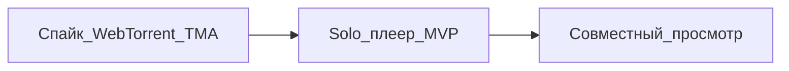

# Ресурсный план: WebTorrent и совместный просмотр (Filmony)

## Зафиксированная граница первого этапа

- **Этап 1 («только просмотр»):** один пользователь, встроенный плеер на WebTorrent (magnet / торрент-файл → воспроизведение в мини-аппе), **без** комнат и **без** синхронизации с другими.
- **Этап 2 (позже):** совместный просмотр — в оценке ниже как **отдельный инкремент** поверх уже работающего одиночного плеера.

Единица оценки: **человеко-дни (PD)** одного сильного fullstack или **0.5–1 FTE** на короткий спринт; диапазоны отражают неопределённость WebView/WebRTC, а не «оптимистичный идеал».

---

## Контекст стека (для привязки оценки)

- Клиент: React, Telegram Mini App (мобильный WebView — главный источник риска для WebRTC/P2P).
- Бэкенд уже умеет **SSE** ([`backend/src/api/feed/routes.py`](backend/src/api/feed/routes.py), [`backend/src/services/feed/global_feed_head_broker.py`](backend/src/services/feed/global_feed_head_broker.py)); для **solo WebTorrent** критичного бэкенда может почти не быть, пока не появятся трекеры/метрики/лимиты под вашим контролем.

---

## Этап 1: Solo WebTorrent (магнит → плеер в TMA)

### Цель по продукту

Пользователь вставляет magnet (или загружает `.torrent`), видит прогресс буфера, базовые контролы, обработку ошибок и «не работает в WebView» — без социальных комнат.

### Разбивка по работам и ресурсу

| Блок | Содержание | Оценка (PD) | Комментарий |
|------|------------|-------------|-------------|
| **A. Спайк пригодности** | WebTorrent (или аналог) в **реальном** Telegram WebView iOS/Android: старт peer connections, память, фон/лок скрина, лимиты на длительные соединения | **5–12** | Итог спайка: «можно в прод» / «только деградация» / «нет». Без этого остальные оценки условны. |
| **B. Инфраструктура сигналинга** | Публичный wss-трекер vs свой лёгкий сервис; политика по **STUN/TURN** (хотя бы сценарии «часть пользователей не коннектится к пирам») | **2–8** | Нижняя граница — только публичные трекеры/STUN и явное «best effort». Верхняя — свой трекер + учёт TURN как расхода. |
| **C. Клиентский плеер** | Интеграция движка, `MediaSource`/совместимость контейнеров, UI: play/pause, seek (если технически допустимо для выбранного файла), индикатор буфера, ошибки, отмена/очистка | **5–10** | Зависит от того, насколько «голый» WebTorrent vs обёртка и от политики по форматам. |
| **D. Безопасность и продукт** | Ограничение размеров, таймауты, утечки памяти при уходе со страницы, базовая телеметрия/логирование (без хранения контента) | **2–5** | Минимум для не-эксперимента. |
| **E. QA и устройства** | Матрица: iOS/Android Telegram, Wi‑Fi/4G, слабые устройства, обрыв сети | **4–10** | Для P2P это не косметика; часто съедает заметную долю бюджета. |

**Суммарно этап 1:** примерно **18–45 PD** (один исполнитель-календарь: порядка **4–9 недель** при 1 FTE и нормальном буфере на непредвиденное по WebView).

**Сжатая версия «только спайк + вердикт»** (без продуктового UI и без полной матрицы QA): **5–15 PD** — если цель именно **проработка** go/no-go до полноценной разработки.

---

## Этап 2: Совместный просмотр (после рабочего solo)

Предпосылка: одиночный просмотр стабилен; добавляется **синхронизация состояния** (ведущий, `t`, play/pause, поколение после seek), а **раздача видео** остаётся в модели WebTorrent/P2P (или гибрид).

| Блок | Содержание | Оценка (PD) |
|------|------------|-------------|
| **Модель комнаты и API** | Создание/вход, роли, TTL, список участников (минимум) | **3–6** |
| **Real-time канал** | WebSocket (предпочтительнее, чем один SSE: нужен uplink частых событий) или эквивалент; масштабирование при росте комнат — отдельно | **5–12** |
| **Клиент: синк-логика** | Дрейф часов, реакция на буферизацию, «догнать ведущего», edge cases при перемотке | **5–15** |
| **Наблюдаемость и нагрузка** | Лимиты на комнату/частоту событий, метрики | **2–5** |
| **QA сценарии «вдвоём-втроём»** | Разные сети, смена ведущего, выход из комнаты | **3–8** |

**Суммарно этап 2:** ориентир **18–46 PD** поверх этапа 1 (сильно зависит от требований к точности синка и от того, будет ли сервер только «метроном» или ещё и оркестрация P2P).

---

## Роли (кто нужен по календарю)

- **Frontend / mini app:** основная доля (A, C, клиентская часть D/E).
- **Backend:** минимально на этапе 1, если нет своего трекера; на этапе 2 — обязателен (комнаты + WebSocket).
- **DevOps / платформа:** по мере появления своего трекера и/или TURN — **отдельный** бюджет времени и **денег** (TURN почти всегда платный при реальном трафике), это не только PD разработки.

---

## Риски, которые двигают оценку вверх

- **WebView Telegram** режет или деградирует WebRTC/P2P по сравнению с обычным мобильным Chrome/Safari — главный фактор разброса в блоке A.
- **Кодеки и контейнеры:** не любой торрент «стримится» в `<video>` без тяжёлого транскода на клиенте (часто ограничение — не торрент как таковой, а **содержимое**).
- **Фон и блокировка экрана:** поведение фонового воспроизведения в TMA может отличаться от ожиданий пользователя «как Netflix».

---

## Рекомендуемая последовательность по ресурсу

1. **Спайк (5–12 PD):** вердикт по WebView + один «счастливый» magnet на тестовом рое.
2. **Solo MVP (ещё ~10–30 PD** поверх спайка, в зависимости от исхода): продуктовый UI, инфраструктурный минимум, QA.
3. **Co-watch:** бюджет отдельно, после стабильного solo.

---

## Итог одной строкой

- **Проработка + go/no-go (спайк):** **5–15 PD**.
- **Полноценный solo WebTorrent в TMA с приемлемым UX и QA:** **~18–45 PD** (широкий коридор из‑за WebView и P2P).
- **Совместный просмотр поверх:** **~18–46 PD** дополнительно, в зависимости от точности синка и серверной модели.
