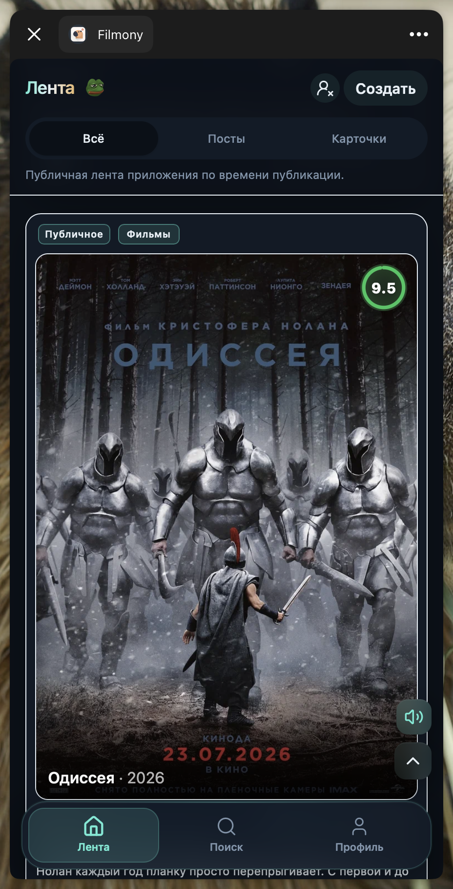
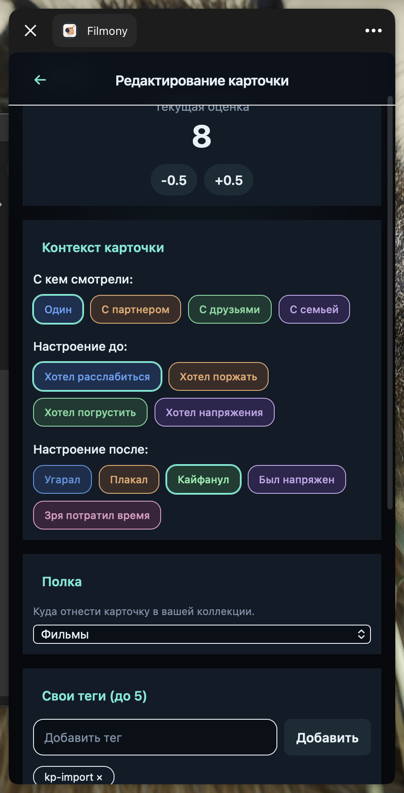
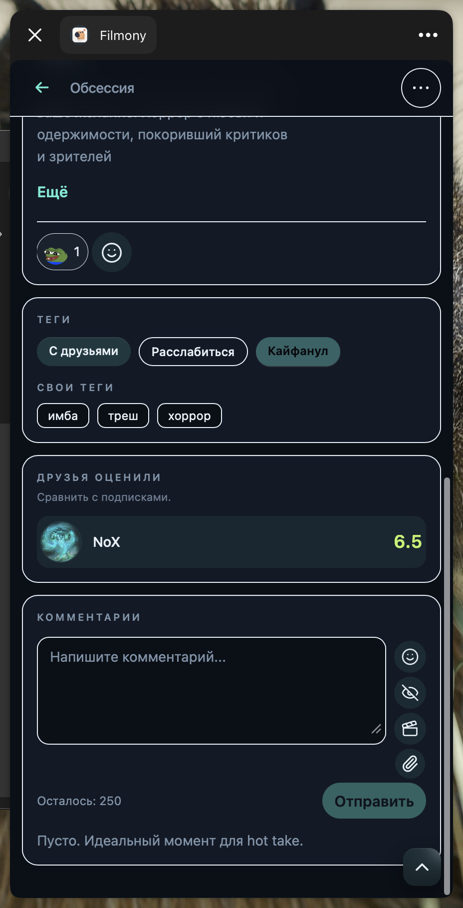
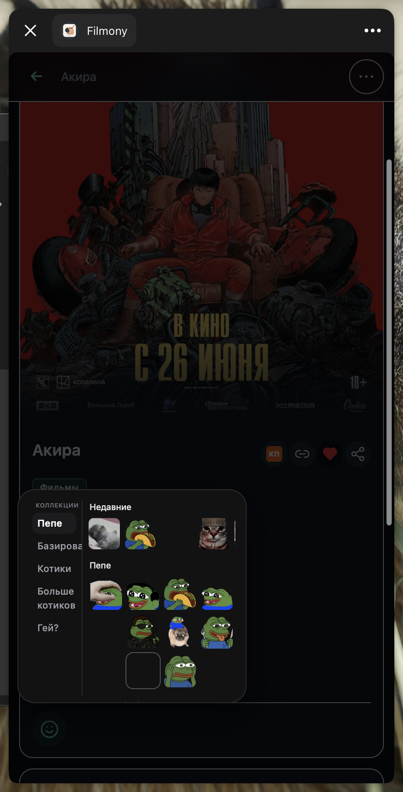
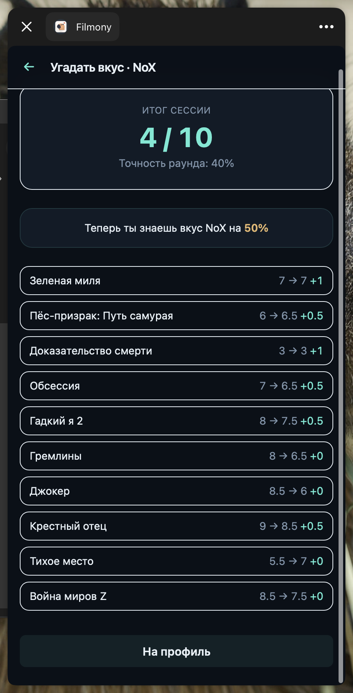
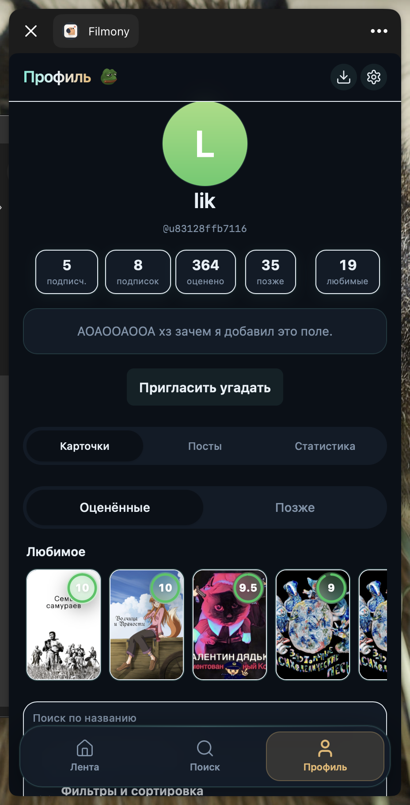
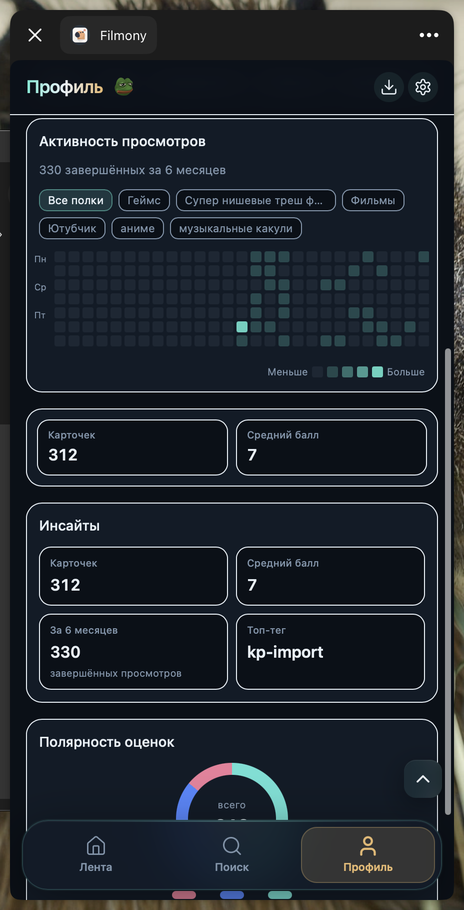
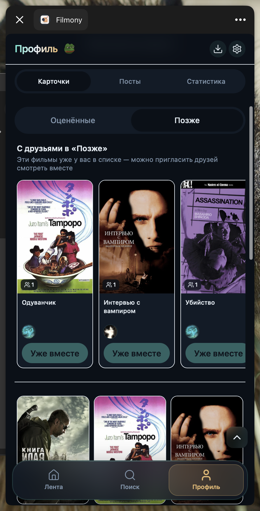

# Filmony

**Telegram Mini App** для тех, кто не может просто «посмотрел и забыл». Оценивай фильмы, делись впечатлениями с друзьями и собирай свою кино-историю — прямо в Telegram.

  

## Что это

Filmony — личный кино-дневник в формате мини-приложения. Поставил оценку от 1 до 10, наклеил теги настроения и компании — и карточка уже в ленте. Подписываешься на друзей, реагируешь мемами, сравниваешь вкусы. Без лишних вкладок и регистраций: открыл бота — и ты в кино.

## Фичи

### Карточка фильма

Не просто «7 из 10», а контекст: с кем смотрел, какое было настроение до и после, свои теги и полка в коллекции. Карточка живёт дольше, чем одна строчка в заметках.

  

На деталке — теги, оценки друзей, реакции и комментарии. Место для hot take, когда лента уже пролистана.

  

### Мем-реакции

Не лайки, а настроение: Pepe, котики, кастомные стикеры и прочий хаос. Реагируй так, как фильм того заслужил.

  

### Угадай вкус

Taste Quiz — угадай, как друг оценил фильм. Попал — получи Knowledge badge. Промахнулся — ну, бывает, пересмотришь.

  

### Taste Match

Алгоритм находит похожие профили: те, кто смотрит и чувствует примерно как ты. Полезно, когда «что посмотреть?» уже не вопрос, а крик души.

### Профиль и коллекция

Публичный профиль: подписчики, био, любимые фильмы и все карточки на одном экране. Хвастаться можно и цифрами, и полкой.

  

Heatmap просмотров, средний балл, полярность оценок — смотри, как менялся твой вкус и чей ещё рядом.

  

### Геймификация

Кино-паспорт со штампами, марафоны, полка с физикой — коллекция, которой хочется хвастаться. Каждый просмотренный фильм — ещё один штамп в паспорте.

### «Позже» и смотрим вместе

Watchlist «Позже» — фильмы в закладки, пока не созреешь. Видно, кто из друзей тоже отложил — можно пригласить на совместный просмотр.

  

### Audio vibe

На карточках — короткий audio vibe: атмосфера фильма в пару секунд, без спойлеров и без «прочитай синопсис».

---

## Для разработчиков

Хочешь поднять локально или покопаться в коде? → [Как запустить / для разработчиков](docs/engineering/getting-started.md)
