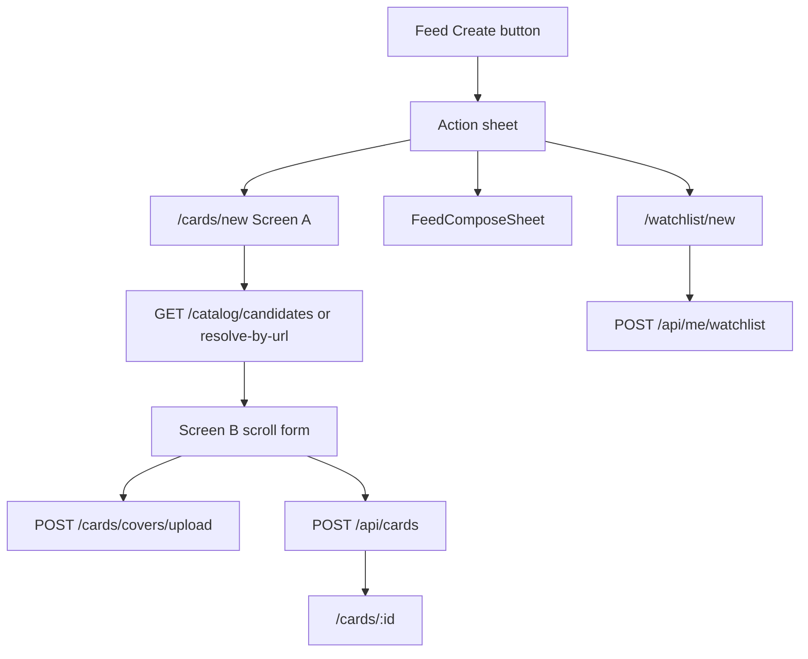

# Card / Post Create Redesign Plan

> **For agentic workers:** Use subagent-driven-development or executing-plans after approval. Spec source of truth: [docs/superpowers/specs/2026-07-19-card-post-create-redesign-design.md](docs/superpowers/specs/2026-07-19-card-post-create-redesign-design.md). Also save the approved plan copy to `docs/superpowers/plans/2026-07-19-card-post-create-redesign.md` and follow feature-delivery artifacts under `.cursor/active/card-post-create-redesign/`.

**Goal:** Make create flows from the feed obvious (≤2 taps to choose card/post/later), keep `UserCard` abstract, and fill fields via Sources→Candidates plus cover upload/paste — without YouTube or renaming `movie_card`.

**Architecture:** Backend adds a candidates coordinator over existing Kinopoisk/RAWG search, URL resolve by host, and cover upload mirroring feed-post images. Frontend replaces dual feed icons with a Create action sheet, rewrites `/cards/new` to smart field + one scroll form, and moves watchlist create to `/watchlist/new`. Existing `POST /api/cards`, `POST /api/feed-posts`, `POST /api/me/watchlist` stay the write path.

**Tech stack:** FastAPI services (`build`/`execute`), pytest in Docker; React + Telegram UI + React Query; RustFS upload via existing image service.

## Global constraints

- Card remains abstract: `display_*` + optional `catalog_item_id`; providers are Sources, not card types.
- No film vs game title dedup on server; Castlevania = two rows; user picks.
- `kind_hint` / `kind` are UI-only; never sent as card type on create.
- Watchlist create only via `/watchlist/new` (not `?mode=watchlist` on `/cards/new`).
- YouTube out of scope; no `movie_card` rename; no merged post+card compose.
- Docker-first backend tests: `make backend-test` / `make backend-test-one`.
- Frontend gate: `cd frontend && npm run lint && npm run build`.

## Current anchors

- Wizard monolith: [`frontend/src/pages/CreateCardPage.tsx`](frontend/src/pages/CreateCardPage.tsx) (~2485 lines, steps 1–4 + `watchlist`).
- Feed dual CTAs: [`frontend/src/pages/FeedPage.tsx`](frontend/src/pages/FeedPage.tsx) (`+` → `/cards/new`, pen → `openCompose()`).
- Catalog today: `GET /api/catalog/search?provider=…`, `POST /api/catalog/resolve` with `{provider,url}` in [`backend/src/api/catalog/routes.py`](backend/src/api/catalog/routes.py).
- Upload reuse: [`UploadFeedPostImageService`](backend/src/services/feed_posts/upload_feed_post_image.py) — extend allowed `media_subdir` with `user_card_covers`.
- Post compose keep: [`FeedComposeSheet`](frontend/src/components/feed/FeedComposeSheet.tsx) + [`ComposeFeedPostProvider`](frontend/src/compose/ComposeFeedPostProvider.tsx).

## File map (locked)

**Backend create/modify**
- `backend/src/api/catalog/schemas.py` — `CatalogCandidateResponse`, list + meta
- `backend/src/api/catalog/routes.py` — `GET /candidates`, `POST /resolve-by-url`
- `backend/src/services/catalog/search_catalog_candidates_service.py` — new
- `backend/src/services/catalog/resolve_catalog_by_url_service.py` — new
- `backend/src/api/cards/routes.py` + schemas — `POST /covers/upload`
- `backend/src/services/cards/upload_user_card_cover.py` — thin wrapper or call image service with `media_subdir='user_card_covers'`
- Extend `UploadFeedPostImageService` allowed subdirs + media key safety if needed
- Tests: extend [`backend/src/tests/api/test_catalog_routes.py`](backend/src/tests/api/test_catalog_routes.py), [`backend/src/tests/api/test_cards_routes.py`](backend/src/tests/api/test_cards_routes.py); add service tests under `backend/src/tests/services/catalog/`

**Frontend create/modify**
- `frontend/src/components/feed/CreateActionSheet.tsx` — new
- `frontend/src/pages/FeedPage.tsx` — single «Создать»
- `frontend/src/api/catalogApi.ts` — `searchCatalogCandidates`, `resolveCatalogByUrl`
- `frontend/src/api/cardApi.ts` — `uploadUserCardCover`
- `frontend/src/hooks/useCatalogCandidates.ts`, `useResolveCatalogUrl.ts`
- `frontend/src/components/create/CatalogCandidatesList.tsx`, `CardCoverBlock.tsx`, `RatedCardScrollForm.tsx`
- Rewrite [`CreateCardPage.tsx`](frontend/src/pages/CreateCardPage.tsx) — Screen A + B; remove wizard step machine and in-page watchlist branch
- `frontend/src/pages/CreateWatchlistPage.tsx` — new; route in [`routes.tsx`](frontend/src/routes.tsx)
- Retarget watchlist deep links: [`WatchlistPosterGrid.tsx`](frontend/src/components/profile/WatchlistPosterGrid.tsx), [`FilmDetailPage.tsx`](frontend/src/pages/FilmDetailPage.tsx) → `/watchlist/new?...`
- Keep `edit-planned` via shared watchlist form component used by `CreateWatchlistPage` and `/cards/:cardId/edit-planned`

**Delivery artifacts**
- `.cursor/features/card-post-create-redesign/feature.md`
- `.cursor/active/card-post-create-redesign/{plan,progress,result}.md`
- `docs/features/card-post-create-redesign.md` at end
- Action-log entry under `.cursor/memory/logs/`
- Copy plan → `docs/superpowers/plans/2026-07-19-card-post-create-redesign.md`

---

## Task sequence

### Task 1 — Delivery scaffolding + plan copy
Create feature slug artifacts and copy this plan into `docs/superpowers/plans/` and `.cursor/active/.../plan.md`. Log planning action.

### Task 2 — `SearchCatalogCandidatesService` + `GET /api/catalog/candidates`
- DTO fields per spec: `candidate_id`, `provider`, `external_id`, `kind`, `kind_hint?`, `title`, `subtitle`, `cover_url`, `catalog_item_id`, `source`, `degraded?`
- Response: `{ items, has_more, meta: { degraded_sources } }`
- Parallel Kinopoisk + RAWG via existing search services; merge; sort local before remote; dedup only same `provider+external_id`
- On one source failure: still 200, populate `meta.degraded_sources`
- TDD in Docker against `test_catalog_routes.py` + new service tests
- `candidate_id` = `"{provider}:{external_id}"`

### Task 3 — `ResolveCatalogByUrlService` + `POST /api/catalog/resolve-by-url`
- Body `{ url }`; v1 hosts only `kinopoisk.ru` / `www.kinopoisk.ru`
- Unknown host → 422; not found → 404
- Reuse `ResolveCatalogItemService` / Kinopoisk resolve under the hood; map to candidate-shaped or resolve response from spec
- Keep legacy `POST /api/catalog/resolve` for compat; new UI does not call it

### Task 4 — Cover upload `POST /api/cards/covers/upload`
- Multipart `file` → `{ url }` under `/api/cards/media/...` or existing cards media proxy pattern consistent with audio/covers
- Extend `UploadFeedPostImageService` with `user_card_covers` subdir (same MIME/size as feed posts: JPEG/PNG/WebP/GIF, 5MB)
- Tests mirror feed-post upload cases (auth, success, bad MIME, oversize)

### Task 5 — Frontend API + hooks
- Wire `searchCatalogCandidates`, `resolveCatalogByUrl`, `uploadUserCardCover`
- Hooks: debounced text → candidates; immediate URL → resolve-by-url (no debounce)
- Types match Candidate DTO exactly

### Task 6 — Feed `CreateActionSheet`
- Replace `+` and pen with labeled «Создать»
- Portal bottom sheet + TGUI `Cell` rows:
  - Карточка → `/cards/new`
  - Пост → `openCompose()`; set compose placeholder to «Мысль, ссылка, упоминание…» if not already
  - Позже → `/watchlist/new`
- Empty-state CTA on feed: open same sheet or navigate card (prefer open sheet for consistency)

### Task 7 — Rewrite `CreateCardPage` Screen A (smart field)
- Remove `addKind` film/game/manual picker and step progress
- Fullscreen smart field + `CatalogCandidatesList` (provider badge + `kind_hint`)
- Actions: tap candidate → Screen B prefilled; «Создать вручную» → Screen B empty/manual
- Preserve bootstrap: `filmId`, `fromCard`+`intent=rate` still land in Screen B with binding
- Strip `branch=watchlist` handling (redirect those callers in Task 9)

### Task 8 — Screen B scroll form + `CardCoverBlock`
- Single scroll: title, summary, cover (2:3 preview + Загрузить / Ссылка / Буфер), rating, company/moods, shelf, tags, note, publish
- Cover: file/clipboard → upload → `display_cover_url`; URL paste sets same field
- Submit via existing `createMovieCard`; success → `navigate('/cards/:id', { replace: true })`
- Share + audio as post-success secondary (navigate to existing share/edit flows or inline after success — do not block publish)
- Keep duplicate-card warning behavior
- Extract helpers from old page into `frontend/src/lib/` where reused

### Task 9 — `CreateWatchlistPage` + deep-link migration
- New page + route `/watchlist/new`
- Shared `WatchlistForm`: smart/manual theme + cover + shelf/note/friends; no rating; `postCreateWatchlistEntry`
- Move `edit-planned` UI onto shared form (route can stay `/cards/:cardId/edit-planned`)
- Retarget `FilmDetailPage` and `WatchlistPosterGrid` watchlist links to `/watchlist/new?...`
- Remove watchlist branch from `CreateCardPage`

### Task 10 — Verification + feature docs closeout
- `make backend-test` (or targeted one-files) for new routes/services + create regression
- `cd frontend && npm run lint && npm run build`
- Manual QA checklist from spec (Castlevania two rows, cover three actions, sheet paths)
- Write `docs/features/card-post-create-redesign.md`, `result.md`, action-log

## Out of scope (do not implement)

- YouTube Source
- Profile/FAB create redesign
- Feed card visual redesign
- localStorage drafts
- Renaming ORM/API `movie_card` fields
