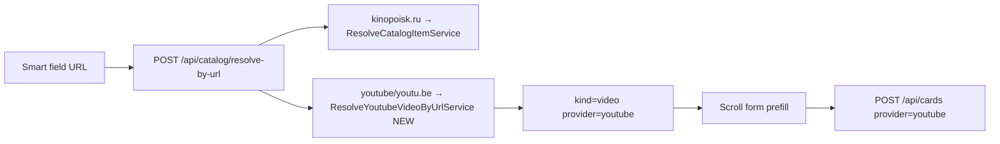

# YouTube Source (URL resolve) — Implementation Plan

> **For agentic workers:** REQUIRED SUB-SKILL: superpowers:subagent-driven-development or executing-plans. Spec baseline: [docs/superpowers/specs/2026-07-19-card-post-create-redesign-design.md](docs/superpowers/specs/2026-07-19-card-post-create-redesign-design.md) § Future: YouTube.

**Goal:** Пользователь вставляет ссылку на YouTube в уже существующее умное поле (`/cards/new`, `/watchlist/new`) — система подставляет title/thumbnail/description и создаёт **абстрактную** карточку, не привязанную к фильму/игре.

**Architecture:** YouTube — ещё один Source только для **resolve-by-url** (не search). Metadata через **YouTube oEmbed** (без API key). Карточка сохраняется как `UserCard` с `provider=youtube`, `external_id=<videoId>`, `display_*`, `source_url=<canonical URL>`, `catalog_item_id=null`. Контракт Candidate/resolve расширяется полем `kind: 'video'`.

**Tech stack:** FastAPI service (`build`/`execute`), httpx oEmbed client, pytest in Docker; минимальные правки React types/bindings.

## Global constraints

- **v1 scope:** только URL resolve (`youtube.com`, `www.youtube.com`, `m.youtube.com`, `youtu.be`). **Без** `GET /api/catalog/candidates` search по YouTube.
- Карточка остаётся абстрактной: не создавать `catalog_item` / `film` для YouTube в v1.
- `POST /api/cards` и watchlist create — расширение validation, без breaking changes для kinopoisk/rawg/manual.
- `kind_hint` / `kind` — только UI; не «тип карточки» в домене.
- Docker tests: `make backend-test-one target=…`; frontend: `npm run lint && npm run build`.
- Delivery artifacts: `.cursor/features/youtube-card-source/`, `.cursor/active/youtube-card-source/`, `docs/features/youtube-card-source.md`.

## Текущие точки расширения

- Orchestrator сегодня: [`ResolveCatalogByUrlService`](backend/src/services/catalog/resolve_catalog_by_url_service.py) — только Kinopoisk hosts.
- Response сегодня жёстко kinopoisk: [`CatalogResolveByUrlResponse`](backend/src/api/catalog/schemas.py) требует `catalog_item_id` + `film`.
- Frontend assume film: [`bindingFromResolveByUrl`](frontend/src/lib/createCardBinding.ts) всегда `catalog_film`.
- `UserCard.source_url` уже есть в ORM ([`user_card.py`](backend/src/models/user_card.py)), но **нет** в [`CardCreateRequest`](backend/src/api/cards/schemas.py).

## Locked product decisions (v1)

| Решение | Выбор |
|---------|--------|
| Metadata source | **oEmbed** `https://www.youtube.com/oembed?url=…&format=json` |
| Provider enum | Добавить `CatalogProvider.youtube` |
| Candidate kind | **`video`** (не `film`) |
| Persistence | **No catalog_item**; `catalog_item_id: null` в resolve response |
| Card create mode | `provider=youtube` + `external_id=<videoId>` + `display_*` + **`source_url`** |
| Duplicate UX | Проверка «у вас уже есть карточка с этим videoId» по `(user_id, provider=youtube, external_id)` — warning как у kinopoisk |
| Search in mixed list | **Out of scope v1** (отдельная фича с YouTube Data API v3) |

## File map

**Backend — create/modify**
- `backend/src/models/catalog_item.py` — `CatalogProvider.youtube`
- `backend/src/providers/youtube/youtube_url.py` — parse video id from URL (watch, youtu.be, shorts)
- `backend/src/providers/youtube/youtube_oembed_client.py` — httpx fetch + DTO
- `backend/src/services/catalog/resolve_youtube_video_by_url_service.py` — `execute(url) -> YoutubeVideoDTO`
- `backend/src/services/catalog/youtube_video_dto.py` — frozen dataclass
- `backend/src/services/catalog/resolve_catalog_by_url_service.py` — route by host; return union DTO (kinopoisk tuple **or** youtube DTO)
- `backend/src/api/catalog/schemas.py` — extend `CatalogResolveByUrlResponse`: `kind: Literal['film','video']`, optional `film`, optional `catalog_item_id`, add `source_url`
- `backend/src/api/catalog/routes.py` — map youtube branch in `resolve_catalog_by_url`
- `backend/src/api/cards/schemas.py` — `source_url` field; validator for `provider=youtube`
- `backend/src/services/cards/create_user_card.py` — create path for youtube provider
- Tests: `backend/src/tests/providers/test_youtube_url.py`, extend `test_catalog_routes.py`, extend `test_cards_routes.py`

**Frontend — modify**
- `frontend/src/api/profileTypes.ts` — `UserCardProvider` + `'youtube'`
- `frontend/src/api/catalogApi.ts` — extend `CatalogResolveByUrlResponse`, optional `CatalogCandidate.kind` includes `'video'`
- `frontend/src/lib/createCardBinding.ts` — `CreationBinding` variant `{ kind: 'youtube_video', … }`; update `bindingFromResolveByUrl`, display helpers, `createMovieCard` payload builder in [`CreateCardPage`](frontend/src/pages/CreateCardPage.tsx) / shared helper
- `frontend/src/components/create/CatalogCandidatesList.tsx` — label `youtube` / `видео` (for resolve result row if shown)
- `frontend/src/lib/watchlistBinding.ts` + [`WatchlistForm`](frontend/src/components/create/WatchlistForm.tsx) — youtube resolve binding
- `frontend/src/lib/createCardBinding.ts` — `mapResolveError` messages for youtube hosts

**Docs**
- `docs/features/youtube-card-source.md`
- `.cursor/features/youtube-card-source/feature.md`

## Task sequence

### Task 1 — Delivery scaffolding
Feature slug `youtube-card-source`: `feature.md`, `plan.md`, `progress.md`, action-log entry.

### Task 2 — YouTube URL parsing + oEmbed client (TDD)
- Unit tests: valid/invalid URLs, youtu.be, watch?v=, shorts, embed paths.
- `YoutubeOembedClient.fetch(url)` → title, thumbnail_url, author_name; map 404 → not found.

### Task 3 — `ResolveYoutubeVideoByUrlService`
- `execute(url: str) -> YoutubeVideoDTO` with `video_id`, `canonical_url`, `title`, `cover_url`, `summary` (author/channel as subtitle candidate).
- Errors: `UnsupportedUrlError`, `VideoNotFoundError`, `UpstreamError`.

### Task 4 — Extend `resolve-by-url` API
- Refactor [`ResolveCatalogByUrlService`](backend/src/services/catalog/resolve_catalog_by_url_service.py) to delegate youtube hosts to Task 3 service.
- Update [`CatalogResolveByUrlResponse`](backend/src/api/catalog/schemas.py):
  - Kinopoisk: unchanged fields (`catalog_item_id`, `film`, `kind='film'`)
  - YouTube: `provider='youtube'`, `external_id=videoId`, `kind='video'`, `title/cover_url/summary/source_url`, `catalog_item_id=null`, `film=null`
- Route tests: happy youtube URL, invalid host still 422, bad video id 404, oEmbed failure 502.

### Task 5 — Card create path for `provider=youtube`
- Add optional `source_url` to `CardCreateRequest` (max 2048).
- Validator: `provider=youtube` requires `external_id` + `display_title`; forbids `film_id`/`catalog_item_id`; allows optional `display_cover_url`/`display_summary`.
- [`CreateUserCardService`](backend/src/services/cards/create_user_card.py): persist `provider=youtube`, `external_id`, `display_*`, `source_url`; duplicate lookup by user+provider+external_id.
- API tests: create rated card from youtube resolve payload; duplicate returns existing behavior.

### Task 6 — Frontend bindings (minimal)
- Extend types; add `youtube_video` binding from resolve response (no `film` dependency).
- [`CreateCardPage`](frontend/src/pages/CreateCardPage.tsx): on resolve success for `kind=video`, prefill scroll form; submit calls `createMovieCard` with youtube fields + `source_url`.
- [`WatchlistForm`](frontend/src/components/create/WatchlistForm.tsx): same resolve + watchlist create payload (reuse binding helper).
- UI labels: provider badge «YouTube», kind «видео».
- Update placeholder/error copy: smart field accepts Kinopoisk **and** YouTube links.

### Task 7 — Verification + docs closeout
- `make backend-test-one` for new/changed tests; `npm run lint && npm run build`.
- `docs/features/youtube-card-source.md`, `result.md`, action-log.
- Manual QA: paste `https://youtu.be/…` on `/cards/new` → preview → publish → card detail shows title + thumbnail + link.

## Out of scope (v1)

- YouTube text search in `GET /api/catalog/candidates`
- YouTube Data API v3 / quota management
- `catalog_item` row for videos
- Feed card visual redesign for video cards
- Import from YouTube playlists/channels

## Follow-up (v2, not in this plan)

- Register `YouTubeSource` in [`SearchCatalogCandidatesService`](backend/src/services/catalog/search_catalog_candidates_service.py) with Data API search
- Optional `catalog_item` + cache table if нужна дедупликация на уровне каталога
