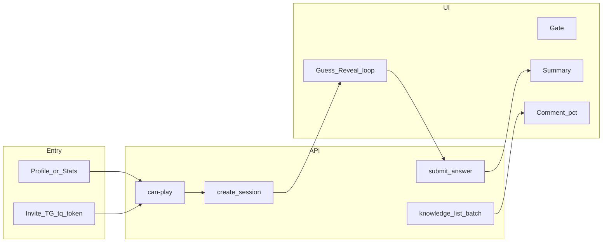

# Taste Quiz Implementation Plan

> **For agentic workers:** REQUIRED SUB-SKILL: Use superpowers:subagent-driven-development (recommended) or superpowers:executing-plans to implement this plan task-by-task. Steps use checkbox (`- [ ]`) syntax for tracking.
>
> Spec source of truth: [docs/superpowers/specs/2026-07-23-taste-quiz-guess-rating-design.md](docs/superpowers/specs/2026-07-23-taste-quiz-guess-rating-design.md) · Feature: [.cursor/features/taste-quiz-guess-rating/feature.md](.cursor/features/taste-quiz-guess-rating/feature.md)

**Goal:** Ship the full Taste Quiz loop (10-card sessions, knowledge edges, invite deep links, stats, comment `%`) end-to-end in Filmony.

**Architecture:** Backend owns sampling, scoring, snapshots, and pair progress; thin FastAPI routes call one `@dataclass` service per use-case (`build`/`execute`). Frontend session UI lives outside `AppShell` (no bottom nav); knowledge `%` is batch-enriched on comment threads; Telegram deep links use `startapp=tq{token}` (built in backend, parsed on frontend only).

**Tech Stack:** FastAPI + SQLAlchemy async + Alembic · React + TGUI + TanStack Query · Celery TG notify · pytest in Docker (`make backend-test`) · frontend `npm run lint && npm run build`

## Global Constraints

- Meaningful rated card = `is_planned=false` AND `rating >= 1.0` (same as [`GetUserCardDetailsService._is_rated_user_card`](backend/src/services/cards/get_user_card_details.py)).
- Scoring: Δ=0 → 1; Δ=0.5 → 0.5; else 0. Server is source of truth.
- Hard gate: owner must have ≥10 rated cards to start.
- Pool: if `|unused| < 10` reset `played_card_ids` then sample 10; no manual card pick; one active session per `(guesser, owner)`.
- Pull start requires guesser follows owner; invite token bypasses follow (soft follow CTA only).
- Never leak `owner_rating` / `mood_after` / `watch_note` to client until that card is answered.
- No lives economy.
- Delivery artifacts: `.cursor/active/taste-quiz-guess-rating/{plan,progress,result}.md`, `docs/features/taste-quiz-guess-rating.md`, action-log entry.
- Locked product defaults (were open in spec): **invite picker = multi-select followers** (one reusable invite token + TG messages to selected, mirror share); **resume via `GET /sessions/{id}`**; **session cards = separate snapshot rows**; **60–84% color = `#86efac`**; TG complete notify **on by default** (no user toggle in v1).

## File map (create / extend)

**Backend create**
- Models: [`backend/src/models/taste_quiz_pair_progress.py`](backend/src/models/taste_quiz_pair_progress.py), `taste_quiz_session.py`, `taste_quiz_session_card.py`, `taste_quiz_invite.py` + export in [`models/__init__.py`](backend/src/models/__init__.py)
- Migration: `backend/src/migrations/versions/*_taste_quiz.py`
- Services: `backend/src/services/taste_quiz/*.py` (8 use-cases + scoring helper) · TG: `services/telegram/send_taste_quiz_complete_notification.py` · deep link helper in [`mini_app_link.py`](backend/src/services/telegram/mini_app_link.py)
- API: `backend/src/api/taste_quiz/{routes,schemas}.py` · mount in [`api/router.py`](backend/src/api/router.py)
- Tasks: wire notify in [`tasks/telegram_engagement.py`](backend/src/tasks/telegram_engagement.py)
- Tests: `backend/src/tests/api/test_taste_quiz_routes.py` + service tests under `tests/services/taste_quiz/`

**Frontend create**
- `frontend/src/api/tasteQuiz{Api,Types}.ts` · `lib/tasteQuiz{QueryKeys,AccuracyColor}.ts` · extend [`miniAppCardDeepLink.ts`](frontend/src/lib/miniAppCardDeepLink.ts)
- Pages: `TasteQuizInvitePage`, `TasteQuizPlayPage`, `TasteQuizInviteLandingPage`, `TasteQuizStatsPage`
- Components: `frontend/src/components/tasteQuiz/*` (Gate, Guess, Reveal, Summary, Stepper, KnowledgeBadge, KnowledgeList, FollowersPicker fork)
- Hooks: `useTasteQuizCanPlay`, `useTasteQuizSession`, `useTasteQuizKnowledgeBatch`

**Frontend extend**
- [`routes.tsx`](frontend/src/routes.tsx), [`TelegramMiniAppStartParamRedirect.tsx`](frontend/src/navigation/TelegramMiniAppStartParamRedirect.tsx)
- CTAs: [`PublicProfilePage.tsx`](frontend/src/pages/PublicProfilePage.tsx), [`ProfilePage.tsx`](frontend/src/pages/ProfilePage.tsx)
- Stats: [`ProfileStatsPanel.tsx`](frontend/src/components/profile/ProfileStatsPanel.tsx) social tab
- Comments: [`FeedCard.tsx`](frontend/src/components/feed/FeedCard.tsx), [`FeedPostCard.tsx`](frontend/src/components/feed/FeedPostCard.tsx), [`MovieCardDetailPage.tsx`](frontend/src/pages/MovieCardDetailPage.tsx)

---

## Task 1 — Delivery scaffold + data model

- [ ] Write `.cursor/active/taste-quiz-guess-rating/plan.md` (this plan condensed) and `progress.md` status `in_progress`
- [ ] Add SQLAlchemy models:
  - **PairProgress:** unique `(guesser_id, owner_id)`, `points_sum`, `attempts`, `played_card_ids` (JSONB `int[]`), timestamps
  - **Session:** UUID PK, guesser/owner FKs, status enum, round_points, started/finished
  - **SessionCard:** UUID PK, session_id, position 0..9, card_id, snapshots (`owner_rating`, title, cover, company, mood_before/after, watch_note), `guess_rating` nullable, `points` nullable, `answered_at`
  - **Invite:** UUID PK, owner_id, `token` unique (`token_urlsafe`), expires_at (7d)
- [ ] Alembic migration via `make make-migration` / Docker; register models
- [ ] Unit-test-level fixture helpers for seeding ≥10 rated cards

**Verify:** migration upgrades cleanly in Docker; models importable.

---

## Task 2 — Core services: can-play, sample, create session

- [ ] `CheckTasteQuizCanPlayService` — rated_count, unused_count, knowledge stub, `active_session_id`, `requires_follow` (false if valid invite_token)
- [ ] Private sampling helper (or small service): pool query → unused → reset if needed → `random.sample(10)` → write Session + SessionCard snapshots; **client DTO strips** rating/mood_after/watch_note
- [ ] `CreateTasteQuizSessionService` — enforce self-play ban, follow (unless invite), ≥10 gate, 409 if active session exists, create pair progress row if missing
- [ ] API: `GET /can-play`, `POST /sessions` (+ schemas)
- [ ] Tests: gate fail; follow required; invite bypass; reset when unused&lt;10; no rating leak in create response; 409 active

**Verify:** `make backend-test-one target=src/tests/api/test_taste_quiz_routes.py` (subset) green.

---

## Task 3 — Answer, abandon, scoring, GET session, TG notify

- [ ] Pure `score_taste_quiz_guess(guess, actual) -> Decimal`
- [ ] `SubmitTasteQuizAnswerService` — strict next unanswered position; score vs snapshot; update session_card + pair `points_sum`/`attempts`/`played_card_ids`; complete session when 10/10; enqueue owner TG notify on complete
- [ ] `AbandonTasteQuizSessionService` — answered stay in played/edge; unanswered not played
- [ ] `GetTasteQuizSessionService` — resume payload with same redaction rules
- [ ] Routes: `POST .../answers`, `POST .../abandon`, `GET .../sessions/{id}`
- [ ] `SendTasteQuizCompleteNotificationService` + Celery task (mirror share card notify) + `telegram_mini_app_taste_quiz_url` / open-app link in message
- [ ] Tests: scoring matrix; order enforcement; double-answer 409; abandon semantics; complete notify mocked `.delay`

**Verify:** full answer/abandon service + API tests green in Docker.

---

## Task 4 — Knowledge list/batch + invites

- [ ] `ListTasteQuizKnowledgeService` — `to_them` (guesser=me, join following) and `to_me` (owner=me); include accuracy_pct; empty rows for followed users with attempts=0 only on `to_them` as CTA-ready stubs (or separate empty section — implement: **attempts&gt;0 rows + followed-without-edge for to_them**)
- [ ] `BatchTasteQuizKnowledgeService` — me→user_ids map for comments
- [ ] `CreateTasteQuizInviteService` / `ResolveTasteQuizInviteService` — token, expiry, share_url via mini_app_link; optional multi-follower TG send (reuse share notify pattern / `SendTelegramBotMessageService`)
- [ ] Routes + schemas for knowledge + invites
- [ ] Tests: directions, batch sparse map, expired invite, create invite returns `tq` deep link

**Verify:** `make backend-test` for taste-quiz modules green.

---

## Task 5 — Frontend API + play loop UI

- [ ] Types + `tasteQuizApi.ts` + query keys + accuracy color helper (`#ff7a8c` / `#e8b86d` / `#86efac` / `#5eead4`)
- [ ] Routes outside AppShell: `/taste-quiz/play/:ownerId`, `/taste-quiz/invite/:inviteToken`, `/taste-quiz/invite`, `/taste-quiz/stats`
- [ ] `TasteQuizPlayPage`: can-play → Gate | resume prompt | Guess↔Reveal loop | Summary; rating stepper (±0.5 via `normalizeRating`/`formatRating`); abandon confirm; soft follow banner on invite path
- [ ] Deep link: parse `tq…` in `TelegramMiniAppStartParamRedirect` → invite landing → resolve → create session
- [ ] Invite page: fork ShareFollowersPicker multi-select → create invite → copy/share link + notify selected

**Verify:** `cd frontend && npm run lint && npm run build`

---

## Task 6 — Profile CTAs, stats, comment badges

- [ ] Public profile: «Угадать вкус» (viewer follows owner); own profile: «Пригласить угадать»
- [ ] `ProfileStatsPanel` social: knowledge block + link to `/taste-quiz/stats` (tabs Я→они / Они→я)
- [ ] `TasteQuizKnowledgeBadge`: `(72%)` after author name only if batch has edge; tap → popover points/attempts
- [ ] Wire batch fetch in FeedCard, FeedPostCard, MovieCardDetailPage comment lists (guesser = current user, ids = comment authors)
- [ ] Russian copy from spec §Copy

**Verify:** lint/build; manual smoke checklist from acceptance criteria in design spec.

---

## Task 7 — Docs, result, memory

- [ ] `docs/features/taste-quiz-guess-rating.md` from result
- [ ] `.cursor/active/.../result.md` + progress `done`
- [ ] Action-log fragment under `.cursor/memory/logs/`
- [ ] Copy plan to `docs/superpowers/plans/2026-07-23-taste-quiz-guess-rating.md` for superpowers archive

**Verify:** feature complete only when backend pytest coverage for all new endpoints + frontend lint/build documented in result.md.

---

## Out of scope (explicit)

- User setting to disable TG quiz-complete notify
- Global leaderboards / lives / streaks
- Changing create-card or feed ranking
- ML taste-match v2
