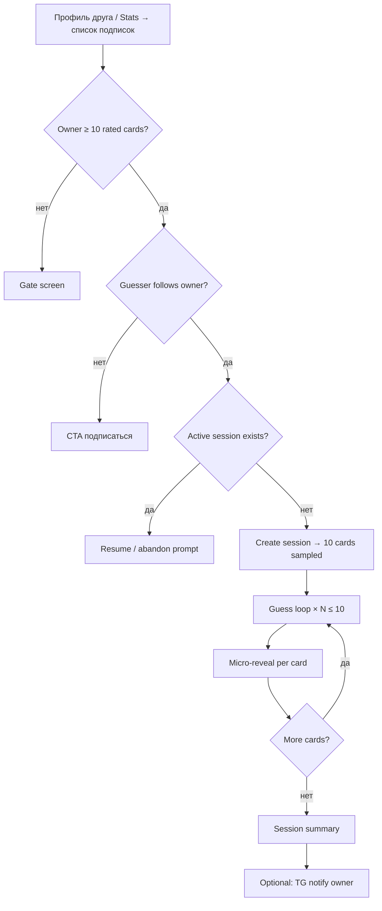
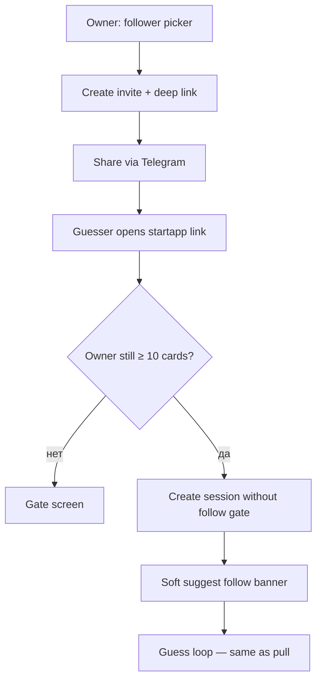
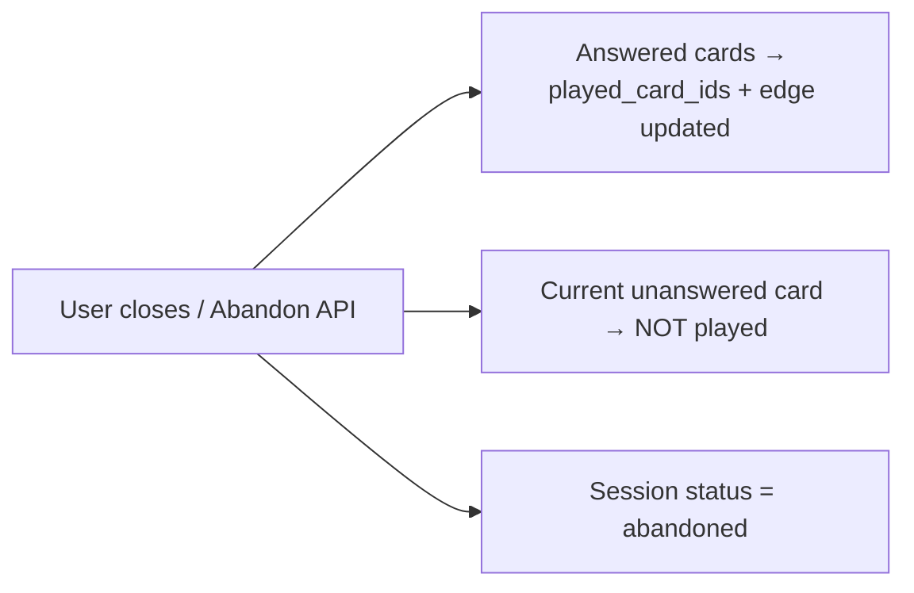

# «Угадай вкус» (Taste Quiz) — design spec

**Статус:** утверждён  
**Дата:** 2026-07-23  
**Feature slug:** `taste-quiz-guess-rating`

## Summary

Социальная мини-игра в Filmony: подписчик (или приглашённый по deep link) угадывает **оценки владельца** по до **10 случайным карточкам** за сессию. Один ответ на карточку, без «жизней». После каждого ответа — микро-раскрытие с дельтой, очками и «мемным» вердиктом; в конце — сводка сессии. Между парами пользователей накапливается **Knowledge edge** (сумма очков + accuracy %), видимая в статистике и рядом с ником в комментариях.

---

## Goals

- Дать подписчикам **игровой способ** узнать вкус автора профиля без ручного просмотра всех карточек.
- Зафиксировать **честный скоринг** (exact / close / miss) и **стабильность** (snapshot полей карточки на момент создания сессии).
- Показать **двустороннюю** «осведомлённость» по всем подпискам: «я → они» и «они → я».
- Встроить entry **pull** (профиль / stats) и **push** (инвайт + Telegram deep link).
- Обогатить комментарии **процентом accuracy** без эмодзи и без шума для пар, которые никогда не играли.

## Non-goals

- Экономика «жизней», streaks, лидерборды глобального масштаба.
- Ручной выбор карточек гuessser'ом или owner'ом внутри сессии.
- Показ `rating`, `mood_after`, `watch_note` **до** ответа.
- ML-рекомендации или taste match v2 (см. `profile-taste-match`) — отдельная фича.
- Изменение семантики create/edit карточки, реакций, ленты.
- Обязательная подписка при старте по **invite deep link** (только мягкий CTA).

---

## User flows

### Pull — из профиля / stats



### Push — инвайт владельца



### Abandon mid-session



---

## Game rules

### Участники

| Роль | Описание |
|------|----------|
| **Owner** | Владелец профиля; его оценённые карточки — пул |
| **Guesser** | Игрок, угадывающий оценки owner |

Направление edge: **guesser → owner** (guesser знает вкус owner).

### Пул карточек

- Только **meaningful rated cards** owner: `is_planned = false`, `rating ∈ [1, 10]` с шагом 0.5 (как в create flow).
- **Hard gate:** owner должен иметь **≥ 10** таких карточек, иначе экран gate (см. UX).
- Guesser **не выбирает** карточки; порядок и состав определяет сервер при `Create session`.

### Сессия

- До **10 карточек** за одну сессию.
- **One-shot:** один submitted guess на карточку; изменить ответ нельзя.
- **One active session per pair** `(guesser_id, owner_id)`: пока сессия `active`, новая создаётся с ошибкой `409`; клиент предлагает resume или abandon.
- Карточки **сэмплируются** с учётом `played_card_ids` для пары (см. Anti-abuse).

### Сэмплинг и `played_card_ids`

Per pair `(guesser_id, owner_id)` хранится множество `played_card_ids` (карточки owner, уже бывшие в завершённых/abandoned раундах с ответом).

Перед новой сессией:

1. `unused = pool \ played_card_ids`
2. Если `|unused| ≥ 10` → случайная выборка **10** из `unused`.
3. Если `|unused| < 10` → **RESET** `played_card_ids` для пары, затем случайная выборка **10** из полного pool (или `min(10, |pool|)` если pool < 10 — при gate ≥10 это не случается для owner).

Guesser не может повторно «фармить» одни и те же карточки, пока не исчерпает unused; reset даёт второй круг.

### Snapshot стабильности

При `Create session` для каждой карточки в сессии сохраняется **immutable snapshot**:

| Поле snapshot | Использование |
|---------------|---------------|
| `owner_rating` | Эталон для скоринга |
| `poster_url`, `title`, `company`, `mood_before` | UI до ответа |
| `mood_after`, `watch_note`, `meme_verdict_key` (derived server-side at reveal) | UI после ответа |
| `card_id` | Ссылка на карточку; edge / played tracking |

Изменения owner на live-карточке **не меняют** уже созданную сессию.

### Скоринг (per card)

| Условие | Очки |
|---------|------|
| `guess === owner_rating` (exact) | **1.0** |
| `|guess − owner_rating| === 0.5` (close) | **0.5** |
| иначе (miss) | **0** |

Guesser выставляет guess через **stepper ±0.5**, диапазон **1–10** (`normalizeRating` / create flow).

**Verdict keys (per card, for meme UI):**

| Key | Условие |
|-----|---------|
| `exact` | Δ = 0 |
| `close` | Δ = 0.5 |
| `miss` | Δ ≥ 1 |

**Round verdict** (микро-раскрытие): производная от `round_points` ∈ {1, 0.5, 0} — маппинг на тот же набор ключей / copy (см. Copy).

### Knowledge edge (guesser → owner)

После каждого **submitted** ответа (и при complete/abandon с ответами):

- `attempts += 1`
- `points_sum += round_points`
- `accuracy_pct = round(100 * points_sum / attempts, 0)` — целое 0–100 для UI

UI показывает **оба**: `points_sum` и `accuracy_pct`.

**Цветовая шкала %** (digit / badge):

| Диапазон | Цвет |
|----------|------|
| 0–29 | `#ff7a8c` (pink) |
| 30–59 | `#e8b86d` (amber) |
| 60–84 | lime / soft green (Filmony mint family, напр. `#86efac`) |
| 85–100 | `#5eead4` (mint) |

### Abandon

- Ответы, уже отправленные в сессии: карточки попадают в `played_card_ids`, edge обновляется.
- **Текущая неотвеченная** карточка: **не** помечается played.
- Сессия → `abandoned`; повторный старт — новая сессия (если нет другой active).

### Subscription & invite

| Entry | Follow required? |
|-------|------------------|
| Pull (профиль / stats «Угадать вкус») | **Да** — guesser must follow owner |
| Push (invite deep link) | **Нет** — сессия стартует; **soft banner** «Подписаться на @owner» |

### Telegram notification

- По завершению сессии (`completed`): **optional** push owner — **default ON** (user setting TBD in settings scope; default в product = on).
- Payload: guesser display name, session score, deep link на summary или профиль guesser.

---

## UX screens

Общие принципы: **тёмная тема** Filmony (mint / amber акценты), **без bottom nav** на время сессии (guess → micro-reveal → next). Stepper оценки — **как create flow** (`RatedCardScrollForm`: − / value / +, шаг 0.5).

### 1. Gate (`TasteQuizGateScreen`)

**Когда:** owner < 10 meaningful rated cards **или** guesser открыл quiz на профиле с недостаточным пулом.

- Illustration / icon (quiz).
- Copy: owner needs ≥10 оценённых карточек.
- Если viewer = owner: CTA «Оценить карточки» → create card.
- Если viewer = guesser: «У @owner пока мало оценок» + back.

### 2. Invite (`TasteQuizInviteScreen`) — owner only

- Follower picker (подписчики owner).
- Multi-select или single + «Отправить приглашение».
- Preview share text + Telegram share.
- После create invite — confirmation + copy link.

### 3. Guess (`TasteQuizGuessScreen`)

**До ответа видно:**

- Poster, title, **company** (chip), **mood_before** (chip).
- Progress: «3 / 10».
- Rating stepper (1–10, ±0.5).
- Primary: «Угадать» (submit disabled until valid rating).
- Secondary: «Выйти» → abandon confirm.

**Скрыто до submit:** owner rating, mood_after, watch_note, Δ, points, meme verdict.

### 4. Micro-reveal (`TasteQuizRevealScreen`)

После submit — fullscreen или sheet:

- Owner rating vs guess, **Δ**, **points** (+1 / +0.5 / 0).
- **Mood after** chip.
- **Watch note** — через существующий **spoiler UI** (`SpoilerRevealBlock` / `CommentBodyWithReactionTokens`).
- **Meme verdict** — короткая фраза по `verdict_key` + optional illustration slot.
- CTA: «Дальше» → следующая карточка или summary.

### 5. Session summary (`TasteQuizSummaryScreen`)

- Total points / max (напр. 7.5 / 10).
- Session accuracy % (points_sum_session / cards_answered).
- Breakdown list (optional compact): title + guess + owner + points.
- Edge update teaser: «Теперь ты знаешь вкус @owner на **72%**» (+ delta vs before if any).
- CTAs: «На профиль», «Ещё раз» (disabled if would violate active session / same rules), share result (optional v1).

### 6. Stats (`TasteQuizStatsScreen` / block)

**Scope:** все подписки пользователя, **оба направления**:

| Tab / section | Смысл |
|---------------|-------|
| **Я → они** | Viewer as guesser; edge к каждому followed user с attempts > 0 |
| **Они → я** | Viewer as owner; edge от каждого guesser с attempts > 0 |

Row: avatar, nickname, `points_sum`, `accuracy_pct` (colored), attempts, last played (optional).

Sort: default by accuracy desc, then points.

Empty: см. Copy.

Entry: профиль → Stats tab block «Угадай вкус» + строка в списке подписок / social insights.

### 7. Comment enrichment

В списке комментариев / author row рядом с nickname:

- Формат: `@nickname` **`(72%)`** — скобки **muted** (`hint_color`), **цифры** — цвет по шкале %.
- **Без emoji.**
- Если пара **never played** (`attempts = 0`) — **ничего не показывать** (не 0%, не placeholder).

Batch API для N comment authors на одной карточке/посте.

### 8. Active session / errors

- Resume banner если вернулся в приложение с active session.
- 409 → «У вас уже есть незаконченная игра с @owner» [Продолжить] [Отменить].
- Pull without follow → follow CTA screen.

---

## Data model & API contracts

### Entities (conceptual)

#### `taste_quiz_pair_progress`

Per directed pair `(guesser_user_id, owner_user_id)`:

```typescript
type TasteQuizPairProgress = {
  guesser_user_id: string // uuid
  owner_user_id: string
  points_sum: number      // float, 0.5 increments
  attempts: number        // int ≥ 0
  accuracy_pct: number    // derived 0–100, stored or computed
  played_card_ids: number[] // owner card ids
  updated_at: string      // iso
}
```

#### `taste_quiz_session`

```typescript
type TasteQuizSessionStatus = 'active' | 'completed' | 'abandoned'

type TasteQuizSession = {
  id: string // uuid
  guesser_user_id: string
  owner_user_id: string
  status: TasteQuizSessionStatus
  card_count: number        // ≤ 10
  current_index: number     // 0-based, next unanswered
  cards: TasteQuizSessionCard[]
  created_at: string
  completed_at: string | null
}

type TasteQuizSessionCard = {
  session_card_id: string
  card_id: number
  order_index: number
  // hints (always in client payload)
  title: string
  poster_url: string | null
  company: CardCompany
  mood_before: CardMoodBefore
  // reveal fields — null until this card is answered (server stores snapshot; never leak pre-submit)
  owner_rating: number | null
  mood_after: CardMoodAfter | null
  watch_note: string | null
  // answer (null until submitted)
  guess_rating: number | null
  round_points: number | null
  verdict_key: 'exact' | 'close' | 'miss' | null
  answered_at: string | null
}
```

#### `taste_quiz_invite`

```typescript
type TasteQuizInvite = {
  id: string
  owner_user_id: string
  invite_token: string     // opaque, URL-safe
  target_user_id: string | null // if picker pre-selected
  expires_at: string | null
  consumed_at: string | null
  created_at: string
}
```

Deep link: `https://t.me/{bot}/{app}?startapp=tq{invite_token}` (по аналогии с `c{id}`, `p{id}`).

### API use-cases (product level)

Base path suggestion: `/api/taste-quiz/…` — финальные пути на этапе implementation.

#### 1. Check can play

`GET /api/taste-quiz/can-play?owner_id={uuid}&invite_token={optional}`

Auth: guesser.

Response:

```json
{
  "can_play": true,
  "reason": null,
  "owner_rated_count": 42,
  "requires_follow": true,
  "guesser_follows_owner": true,
  "active_session_id": null,
  "gate_min_rated_cards": 10
}
```

`reason` enum: `owner_insufficient_cards` | `not_following` | `active_session_exists` | null.

Invite flow: when valid `invite_token` query param is present, `requires_follow: false`.

#### 2. Create session

`POST /api/taste-quiz/sessions`

Body:

```json
{
  "owner_id": "uuid",
  "invite_token": "optional-string"
}
```

- Validates gate, follow (unless invite), no active session.
- Samples cards, writes snapshots server-side; **client session payload omits reveal fields** (`owner_rating`, `mood_after`, `watch_note`) on unanswered cards.

Errors: `403` not following, `409` active session, `422` gate.

#### 3. Submit answer

`POST /api/taste-quiz/sessions/{session_id}/answers`

Body:

```json
{
  "session_card_id": "uuid",
  "guess_rating": 8.5
}
```

Response: updated card with `round_points`, `verdict_key`, reveal fields; session progress; optional `pair_progress` snapshot.

Errors: `409` already answered, `400` wrong index / invalid rating.

Auto-complete session when last card answered → `status: completed`, trigger TG notify job if enabled.

#### 4. Abandon session

`POST /api/taste-quiz/sessions/{session_id}/abandon`

- Marks session abandoned; persists edge + played for answered only.

#### 5. Get knowledge list

`GET /api/taste-quiz/knowledge?direction=to_them|to_me`

Query: pagination, sort.

Response:

```json
{
  "items": [
    {
      "user_id": "uuid",
      "profile_slug": "string",
      "display_name": "string",
      "avatar_url": "string | null",
      "points_sum": 12.5,
      "attempts": 20,
      "accuracy_pct": 63
    }
  ],
  "next_cursor": "..."
}
```

- `to_them`: viewer is guesser.
- `to_me`: viewer is owner.

Only rows with `attempts > 0`.

#### 6. Get knowledge batch (comments)

`POST /api/taste-quiz/knowledge/batch`

Body:

```json
{
  "owner_id": "uuid",
  "guesser_user_ids": ["uuid", "..."]
}
```

Response:

```json
{
  "items": {
    "guesser-uuid": {
      "attempts": 15,
      "accuracy_pct": 72,
      "points_sum": 11.0
    }
  }
}
```

Omit keys where `attempts = 0` (client shows nothing).

#### 7. Create invite

`POST /api/taste-quiz/invites`

Body:

```json
{
  "target_user_id": "uuid | null"
}
```

Owner only. Returns `invite_token`, `share_url`, `telegram_share_text`.

#### 8. Resolve invite

`GET /api/taste-quiz/invites/{token}`

Public-ish (auth optional for preview). Returns owner profile snippet, `can_play`, gate info. Client then calls Create session with `invite_token`.

### Service layer (implementation hint)

| Use-case | Service (illustrative) |
|----------|------------------------|
| Can play | `CheckTasteQuizCanPlayService` |
| Create session | `CreateTasteQuizSessionService` |
| Submit answer | `SubmitTasteQuizAnswerService` |
| Abandon | `AbandonTasteQuizSessionService` |
| Knowledge list | `ListTasteQuizKnowledgeService` |
| Knowledge batch | `BatchTasteQuizKnowledgeService` |
| Create invite | `CreateTasteQuizInviteService` |
| Resolve invite | `ResolveTasteQuizInviteService` |

Presentation: thin routes; business rules (sampling, scoring, reset) — только в services; persistence — DAOs.

---

## Copy & a11y

### Key buttons (RU)

| Control | Copy |
|---------|------|
| Pull entry (profile) | **Угадать вкус** |
| Pull entry (stats row) | **Угадать вкус** |
| Invite CTA (owner) | **Пригласить угадать** |
| Submit guess | **Угадать** |
| Next card | **Дальше** |
| Abandon confirm | **Выйти из игры** / **Остаться** |
| Resume | **Продолжить игру** |
| Share invite | **Отправить в Telegram** |
| Follow soft CTA (invite) | **Подписаться на {name}** |
| Gate (owner) | **Нужно минимум 10 оценённых карточек** |
| Gate CTA (owner) | **Добавить карточку** |

### Empty states

| Surface | Copy |
|---------|------|
| Stats «Я → они» | **Вы ещё ни с кем не играли.** Подпишитесь на друзей и нажмите «Угадать вкус» в их профиле. |
| Stats «Они → я» | **Вас ещё никто не угадывал.** Пригласите подписчиков — кнопка «Пригласить угадать». |
| Comment batch (no data) | *(no UI — intentional silence)* |

### Share text (invite)

> {owner_name} приглашает угадать его вкус в Filmony 🎬  
> Открой квиз: {share_url}

*(Эмодзи только в **Telegram share preview**, не в comment % badge.)*

### Meme verdict copy (examples)

| Key | Пример фразы |
|-----|----------------|
| `exact` | **В точку!** Ты читаешь мысли. |
| `close` | **Почти!** Промах на полшага. |
| `miss` | **Мимо.** Вкусы разошлись. |

Round headline может дублировать points: «+1», «+0.5», «0».

### a11y

- **Tap target** для `(72%)` badge в комментариях: min **44×44 pt** hit area (можно через padding на обёртке, визуально компактно).
- **Contrast:** % digit на фоне comment row — проверить WCAG AA для pink/amber на `--tgui--bg_color`; при fail — добавить subtle pill background.
- Stepper: `aria-label` «Ваша оценка, {value} из 10»; кнопки −/+ с «Уменьшить на 0.5» / «Увеличить на 0.5».
- Spoiler note: reuse `aria-label="Показать спойлер"` from `SpoilerRevealBlock`.
- Progress: `aria-valuenow` / `aria-valuemax` на индикаторе «3 из 10».
- Gate / errors: focus management при modal abandon.

---

## Analytics events (light suggestions)

| Event | Properties |
|-------|------------|
| `taste_quiz_session_started` | `entry: pull|invite`, `owner_id`, `card_count` |
| `taste_quiz_answer_submitted` | `session_id`, `verdict_key`, `round_points`, `index` |
| `taste_quiz_session_completed` | `session_id`, `total_points`, `accuracy_pct`, `duration_sec` |
| `taste_quiz_session_abandoned` | `session_id`, `answered_count` |
| `taste_quiz_invite_created` | `has_target_user` |
| `taste_quiz_invite_opened` | `invite_token` (hash) |
| `taste_quiz_gate_shown` | `reason`, `owner_rated_count` |
| `taste_quiz_follow_cta_tapped` | `from: invite|pull` |
| `taste_quiz_stats_viewed` | `direction` |

---

## Open questions / out of scope

### Resolved in this spec (not open)

- Scoring tiers, snapshot, played reset, one active session, no lives — **fixed**.
- Comment % visibility rules — **fixed**.

### Out of scope v1

- Global leaderboard, daily challenges, rewards.
- Playing with non-subscribers without invite link.
- Owner preview of guesser session in realtime.
- Editing guess after submit.
- Per-card time limits.

### Minor follow-ups (non-blocking)

- User-level toggle «уведомлять о завершении квиза» — default on; placement in notification settings.
- Exact mint/lime hex for 60–84 band — align with `--filmony-mint` token at implement time.
- Meme verdict asset pack vs text-only v1.

---

## Acceptance criteria checklist

### Product / UX

- [ ] Pull entry «Угадать вкус» on friend profile and stats subscription list.
- [ ] Push entry: owner invite flow + Telegram deep link opens quiz without follow requirement.
- [ ] Gate when owner < 10 meaningful rated cards.
- [ ] Session ≤ 10 cards; guesser cannot pick cards.
- [ ] Before answer: poster, title, company, mood_before only.
- [ ] After answer: rating, Δ, points, mood_after, spoiler watch_note, meme verdict.
- [ ] Rating stepper 1–10, step 0.5, matches create flow behavior.
- [ ] No bottom nav during active session screens.
- [ ] Session summary shows totals and updated edge.
- [ ] Stats: both directions across subscriptions; only attempts > 0.
- [ ] Comments: `(NN%)` with muted parens, colored digits, no emoji; hidden if never played.
- [ ] Abandon: answered → played + edge; unanswered → not played.
- [ ] One active session per pair enforced.

### Game logic

- [ ] Scoring: 1 / 0.5 / 0 with exact half-step close only.
- [ ] `accuracy_pct = points_sum / attempts` displayed with color bands.
- [ ] `played_card_ids` sampling + reset when unused < 10.
- [ ] Snapshots frozen at session create.

### API

- [ ] All eight use-cases implemented with contracts above.
- [ ] `409` on duplicate active session; follow check on pull only.
- [ ] Batch knowledge for comment enrichment.
- [ ] Optional TG notify on complete (default on).

### Quality

- [ ] Backend pytest: scoring, sampling/reset, abandon, gate, follow/invite paths, active session conflict, snapshot immutability.
- [ ] Frontend lint + build clean on touched files.
- [ ] a11y: stepper labels, spoiler, % tap target.

---

## References

- Rating stepper: `frontend/src/components/create/RatedCardScrollForm.tsx`, `normalizeRating` in `frontend/src/lib/createCardBinding.ts`
- Spoiler UI: `frontend/src/components/comments/SpoilerRevealBlock.tsx`
- Deep links: `backend/src/services/telegram/mini_app_link.py`
- Card enums: `backend/src/models/card_enums.py`
- Subscriptions: existing follow graph / `ListUserSubscriptionsService`
- Related (separate): `.cursor/features/profile-taste-match/feature.md`
