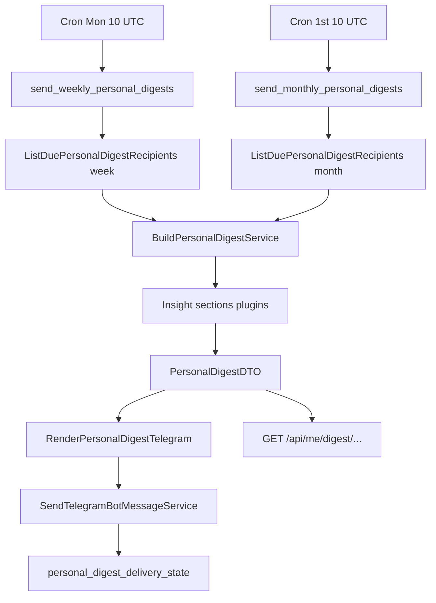

# Personal digest redesign (weekly + monthly) — Design Spec

**Date:** 2026-08-08  
**Status:** approved — implementation in progress  
**Feature slug:** `personal-digest-redesign`

---

## 1. Context

Сегодня в Filmony **три разрозненных Telegram-pipeline** для периодических сообщений:

| Pipeline | Cron (prod, до redesign) | Проблема |
|----------|--------------------------|----------|
| `send_subscribed_activity_digests` | каждые 6 ч | узкий social pool, шум, нет личной статистики |
| `send_weekly_controversy_digests` | пн 13:00 UTC | нишево, часто skip |
| `send_monthly_recap_nudges` | **не был в cron** | слишком короткий Telegram (2 поля из богатого recap) |

In-app **Monthly Recap** (`BuildMonthlyRecapService`, `/me/recap/:year/:month`) уже агрегирует фильмы, жанры, decades, directors, franchises, stamps, marathons — но **не включает** актёров, коллекции, ачивки, streak, mood/company и сравнение с прошлым периодом.

С момента написания старых digest’ов в продукте появились: **actor cast**, **collections + progress**, **achievements + rarity**, **director/franchise marathons**, **rating streak**, Oscar badges (UI-only).

**Цель redesign:** два личных продукта — **weekly** (история недели + друзья + приколы) и **monthly** (полная статистика месяца) — один архитектурный стек, **2 cron job’а** на prod.

---

## 2. Goals

1. **Weekly personal digest** — Telegram + in-app страница; личная сводка за прошлую календарную неделю (пн–вс UTC) + **компактный блок «друзья»** + 1–3 fun facts.
2. **Monthly personal digest** — Telegram-teaser + расширенная in-app сводка; все ключевые оси taste/gamification за прошлый UTC-месяц.
3. **Единый composer** — `BuildPersonalDigestService` с `period=week|month`, plug-in секции, общий рендер Telegram / API DTO.
4. **Prod cron** — ровно **2** filmony digest job’а (+ infra backup и achievement rarity отдельно).
5. **Deprecate cron** для subscribed 6h digest и standalone weekly controversy (код social/controversy сохраняем для reuse внутри weekly friends block).

---

## 3. Non-goals (v1)

| Исключено | Примечание |
|-----------|------------|
| Отдельный cron для social / subscribed 6h | Social только как секция weekly «друзья» |
| Push/email | Только Telegram + in-app |
| Digest для пользователей без Telegram | skip (`skipped_no_telegram`) |
| Opt-in/opt-out UI | v2; v1 — всем eligible |
| LLM-generated copy | Rule-based + microFun pools |
| Global leaderboards | Только personal + friend highlights |
| Year-in-review | Отложено |
| Digest на planned-only карточках | Только meaningful rated (`is_planned=false`, `rating>=1`, `film_id` где применимо) |

---

## 4. Cron & prod runbook

**Timezone prod host:** UTC (`Etc/UTC`).

### 4.1 Filmony digest crons (после redesign)

```cron
# Weekly personal digest — Monday 10:00 UTC (previous Mon–Sun)
0 10 * * 1 docker exec -w /opt/app filmony-celery-worker celery -A celery_app call tasks.personal_digest.send_weekly_personal_digests >>/var/log/filmony-weekly-digest.log 2>&1

# Monthly personal digest — 1st day 10:00 UTC (previous calendar month)
0 10 1 * * docker exec -w /opt/app filmony-celery-worker celery -A celery_app call tasks.personal_digest.send_monthly_personal_digests >>/var/log/filmony-monthly-digest.log 2>&1
```

### 4.2 Остаются (не digest)

```cron
0 */6 * * * /opt/homelab-infra/scripts/backup-all-databases.sh >>/opt/homelab-pg-backup.log 2>&1
0 4 * * * docker exec -w /opt/app filmony-celery-worker celery -A celery_app call tasks.achievement_rarity.recalculate_achievement_rarity >>/var/log/filmony-achievement-rarity.log 2>&1
```

### 4.3 Удалены с prod (2026-08-08)

- `send_subscribed_activity_digests` (6h)
- `send_weekly_controversy_digests` (Mon 13:00)
- `manage_seed_oscars.py` (Jan 20)
- `sync_film_award_badges` (Mar 5 / Mar 25)

### 4.4 Rollout phases

| Phase | Deliverable |
|-------|-------------|
| **0** (this spec) | Celery task registration + prod cron + stub batch (log + skip) |
| **1** | `BuildPersonalDigestService` month + extend recap API + monthly Telegram teaser |
| **2** | Weekly digest + friends block + weekly page + Telegram |
| **3** | Fun facts engine + controversy-as-insight + deprecate old nudge task |

**Manual verify after deploy:**

```bash
ssh homelab 'cd /opt/filmony && docker compose exec -T -w /opt/app filmony-celery-worker celery -A celery_app call tasks.personal_digest.send_weekly_personal_digests'
tail -20 /var/log/filmony-weekly-digest.log
```

---

## 5. Architecture



### 5.1 Services (backend)

| Service | Responsibility |
|---------|----------------|
| `BuildPersonalDigestService` | Orchestrator: window bounds, aggregate cards, call section builders |
| `BuildPersonalDigestFriendsSectionService` | Weekly only: following activity summary |
| `BuildPersonalDigestFunFactsService` | Rule-based + microFun fallback |
| `RenderPersonalDigestTelegramService` | HTML Telegram body + deep link |
| `SendPersonalDigestTelegramService` | Idempotent send + persist state |
| `ListDuePersonalDigestRecipientIdsService` | Eligible users for period |

**Presentation:** `tasks/personal_digest.py` — thin Celery batch loops (pattern: `monthly_recap.py`).

### 5.2 State & idempotency

**New table:** `personal_digest_delivery_state`

| Column | Type | Notes |
|--------|------|-------|
| `id` | PK | |
| `user_id` | UUID FK | |
| `period` | `VARCHAR` | `week` \| `month` |
| `period_key` | `VARCHAR` | ISO week `2026-W19` or month `2026-05` |
| `sent_at` | TIMESTAMPTZ | |
| `payload_hash` | VARCHAR nullable | optional dedupe |

**Unique:** `(user_id, period, period_key)`

**Migration path:** `monthly_recap_nudge_state` → read-only fallback until backfill; новые sends пишут только в `personal_digest_delivery_state`. Старые таблицы (`subscribed_activity_digest_state`, `weekly_controversy_state`) не удаляем в v1.

### 5.3 Period boundaries

- **Week:** ISO week, digest за **завершённую** неделю; cron в **понедельник 10:00 UTC** → window = previous Mon 00:00 – Sun 23:59:59 UTC.
- **Month:** UTC calendar month; cron **1-го в 10:00 UTC** → previous month (reuse `previous_complete_month()`).

**Eligibility:** ≥1 meaningful rated card in window.

---

## 6. PersonalDigestDTO (shared shape)

```python
@dataclass
class PersonalDigestDTO:
    user_id: UUID
    period: Literal['week', 'month']
    period_key: str          # "2026-W19" | "2026-05"
    period_label: str        # "28 апр – 4 мая" | "Май 2026"
    window_start: datetime
    window_end: datetime

    # Overview
    total_rated: int
    average_rating: float
    vs_previous_period: PeriodDelta | None  # month always; week when prior week has data

    # Films
    top_films: list[DigestFilmItem]       # week: top 3; month: top 3 + optional worst 1
    all_films: list[DigestFilmItem]       # in-app only; omitted from Telegram

    # People (from film metadata + film_actor)
    top_director: DigestPersonItem | None
    top_actor: DigestPersonItem | None
    director_breakdown: list[DigestPersonItem]  # month: top 5; week: top 3
    actor_breakdown: list[DigestPersonItem]
    new_director_spotlight: DigestPersonItem | None  # first time in user's rated history
    new_actor_spotlight: DigestPersonItem | None

    # Taste
    genre_breakdown: list[DistributionItem]
    decade_breakdown: list[DecadeItem]
    top_country: str | None
    new_countries_count: int
    franchise_breakdown: list[FranchiseItem]
    dominant_mood_after: str | None
    dominant_company: str | None

    # Gamification
    new_stamps: list[StampItem]
    marathons_unlocked: list[MarathonItem]
    achievements_unlocked: list[AchievementItem]  # slug, title, rarity_pct optional
    collection_deltas: list[CollectionDeltaItem]  # slug, title, rated_before, rated_after

    # Activity
    peak_activity_date: date | None
    peak_activity_count: int
    streak_current: int
    streak_best_in_period: int

    # Social (weekly only)
    friends: FriendsDigestSection | None

    # Personality
    fun_facts: list[FunFactItem]  # scored; renderer picks subset

    # Optional insight cards
    controversy: ControversyInsight | None  # weekly, if spread >= threshold
```

---

## 7. Weekly digest — content spec

### 7.1 Telegram (target 10–14 lines HTML)

| # | Block | Source | Skip if |
|---|-------|--------|---------|
| 1 | Title `📅 Твоя неделя · {period_label}` | computed | never |
| 2 | `{N} фильмов · ср. {avg}` | overview | N=0 → no send |
| 3 | `⭐ {title} — {rating}` | top_films[0] | — |
| 4 | `🎬 {director}` or `🎭 {actor}` | people | no data |
| 5 | Gamification one-liner | first of: achievement / stamp / collection delta / marathon | none |
| 6 | Streak | `🔥 серия {n} дн.` or gentle nudge | optional |
| 7 | **Friends** (see §8) | friends section | no following activity |
| 8 | Fun fact | fun_facts[0] | pool empty |
| 9 | Deep link | `startapp=wd{period_key}` | — |

### 7.2 In-app `/me/digest/week/:periodKey`

Sections (collapsible cards):

1. **Обзор** — numbers + vs previous week
2. **Фильмы** — chronological list + top 3 cards
3. **Люди** — director + actor chips with links
4. **Вкус** — dominant genre, mood, company
5. **Коллекции & ачивки** — deltas and unlocks
6. **Друзья** — expanded friends block (§8)
7. **Приколы недели** — up to 3 fun facts
8. **Controversy** — optional card linking to film

---

## 8. Weekly friends block («сводка по друзьям»)

**Scope:** activity of users the recipient **follows** (`ListFollowingUserIdsForFollowerUserService`) during the **same week window**.

### 8.1 Data collected

| Signal | Weight | Cap |
|--------|--------|-----|
| New rated film card | high | — |
| Rating ≥ 9 | high | — |
| New feed post | medium | — |
| Collection progress milestone (+5 films in collection) | medium | — |
| Achievement unlock | medium | — |
| Author with most activity | summary row | 1 |

Reuse collectors from `CollectSubscribedActivityDigestCandidatesService` where possible; **extend** with collection/achievement events.

### 8.2 Telegram friends format (3–5 lines max)

```
👥 Друзья за неделю
• @alice — «Дюна 2» (9)
• @bob — 3 оценки · топ жанр: триллер
• @carol — закрыла 50% Letterboxd Top 500
```

Rules:

- Max **3 friend lines** in Telegram; diversity by author (not 3 cards from same person).
- Display name: `display_name` → `@username` → «Друг».
- Link to profile optional in in-app; plain text in Telegram.
- If **zero** following activity → omit block entirely (not «тишина»).

### 8.3 In-app friends section

- Up to **8** items grouped by friend.
- Sub-link «Вся активность подписок» → `/feed` or future subscriptions activity view.

### 8.4 Controversy reuse

If `ComputeWeeklyControversyService` returns spread ≥ `MIN_SPREAD_FOR_TELEGRAM_DIGEST` for recipient, add **personal** insight (not separate cron):

`⚡ Сильнее всего разошлись с @friend по «{film}»`

---

## 9. Monthly digest — content spec

### 9.1 Telegram teaser (5–7 hooks, not full stats)

| Hook | Example |
|------|---------|
| Title | `📊 Итоги · {month_label}` |
| Volume | `23 фильма · ср. 7.8` |
| vs prev | `(+4 к апрелю)` |
| Director | `🎬 {name} ({count})` |
| Actor | `🎭 {name} ({count})` |
| Gamification | `🏆 2 ачивки · Letterboxd 12→28` |
| Streak | `🔥 лучшая серия 9 дн.` |
| CTA | deep link `startapp=md{year}-{month}` |

Monthly Telegram **never** includes friends block (weekly-only).

### 9.2 In-app `/me/digest/month/:year/:month`

Evolve existing `MonthlyRecapPage` → **Period Digest Month** (route may alias `/me/recap/...` for backward compat).

| Section | Content |
|---------|---------|
| **Обзор** | total, avg, vs prev month, peak day, streak |
| **Фильмы** | top 3, worst 1 (if ≥5 rated), 9+ count |
| **Люди** | director + actor hero, breakdown top 5, «новые для тебя» |
| **Вкус** | genre + decade donuts, country, franchise top 3, mood/company |
| **Gamification** | stamps, marathons, achievements + rarity %, collection progress bars (pinned + top evergreen) |
| **Приколы месяца** | up to 5 fun facts |
| **Compare** (v1.1) | optional taste peer percentile |

### 9.3 New aggregations (extend `BuildMonthlyRecapService` or section plugins)

- **Actors:** join `film_actor` → `person`, same filters as profile stats `_rated_card_filters()`.
- **Collections:** `UserCollectionProgress` delta in window; show `rated_count/total` for collections touched.
- **Achievements:** `UserAchievement.unlocked_at` in window + join rarity snapshot.
- **Streak:** `BatchUserRatingStreaksService` at end of period + best streak days within window.

---

## 10. Fun facts engine

**Interface:**

```python
class DigestInsightRule(Protocol):
    def try_build(self, ctx: DigestBuildContext) -> FunFactItem | None: ...
```

**v1 rules (non-exhaustive):**

| Rule id | Condition | Copy pattern |
|---------|-----------|--------------|
| `genre_dominance` | one genre ≥60% | «{genre} — {pct}% недели/месяца» |
| `rating_all_high` | all ratings ≥8 | «Без разочарований» |
| `rating_wide_spread` | max-min ≥4 | «Разброс вкуса {min}–{max}» |
| `era_skew` | decade ≥50% | «Одержим {decade}-ми» |
| `collection_sprint` | +10% collection in period | «Прокачал {collection}» |
| `marathon_complete` | marathon unlocked | «Закрыл марафон {label}» |
| `new_country_burst` | new_countries ≥3 | «{n} новых стран» |
| `streak_record` | best in period ≥7 | «Рекорд серии: {n}» |
| `microfun_fallback` | always if <2 facts | pool `digest_weekly` / `digest_monthly` |

**Selection:** score rules → take top K (weekly K=3, monthly K=5) → deterministic tie-break by `user_id+period_key`.

---

## 11. API

### 11.1 Routes (new / evolved)

| Method | Path | Auth | Notes |
|--------|------|------|-------|
| GET | `/api/me/digest/week/{period_key}` | required | ISO `2026-W19` |
| GET | `/api/me/digest/week/latest` | required | previous complete week |
| GET | `/api/me/digest/month/{year}/{month}` | required | |
| GET | `/api/me/digest/month/latest` | required | alias existing `/api/me/recap/latest` |

Response schema: `PersonalDigestResponse` mirrors DTO (OpenAPI in `api/profile/schemas.py` or `api/digest/`).

### 11.2 Deep links (Telegram Mini App)

| Period | `startapp` param | Route |
|--------|------------------|-------|
| Week | `wd2026-W19` | `/me/digest/week/2026-W19` |
| Month | `md2026-05` | `/me/digest/month/2026/5` |

Extend `mini_app_link.py` parsers alongside existing `mr{year}-{month}`.

---

## 12. Frontend

| Asset | Action |
|-------|--------|
| `WeeklyDigestPage.tsx` | new |
| `MonthlyRecapPage.tsx` | extend with actors, collections, achievements, fun facts |
| `profileApi.ts` | digest endpoints |
| Profile banner | show weekly on Mon–Wed if unread; monthly on 1st–7th |
| `routes.tsx` | `/me/digest/week/:periodKey`, month routes |

Telegram UI components reuse `StatsDonutChart`, person links (`/directors`, `/actors`).

---

## 13. Testing

| Layer | Tests |
|-------|-------|
| Unit | fun fact rules, period bounds, Telegram render snapshots |
| Unit | friends section selection / caps |
| Integration | `BuildPersonalDigestService` week/month with DB fixtures |
| Integration | `SendPersonalDigestTelegramService` idempotency |
| Integration | API routes auth + 404 empty window |
| Integration | Celery task registration + batch smoke |

---

## 14. Acceptance criteria

- [ ] Prod crontab: exactly 2 digest lines (weekly + monthly); old digest crons removed
- [ ] Celery tasks registered and callable without import error
- [ ] Weekly Telegram includes personal stats + friends block (when data exists) + fun fact
- [ ] Monthly Telegram teaser includes ≥5 hooks when data rich enough
- [ ] Monthly in-app shows actors, collections, achievements sections
- [ ] Idempotent: re-run same period does not double-send
- [ ] Users with 0 rated in window skipped
- [ ] pytest coverage for new services and tasks

---

## 15. References

- Existing: `BuildMonthlyRecapService`, `send_subscribed_activity_digest.py`, `send_weekly_controversy_digest.py`
- Profile stats actors: `get_user_card_stats.py`
- Collections progress: `UserCollectionProgress`, `RefreshUserCollectionProgressService`
- Achievements: `UserAchievement`, `RecalculateAchievementRarityService`
- Streaks: `batch_user_rating_streaks.py`
- microFun: `frontend/src/lib/microFun/`
