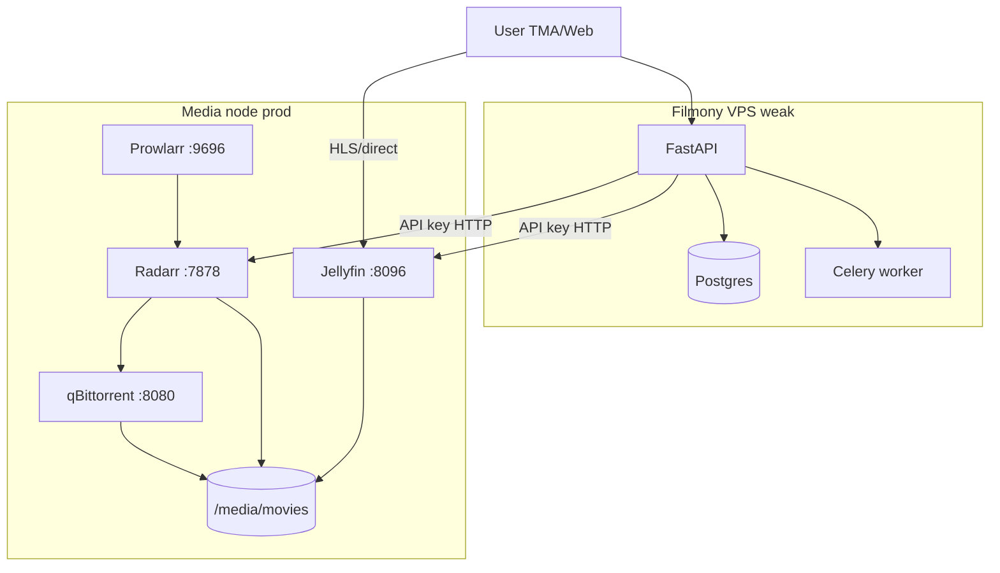

# Film playback rework — Prowlarr + Radarr + qBittorrent + Jellyfin

**Date:** 2026-08-10  
**Status:** draft for review  
**Feature slug:** `film-radarr-playback`  
**Supersedes (primary path):** `film-hls-playback` balancer resolvers (Kodik/Collaps/Alloha)

---

## 1. Зачем переработка

Текущий MVP `film-hls-playback` завязан на **партнёрские балансеры** (token, нестабильные API, CDN hotlink). Для закрытого круга (~5 человек) с требованием **русская озвучка + 4K** и **полный контроль на проде** переходим на **свой media stack**:

| Было | Станет |
|------|--------|
| Kodik/Collaps/Alloha token | Prowlarr + Radarr + qBittorrent |
| HLS с CDN балансера | Jellyfin stream (HLS/direct) с media node |
| Filmony только JSON-resolver | Filmony orchestration + статус загрузки |
| Байты мимо Filmony VPS | Байты мимо Filmony VPS (**без изменений**) |

**Filmony VPS (2–4 GB)** по-прежнему **не** качает торренты и **не** транскодит. Весь тяжёлый контур — **отдельная media-машина** с диском.

---

## 2. Целевая архитектура



### Роли компонентов

| Компонент | Роль |
|-----------|------|
| **Prowlarr** | Единая точка настройки **индексаторов** (RuTracker, Rutor, …); синхронизация в Radarr |
| **Radarr** | Каталог фильмов: lookup по TMDB, quality profile **RU 4K**, поиск релизов, import в `/movies` |
| **qBittorrent** | Download client; категория `radarr`; сохранение на volume |
| **Jellyfin** | Сканирует `/movies`, отдаёт **stream URL** (HLS или direct play) клиенту |
| **Filmony API** | Auth, mapping `Film` → Radarr movie, trigger add/search, poll status, выдача Jellyfin URL |
| **Celery** | Долгий poll/webhook processing (optional phase 1b) |

### Сеть

- Media node и Filmony VPS связаны **приватно** (Tailscale / LAN / VPN).  
- Jellyfin и Radarr **не** публикуются в интернет без reverse proxy + auth.  
- Для TMA: Jellyfin за HTTPS с valid cert (или Tailscale-only для beta).

---

## 3. Product decisions (locked)

| Вопрос | Решение |
|--------|---------|
| Primary playback source | Radarr library + Jellyfin stream |
| Balancer (Kodik/…) | **Deprecated** primary; env `PLAYBACK_BALANCER_ENABLED=false` default |
| Ключ для Radarr lookup | **`tmdb_id`** обязателен для «Смотреть»; если null — backend sync TMDB по `imdb_id`/`kinopoisk_id` или 422 |
| `kinopoisk_id` | UI/каталог; не используется Radarr напрямую |
| Качество | Quality profile **RU-2160p** (4K, русская дорожка приоритет) |
| Озвучка | Custom formats Radarr: Russian audio required; Dub/LostFilm допустимы по score |
| Сериалы | Out of scope (только Radarr, без Sonarr) |
| Player UI | Существующий `FilmWatchPage` + `<video>` / hls.js; источник URL — Jellyfin |
| On-demand download | При отсутствии файла — **авто-add** в Radarr + search; UI «Идёт загрузка…» |
| Filmony segment proxy | **Запрещено** (как в v1) |
| qBittorrent на Filmony VPS | **Запрещено** |

---

## 4. UX flow

### 4.1 «Смотреть» — happy path (фильм уже в библиотеке)

1. User → `/films/:id/watch`
2. `GET /api/films/{id}/playback`
3. Backend: Radarr movie by `tmdb_id` → `hasFile=true` → Jellyfin item by TMDB → `stream_url`
4. Response `200`:

```json
{
  "status": "ready",
  "provider": "jellyfin",
  "title": "Интерстеллар",
  "hls_url": "https://jellyfin.example/.../master.m3u8?api_key=...",
  "expires_at": "2026-08-10T20:00:00Z",
  "film_id": 42,
  "tmdb_id": 157336,
  "kinopoisk_id": 258687,
  "qualities": [],
  "translations": []
}
```

5. Client attaches stream (native iOS / hls.js).

### 4.2 On-demand (фильма нет — старт загрузки)

1. Same endpoint → Radarr: movie missing or `hasFile=false`
2. Backend: `POST /api/v3/movie` + `POST /api/v3/command` (`MoviesSearch`)
3. Response `202`:

```json
{
  "status": "downloading",
  "message": "Фильм добавлен в загрузку. Обычно это занимает от нескольких минут до часа.",
  "radarr_movie_id": 123,
  "film_id": 42,
  "tmdb_id": 157336
}
```

4. Frontend polls `GET /api/films/{id}/playback/status` каждые 10–15 s → `ready` | `downloading` | `failed`
5. On `ready` → re-fetch playback → play

### 4.3 Errors (Russian copy)

| Condition | HTTP | User message |
|-----------|------|--------------|
| No `tmdb_id` and sync failed | 422 | «Смотреть недоступно: нет привязки к TMDB» |
| Radarr/Jellyfin unreachable | 502 | «Медиа-сервер недоступен. Попробуйте позже» |
| Search timeout / no releases | 422 | «Не найдено подходящего релиза (RU 4K)» |
| Download failed | 422 | «Загрузка не удалась» |

---

## 5. Backend rework

### 5.1 New settings (`PlaybackSettings` extension)

```env
# Source selection
PLAYBACK_MODE=radarr                    # radarr | balancer (legacy)
PLAYBACK_BALANCER_ENABLED=false

# Media stack (private network)
RADARR_BASE_URL=http://100.x.x.x:7878
RADARR_API_KEY=
QBITTORRENT_BASE_URL=http://100.x.x.x:8080   # optional health only
QBITTORRENT_USERNAME=
QBITTORRENT_PASSWORD=

JELLYFIN_BASE_URL=https://jellyfin.example
JELLYFIN_API_KEY=
JELLYFIN_USER_ID=                         # service user for stream URLs

PROWLARR_BASE_URL=http://100.x.x.x:9696   # optional admin health
PROWLARR_API_KEY=

PLAYBACK_CACHE_TTL_SECONDS=60             # shorter — library state changes
PLAYBACK_DOWNLOAD_POLL_TIMEOUT_HOURS=6
```

### 5.2 New / changed services

| Service | Responsibility |
|---------|----------------|
| `EnsureFilmTmdbIdService` | If `film.tmdb_id` null → sync via existing TMDB pipeline |
| `ResolveRadarrFilmPlaybackService` | Main orchestrator (replaces balancer chain when `PLAYBACK_MODE=radarr`) |
| `RadarrClient` | lookup, get movie, add, search command, queue status |
| `JellyfinClient` | find item by TMDB provider id, build stream URL |
| `GetFilmPlaybackStatusService` | Poll Radarr `hasFile`, queue, history |

**Resolver chain change:**

```text
ResolveFilmPlaybackService.execute()
  if settings.playback.mode == "radarr":
    return ResolveRadarrFilmPlaybackService.execute(...)
  else:
    legacy Kodik → Collaps → Alloha
```

### 5.3 API endpoints

| Method | Path | Purpose |
|--------|------|---------|
| GET | `/api/films/{film_id}/playback` | ready → 200 + stream; missing → trigger download 202; errors 422/502 |
| GET | `/api/films/{film_id}/playback/status` | `{ status, progress_pct?, eta? }` while downloading |

Auth: `CurrentUser` (unchanged).

Response schema: extend `FilmPlaybackResponse` with `status: ready | downloading | failed` (breaking additive field).

### 5.4 Mapping Film → Radarr

1. Load `Film` by id  
2. Require `tmdb_id` (attempt enrich if missing)  
3. `GET /api/v3/movie?tmdbId={tmdb_id}` — if exists and `movieFile` present → Jellyfin  
4. Else `GET /api/v3/movie/lookup/tmdb?tmdbId=` → add with:
   - `qualityProfileId` = **RU-4K profile id**
   - `rootFolderPath` = `/movies`
   - `monitored` = true
   - `addOptions.searchForMovie` = true  
5. Store optional `film_playback_state` row (film_id, radarr_id, status, updated_at) — **new table** or Redis cache

### 5.5 Jellyfin stream URL

- Library scan path = Radarr root folder (same volume mount in Jellyfin)  
- Find item: `GET /Items?Recursive=true&IncludeItemTypes=Movie&AnyProviderIdEquals=tmdb.{id}`  
- Stream: `GET /Videos/{itemId}/stream.m3u8` with `X-Emby-Token` or static API key query  
- **4K HEVC in browser/TMA:** Jellyfin may **transcode** → CPU load on **media node**, not Filmony  
- For iOS TMA: prefer HLS manifest from Jellyfin (handles transcode)

### 5.6 Deprecation

- `providers/playback/kodik|collaps|alloha` — keep behind `PLAYBACK_BALANCER_ENABLED`  
- Default prod: `PLAYBACK_MODE=radarr`, balancers off  
- Update `docs/features/film-hls-playback.md` with deprecation notice after ship

---

## 6. Media stack — Radarr quality (RU 4K)

### 6.1 Quality profile «RU-2160p» (locked defaults)

| Priority | Quality | Min score |
|----------|---------|-----------|
| 1 | Bluray-2160p | — |
| 2 | WEBRip-2160p / WEBDL-2160p | — |
| 3 | Bluray-1080p (fallback if no 4K) | lower tier |

**Cutoff:** WEBRip-2160p or Bluray-2160p (configurable in runbook).

### 6.2 Custom formats (Radarr)

| Name | Condition | Score |
|------|-----------|-------|
| `RU-audio` | Language: Russian | +10000 |
| `RU-dub` | Release title contains: Dub, Дубляж, Пифагор, … | +500 |
| `EN-audio-only` | Language: English only | -10000 |
| `Cam/LQ` | Source cam/ts | reject |

Release profiles: prefer `Repack`, exclude cam.

### 6.3 Prowlarr indexers (minimum prod set)

Configure in Prowlarr → sync to Radarr:

| Indexer | Notes |
|---------|-------|
| RuTracker | Primary RU catalog; requires credentials/cookies |
| Rutor | Mirror-style |
| (optional) Kinozal | Invite-based |

**Indexer health:** Prowlarr dashboard all green before prod sign-off.

### 6.4 qBittorrent

- Category: `radarr` (Radarr download client config)  
- Default save path: `/downloads` → Radarr remote path mapping → `/movies`  
- No Filmony access to qBittorrent UI required for playback (Radarr orchestrates)

---

## 7. Infrastructure

### 7.1 Hardware (media node prod minimum)

| Resource | Minimum for RU 4K library |
|----------|---------------------------|
| CPU | 4 cores (Jellyfin transcode headroom) |
| RAM | 8 GB |
| Disk | **≥ 2 TB** (4K ~50–80 GB/film); SSD for metadata, HDD OK for movies |
| Network | Stable; upload matters if remote watch |

Filmony VPS unchanged (2–4 GB).

### 7.2 Compose layout

Reference compose lives in repo: `media-stack/docker-compose.yml` (to be added in implementation phase).

Services on **one media host**:

- `prowlarr` (linuxserver/prowlarr)
- `radarr` (linuxserver/radarr)
- `qbittorrent` (linuxserver/qbittorrent)
- `jellyfin` (jellyfin/jellyfin)

Shared volumes:

```text
/mnt/media/
  movies/          ← Radarr root + Jellyfin library
  downloads/       ← qBittorrent incomplete
```

### 7.3 Secrets & backup

- API keys only in env / secrets manager  
- Backup: Radarr SQLite + config XML + Prowlarr DB (not the movie files if re-download OK)  
- Jellyfin config backup

---

## 8. Frontend rework (minimal)

Reuse `FilmWatchPage`:

| `playback.status` | UI |
|-------------------|-----|
| `ready` | Existing player + `hls_url` |
| `downloading` | Progress screen + poll `/playback/status` |
| `failed` | Error + «Попробовать снова» (re-trigger search) |

Hide translation/quality pickers when `provider=jellyfin` (single stream).

CTA «Смотреть» unchanged; gate on `tmdb_id` OR `kinopoisk_id` with backend TMDB enrich.

---

## 9. Phased delivery

### Phase 0 — Media stack prod (ops)
- Deploy compose on media node  
- Prowlarr indexers + Radarr download client + Jellyfin library  
- Quality profile RU-4K imported  
- Manual test: add «Интерстеллар» in Radarr → download → play in Jellyfin UI  
- **Exit:** 1 film RU 4K plays in Jellyfin web

### Phase 1 — Filmony backend
- `RadarrClient`, `JellyfinClient`, `ResolveRadarrFilmPlaybackService`  
- Settings + `PLAYBACK_MODE=radarr`  
- Endpoints playback + status  
- Unit/integration tests with mocks  
- **Exit:** curl returns `hls_url` for library movie

### Phase 2 — Frontend status UX
- Poll downloading state  
- Error copy  
- **Exit:** full flow in TMA + desktop

### Phase 3 — Hardening
- Celery task or Radarr webhook for faster ready signal  
- Monitoring (Radarr queue, disk space)  
- Deprecate balancer env in prod docs

---

## 10. Testing

| Layer | Tests |
|-------|-------|
| Unit | Radarr/Jellyfin client response parsing; TMDB enrich gate; status mapping |
| Integration | Mock Radarr: not in library → 202; has file → 200 + jellyfin url mock |
| Manual prod | Checklist in runbook §10 |

---

## 11. Risks

| Risk | Mitigation |
|------|------------|
| No RU 4K release on indexers | Fallback 1080p RU in profile; clear user message |
| TMDB id missing on film | Enrich service before playback |
| Jellyfin transcode overload | Limit concurrent streams; 1080p max transcode in Jellyfin |
| RuTracker indexer breaks | Prowlarr backup indexers |
| Legal | Out of scope; closed beta |
| TMA iOS 4K direct play fails | Jellyfin HLS transcode to 1080p |

---

## 12. Acceptance criteria (rework done)

1. Prod media-stack running per runbook; Prowlarr indexers synced; Radarr RU-4K profile active  
2. At least one reference movie (e.g. TMDB 157336) downloaded in 4K RU and plays in Jellyfin  
3. Filmony «Смотреть» plays same movie via Jellyfin URL without balancer tokens  
4. On-demand add works for film not in library (202 → poll → ready)  
5. Filmony VPS does not run qBittorrent/ffmpeg  
6. Tests green; docs updated  

---

## 13. Related files (implementation touch map)

| Area | Path |
|------|------|
| Current playback | `backend/src/services/films/resolve_film_playback.py` |
| Balancer resolvers | `backend/src/providers/playback/*` |
| Settings | `backend/src/conf/settings.py` |
| Watch UI | `frontend/src/pages/FilmWatchPage.tsx` |
| Film model | `backend/src/models/film.py` (`tmdb_id`, `imdb_id`, `kinopoisk_id`) |
| TMDB sync | `backend/src/services/tmdb/` |
| New compose | `media-stack/docker-compose.yml` (phase 0) |
| Prod runbook | `docs/engineering/media-stack-prod-setup.md` |

---

## 14. Open questions for review

1. **Media node host:** отдельный VPS / домашний NAS / тот же homelab? (spec assumes **dedicated media node**)
2. **Jellyfin access:** только Tailscale для beta или публичный HTTPS subdomain?
3. **Fallback 1080p RU:** автоматически если 4K не найден за N минут? (**default: yes**, per quality profile tier)

---

**Next step after approval:** implementation plan in `docs/superpowers/plans/2026-08-10-film-radarr-torrent-stack.md` + Phase 0 runbook execution on prod media node.
