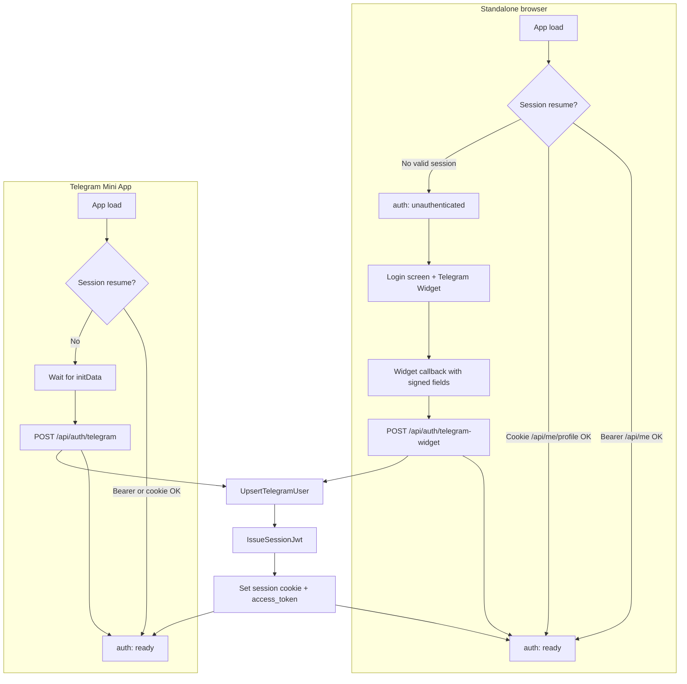

# Standalone web + Telegram Login Widget

**Status:** Draft approved in brainstorming  
**Date:** 2026-08-10  
**Scope:** `frontend/src/auth/`, `backend/src/api/auth/`, `backend/src/services/auth/`

---

## Problem

Filmony today is effectively **Telegram Mini App (TMA) only** for authenticated use:

- `AuthProvider` short-circuits outside TMA: `isTMA()` → initial state `{ kind: 'skipped' }`, no bootstrap effect runs.
- Protected pages treat `skipped` like a hard gate and show copy such as “Откройте приложение в Telegram…”.
- `runAuthBootstrap` (Bearer resume, cookie resume, `initData` exchange) exists only on the TMA path; a normal browser tab never reaches it.
- `POST /api/auth/telegram` verifies Mini App `initData` only; there is no browser-native login endpoint.

Result: opening Filmony in a desktop or mobile browser shows read-only or blocked UX with no way to sign in, even though session infrastructure (HttpOnly cookie + `access_token` in JSON + Bearer probe on `/api/me`) is already in place for TMA users.

---

## Goals

1. **Browser login v1** — unauthenticated visitors in a normal browser can sign in with the [Telegram Login Widget](https://core.telegram.org/widgets/login) and use the full app.
2. **Identity unification** — the same `telegram_user_id` maps to the same `User` row whether the user signs in via Mini App `initData` or the Login Widget (no duplicate accounts).
3. **Preserve TMA path** — existing Mini App bootstrap (`initData` → `POST /api/auth/telegram`) stays unchanged for users who open the app inside Telegram.
4. **Reuse session stack** — after either login path, issue the same JWT, set the same HttpOnly session cookie, and return `access_token` for Bearer storage; resume logic works in both environments.
5. **Replace hard gate** — remove `skipped` as the default non-TMA state; show a dedicated login screen instead of “open in Telegram” as the only option.

## Non-goals (v1)

- Email/password, OAuth providers, or magic links.
- Bot deep-link hybrid flows (e.g. “send /start link to complete login in browser”).
- Separate “web-only” user type or account linking UI.
- Changing JWT shape, cookie name, or session max-age semantics.
- Requiring Telegram for read-only public routes that already work without auth.

---

## Chosen approach

**Telegram Login Widget only** for standalone web v1.

| Environment | Login mechanism | API |
|-------------|-----------------|-----|
| Telegram Mini App | `initData` from `@telegram-apps/sdk` / `window.Telegram.WebApp` | `POST /api/auth/telegram` (existing) |
| Standalone browser | Telegram Login Widget callback → frontend posts signed payload | `POST /api/auth/telegram-widget` (new) |

Both paths converge on `UpsertTelegramUserService` + `IssueSessionJwtService` and the same response shape (`TelegramAuthResponse`: user fields + `access_token`).

---

## Architecture flow



**ASCII summary**

```
Browser:  load → resume (Bearer/cookie) → ready
                  └→ login screen → widget → POST /telegram-widget → upsert → JWT → ready

TMA:      load → resume (Bearer/cookie) → ready
                  └→ initData → POST /telegram → upsert → JWT → ready
```

---

## Frontend changes

### AuthProvider and bootstrap

- **Remove TMA-only skip:** `AuthProvider` runs bootstrap in **all** environments, not only when `isTMA()` is true.
- **New auth state:** replace `{ kind: 'skipped' }` with `{ kind: 'unauthenticated' }` for “no session and not yet logged in” in the browser. TMA may still use `loading` while waiting for `initData`; browser shows login when resume fails and widget has not completed.
- **Resume outside TMA:** reuse existing `runAuthBootstrap` paths:
  1. `sessionStorage` Bearer → `GET /api/me` with `Authorization`.
  2. HttpOnly cookie → `GET /api/me/profile` with `credentials: 'include'`.
- **TMA-only behavior unchanged:** after failed resume, wait for `initData` and call `authTelegram` as today. After logout in TMA, re-run bootstrap (`loading` → initData exchange); never show `/login` or the widget.
- **Browser-only branch:** after failed resume, transition to `unauthenticated` (do not poll for `initData`).

### Login screen

- Dedicated `/login` route (standalone browser only). Protected routes redirect to `/login?returnTo=<path>` when `auth.kind === 'unauthenticated'`. TMA never navigates to `/login`; it re-runs initData exchange after logout or failed resume.
  - Filmony branding and short explanation.
  - **Telegram Login Widget** via the official script (`https://telegram.org/js/telegram-widget.js?22`) with `data-telegram-login` and `data-onauth` JavaScript callback (no third-party React wrapper).
  - On widget callback, `POST /api/auth/telegram-widget` with the signed field set; on success, persist `access_token`, set session flag, `setState({ kind: 'ready' })`, redirect to `returnTo` query param or `/`.
- **Remove “open in Telegram” as hard gate** on feed, profile, subscriptions, etc.: delete `skipped` branches that block the app; use `unauthenticated` → login screen or shared `AuthRequired` wrapper instead of dead-end hint text.

### Widget integration notes

- **BotFather:** run `/setdomain` for the Filmony bot for **each hostname** that serves the widget (production, staging, and local dev tunnel if used). Domain must match the browser origin exactly.
- **Bot username:** widget `data-telegram-login` must match the same bot whose token the backend uses for HMAC verification.
- **CORS / API origin:** widget callback runs in the browser origin; API calls use existing `VITE_API_ORIGIN` + credentials rules already used by TMA auth.
- **Optional soft CTA:** pages may still link “Open in Telegram” for users who prefer the Mini App, but it is not a blocker for web login.

### Page-level gates

- Replace checks for `auth.kind === 'skipped'` with `unauthenticated` (redirect to login) or `loading` (skeleton).
- `useAuthReadyGate`: treat `unauthenticated` as not ready; do not treat it as “pending” like `loading`.

---

## Backend changes

### New route

`POST /api/auth/telegram-widget`

- **Request body:** JSON object with Telegram Login Widget callback fields: `id`, `auth_date`, `hash`, and optional `first_name`, `last_name`, `username`, `photo_url`. Pydantic schema field names match Telegram’s snake_case callback parameters exactly (no camelCase aliases).
- **Response:** same as `POST /api/auth/telegram` — `TelegramAuthResponse` + `Set-Cookie` for session JWT.
- **Errors:** `401` for invalid/expired signature; `422` for malformed body; map service errors in the route, keep logic out of the handler.

### New service

`VerifyTelegramLoginWidgetService`

- **Purpose:** verify widget callback per [Telegram Login Widget documentation](https://core.telegram.org/widgets/login#checking-authorization):
  - Reject missing `hash` or `auth_date`; enforce `auth_date` recency with `max_age_seconds=86400` (same default as `VerifyTelegramInitDataService`).
  - Build `data_check_string` from sorted `key=value` lines for all fields except `hash`.
  - `secret_key = SHA256(bot_token)` (raw bytes).
  - `calculated_hash = HMAC-SHA256(secret_key, data_check_string)`; compare with `hash` using constant-time compare.
  - Parse `id` as `telegram_user_id`; map optional profile fields into `TelegramWebAppUser` (same DTO as initData path).
- **Typed errors:** `TelegramLoginWidgetInvalidError` in `backend/src/services/auth/errors.py` (sibling of `TelegramInitDataInvalidError`); route maps both to `401`.

### Reuse (unchanged contracts)

- `UpsertTelegramUserService.execute(profile)` — keyed on `telegram_user_id`; updates name/username/photo on repeat login.
- `IssueSessionJwtService.execute(user.id)` — same JWT claims and TTL.
- `POST /api/auth/telegram` — **no breaking changes**; `VerifyTelegramInitDataService` remains separate (different HMAC recipe: `WebAppData` key derivation).

### Layering

- Route: validate body → `VerifyTelegramLoginWidgetService.build().execute(...)` → `UpsertTelegramUserService` → `IssueSessionJwtService` → cookie + response.
- No SQL or HMAC logic in the route module.

---

## Auth states

| State | Meaning | Typical UI |
|-------|---------|------------|
| `loading` | Bootstrap in progress (resume and/or TMA initData wait) | App shell / route fallback |
| `ready` | Valid session; user id available from `/api/me` | Full app |
| `unauthenticated` | No session in standalone browser (including after logout) | `/login` with widget |
| `error` | Bootstrap failed after retries (network, invalid initData in TMA, widget POST failed) | Error message + retry / re-open |

`skipped` is **removed** from the public auth union.

---

## Error handling

| Condition | HTTP | User-facing (RU, existing tone) | Recovery |
|-----------|------|----------------------------------|----------|
| Widget hash mismatch / tampered payload | 401 | Не удалось подтвердить вход через Telegram | Retry widget |
| `auth_date` expired | 401 | Сессия входа устарела — войдите снова | Retry widget |
| Missing required widget fields | 422 | Некорректные данные входа | Retry widget |
| Invalid initData (TMA) | 401 | (existing) invalid init data | Re-open from Telegram |
| Empty initData (TMA) | — | Пустой initData — откройте приложение из Telegram | Open Mini App |
| POST ok but no `access_token` | — | Ответ входа без access_token | Retry / support |
| Network failure | — | Сеть недоступна | Retry |
| Resume probe 401/403 | — | (silent) fall through to login or initData | Login or TMA |

---

## Session model

Unchanged from TMA auth; both login paths produce the same artifacts:

| Mechanism | Storage | Use |
|-----------|---------|-----|
| HttpOnly cookie | Set by `POST /api/auth/telegram` or `/telegram-widget` | `credentials: 'include'` on API client; resume via `/api/me/profile` |
| Bearer `access_token` | `sessionStorage` (`filmony_access_token_v1`) | `Authorization: Bearer …` on `apiFetch`; resume via `/api/me` |
| Session flag | `sessionStorage` (`filmony_tma_authenticated_v1`, key retained for compatibility) | Fast path to show `loading` vs cold `unauthenticated` on reload in browser and TMA |

Logout: existing `POST /api/auth/logout` clears cookie; frontend clears Bearer + flag + caches (same as today).

**Security notes:** cookie `Secure` + `SameSite` policy stays environment-driven; widget verification must use production bot token; never log `hash` or full widget payload in production logs.

---

## Testing plan

### Backend unit (`make backend-test-unit`)

- `VerifyTelegramLoginWidgetService`: valid signature fixture; wrong hash; expired `auth_date`; missing fields; field-order independence of `data_check_string`.
- Add DTO mapping tests only if a shared widget → `TelegramWebAppUser` mapper helper is extracted; otherwise cover mapping via service/route tests.

### Backend integration (`make backend-test-integration`)

- `POST /api/auth/telegram-widget`: happy path returns 200, user row created/updated, `access_token` present, `Set-Cookie` present.
- Same `telegram_user_id` via widget then via initData (or reverse) resolves to **one** user id.
- Invalid payload → 401; malformed body → 422.
- Authenticated requests with cookie/Bearer from widget login succeed on a protected route (e.g. `/api/me`).

### Frontend

- `runAuthBootstrap`: browser path resumes Bearer/cookie; falls through to `unauthenticated` without initData poll.
- TMA path: still waits for initData and calls `/api/auth/telegram`.
- Login screen: widget callback triggers API mock, sets token, transitions to `ready`.
- Remove/update tests that expect `skipped` on non-TMA.

### Docker

Run full suite via root `Makefile` targets (`make backend-test`, `make backend-test-one target=…`) inside the `backend` container per project conventions; frontend `npm run lint` + tests for touched auth modules.

---

## Out of scope

- Bot `/start` or `t.me` deep links as a required step for web login.
- Email/password, phone OTP, or third-party IdPs.
- Multi-account linking (one Filmony user bound to multiple Telegram ids).
- Widget on mobile WebView inside Telegram (users there should use Mini App initData).
- Admin/analytics dashboards for login method attribution (can be added later).
- Changing public SEO/marketing landing separately from in-app login route.

---

## Acceptance criteria

1. Opening Filmony in a desktop browser without a session shows a **login screen with Telegram Login Widget**, not a dead-end “open in Telegram” message.
2. Successful widget login creates or updates the user by `telegram_user_id`, returns JWT + cookie, and navigates to the main app (`auth.kind === 'ready'`).
3. A user who previously used only the Mini App can log in on the web with the same Telegram account and sees the **same profile and data** (single user row).
4. Mini App login via `initData` and `POST /api/auth/telegram` continues to work without regression.
5. Session resume works in the browser via stored Bearer or HttpOnly cookie without re-clicking the widget.
6. `POST /api/auth/telegram-widget` rejects tampered or expired widget payloads with `401`.
7. `skipped` auth state is removed; pages use `unauthenticated` / login redirect instead.
8. Backend tests cover widget verification and the new route; frontend tests cover browser bootstrap and login success path.
9. BotFather `/setdomain` documented in deployment checklist for each environment hostname serving the widget.
